<div align="center">

<a href="https://youtu.be/rxII87CZEUE"></a>

<br>

<picture>
  <source media="(prefers-color-scheme: dark)" srcset="docs/assets/readme/hero-dark.svg">
  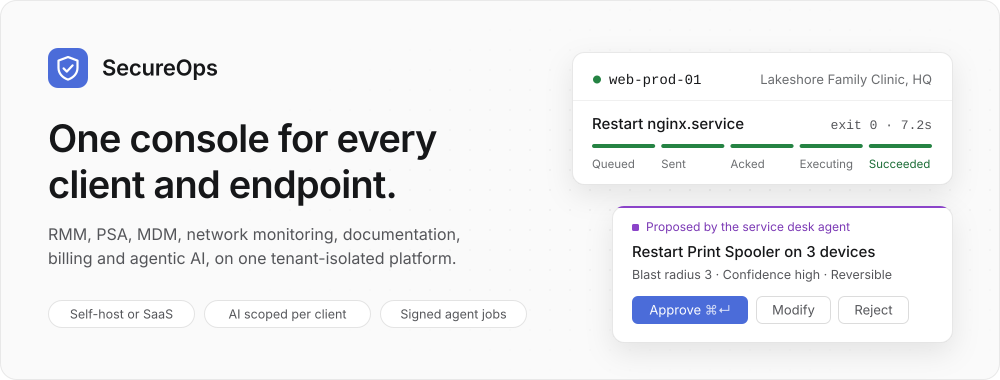
</picture>

<p><b>The operations platform for MSPs and internal IT teams.</b><br>
RMM, PSA, MDM, network monitoring, IT documentation, billing, projects, a client portal and agentic AI,<br>
on one tenant-isolated data model. Run it as a service, in your own cloud, or on your own racks with no route out.</p>

<p>


<br>
<a href="mailto:a.wasey40@gmail.com?subject=SecureOps%20source%20code%20access"></a>
</p>

<p>
<a href="#why-secureops">Why SecureOps</a> ·
<a href="#every-capability-step-by-step">Every capability, step by step</a> ·
<a href="#everything-in-one-platform">Platform</a> ·
<a href="#agentic-ai-inside-fences">AI</a> ·
<a href="#how-it-compares">Compare</a> ·
<a href="#pricing">Pricing</a> ·
<a href="#run-it-anywhere">Deploy</a> ·
<a href="#architecture">Architecture</a> ·
<a href="#quickstart">Quickstart</a> ·
<a href="#license">License</a>
</p>

</div>

> [!IMPORTANT]
> **The source code is private.** This repository is the public face of SecureOps: everything it does, shown in its real screens. To read, run or evaluate the code, email **[a.wasey40@gmail.com](mailto:a.wasey40@gmail.com?subject=SecureOps%20source%20code%20access)** with your GitHub username and what you would like to use it for, and you will be invited to the private repository.

<br>

<picture>
  <source media="(prefers-color-scheme: dark)" srcset="docs/assets/readme/walkthrough/device-overview-dark.webp">
  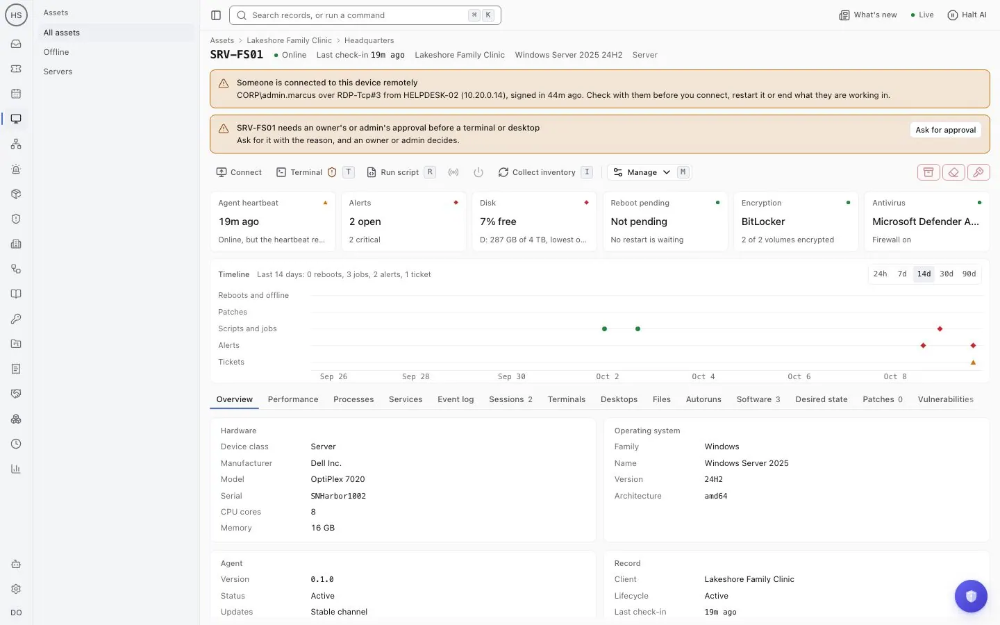
</picture>

<p align="center"><sub><b>Device 360.</b> Whether a machine is healthy in one screen: who is connected to it right now, what it may safely be asked to do, and every job ever sent to it with its real outcome.</sub></p>

## Why SecureOps

Built for the eight-hour shift, not the demo: every action says whether the device obeyed, every change stays on the record for years, and the AI does real work inside fences a person sets.

<table>
<tr>
<td width="33%" valign="top">

**The truth about every action**

A reboot, a script or a patch is a signed job you watch climb its ladder: queued, sent, acknowledged, executing, then succeeded or failed with its exit code. Nothing on screen is optimistic. An update counts as installed only when the next scan proves it, and a device that stopped reporting says so, with its age.

</td>
<td width="33%" valign="top">

**Seven years of history**

Every change in every module, and every sensitive read (a password revealed, a key escrow opened, a remote session), goes on a per-workspace hash chain that shows any tampering. At least 13 months on screen and seven years in all, a floor no one can shorten.

</td>
<td width="33%" valign="top">

**AI that acts, inside fences**

Triage, replies, articles, scripts, remediation and a phone line, each with its own autonomy per client, approval cards that state the blast radius, and a supervisor that demotes a capability whose error rate rises. Retrieval never crosses from one client to another. An irreversible action is never the AI's to take.

</td>
</tr>
<tr>
<td width="33%" valign="top">

**Runs where you need it**

One release serves a multi-tenant SaaS, a single company's own cloud account, a server in the rack, and a network with no route out at all: a Helm chart, a single-node Compose bundle, a Pulumi program for EKS or GKE, and an air-gap bundle that loads into your own registry.

</td>
<td width="33%" valign="top">

**One price, every module**

$1.75 an endpoint a month on Scale, falling to $0.95 above 10,000, with every module and every technician included. Solo is free for good: 100 endpoints, 3 technicians and 3 clients, with the whole service desk. Prices are on the page, with a calculator.

</td>
<td width="33%" valign="top">

**Moves you in without a gap**

Importers read Atera, Syncro, HaloPSA, ConnectWise PSA, Autotask, NinjaOne, Datto RMM, ITarian, IT Glue and Hudu, with a dry run first. Switch scripts for 12 RMMs install SecureOps and remove the old agent only after the new one has checked in and holds its first policy.

</td>
</tr>
</table>

## Every capability, step by step

30 capabilities in 196 steps, in the order a team meets them. Every picture is the running product: a workspace made with its sample data, two Linux machines enrolled with the Deploy dialog's one-line command, and an SNMP device on their network. Each picture follows your GitHub theme, light or dark; open one to see it full size.

<table>
<tr>
<td width="33%" valign="top"><a href="#1-get-started"><b>1. Get started</b></a><br><sub>4 steps</sub></td>
<td width="33%" valign="top"><a href="#2-deploy-the-agent"><b>2. Deploy the agent</b></a><br><sub>7 steps</sub></td>
<td width="33%" valign="top"><a href="#3-device-360"><b>3. Device 360</b></a><br><sub>10 steps</sub></td>
</tr>
<tr>
<td width="33%" valign="top"><a href="#4-remote-access"><b>4. Remote access</b></a><br><sub>6 steps</sub></td>
<td width="33%" valign="top"><a href="#5-scripts-and-jobs"><b>5. Scripts and jobs</b></a><br><sub>4 steps</sub></td>
<td width="33%" valign="top"><a href="#6-policies-monitors-and-alerts"><b>6. Policies, monitors and alerts</b></a><br><sub>7 steps</sub></td>
</tr>
<tr>
<td width="33%" valign="top"><a href="#7-automation-and-desired-state"><b>7. Automation and desired state</b></a><br><sub>7 steps</sub></td>
<td width="33%" valign="top"><a href="#8-patching"><b>8. Patching</b></a><br><sub>6 steps</sub></td>
<td width="33%" valign="top"><a href="#9-software"><b>9. Software</b></a><br><sub>3 steps</sub></td>
</tr>
<tr>
<td width="33%" valign="top"><a href="#10-agent-updates-protection-and-encryption"><b>10. Agent updates, protection and encryption</b></a><br><sub>3 steps</sub></td>
<td width="33%" valign="top"><a href="#11-network-monitoring"><b>11. Network monitoring</b></a><br><sub>8 steps</sub></td>
<td width="33%" valign="top"><a href="#12-mobile-device-management"><b>12. Mobile device management</b></a><br><sub>7 steps</sub></td>
</tr>
<tr>
<td width="33%" valign="top"><a href="#13-service-desk"><b>13. Service desk</b></a><br><sub>6 steps</sub></td>
<td width="33%" valign="top"><a href="#14-changes-and-problems"><b>14. Changes and problems</b></a><br><sub>3 steps</sub></td>
<td width="33%" valign="top"><a href="#15-dispatch-and-time"><b>15. Dispatch and time</b></a><br><sub>7 steps</sub></td>
</tr>
<tr>
<td width="33%" valign="top"><a href="#16-sales"><b>16. Sales</b></a><br><sub>4 steps</sub></td>
<td width="33%" valign="top"><a href="#17-quotes-and-orders"><b>17. Quotes and orders</b></a><br><sub>6 steps</sub></td>
<td width="33%" valign="top"><a href="#18-invoices-and-payments"><b>18. Invoices and payments</b></a><br><sub>6 steps</sub></td>
</tr>
<tr>
<td width="33%" valign="top"><a href="#19-contracts-usage-and-accounting"><b>19. Contracts, usage and accounting</b></a><br><sub>5 steps</sub></td>
<td width="33%" valign="top"><a href="#20-procurement-stock-and-custody"><b>20. Procurement, stock and custody</b></a><br><sub>5 steps</sub></td>
<td width="33%" valign="top"><a href="#21-projects"><b>21. Projects</b></a><br><sub>4 steps</sub></td>
</tr>
<tr>
<td width="33%" valign="top"><a href="#22-documentation-and-knowledge"><b>22. Documentation and knowledge</b></a><br><sub>6 steps</sub></td>
<td width="33%" valign="top"><a href="#23-the-vault"><b>23. The vault</b></a><br><sub>5 steps</sub></td>
<td width="33%" valign="top"><a href="#24-clients-and-the-vcio-plan"><b>24. Clients and the vCIO plan</b></a><br><sub>6 steps</sub></td>
</tr>
<tr>
<td width="33%" valign="top"><a href="#25-the-client-portal"><b>25. The client portal</b></a><br><sub>9 steps</sub></td>
<td width="33%" valign="top"><a href="#26-reports"><b>26. Reports</b></a><br><sub>6 steps</sub></td>
<td width="33%" valign="top"><a href="#27-security-and-compliance"><b>27. Security and compliance</b></a><br><sub>14 steps</sub></td>
</tr>
<tr>
<td width="33%" valign="top"><a href="#28-agentic-ai"><b>28. Agentic AI</b></a><br><sub>12 steps</sub></td>
<td width="33%" valign="top"><a href="#29-integrations-identity-and-your-data"><b>29. Integrations, identity and your data</b></a><br><sub>14 steps</sub></td>
<td width="33%" valign="top"><a href="#30-the-technician-app"><b>30. The technician app</b></a><br><sub>6 steps</sub></td>
</tr>
</table>

### 1. Get started

An account, an organisation and a working workspace in about a minute, with no card and no sales call.

<table>
<tr>
<td width="50%" valign="top">
<picture>
  <source media="(prefers-color-scheme: dark)" srcset="docs/assets/readme/walkthrough/start-signup-dark.webp">
  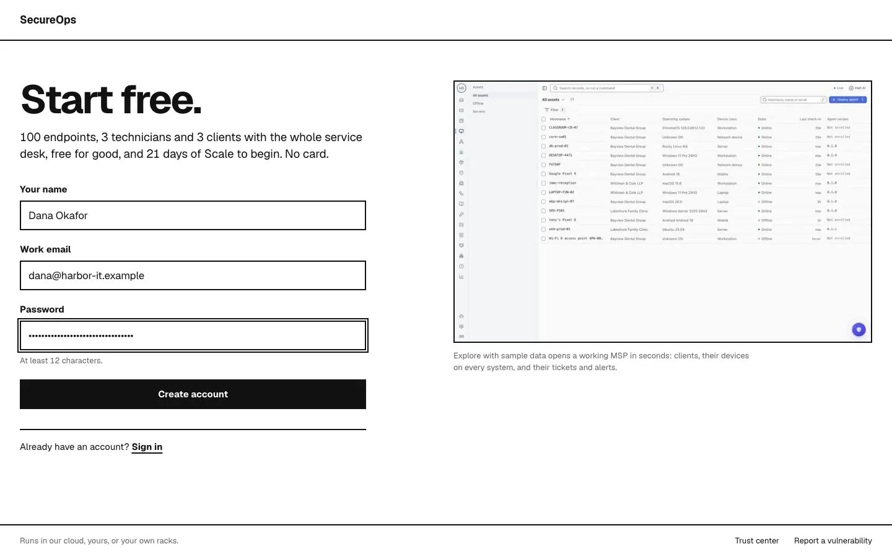
</picture>
<p><b>1. Create an account</b><br><sub>Name, work email and a password. The free plan and the 21-day trial of Scale start here, with no card.</sub></p>
</td>
<td width="50%" valign="top">
<picture>
  <source media="(prefers-color-scheme: dark)" srcset="docs/assets/readme/walkthrough/start-organisation-dark.webp">
  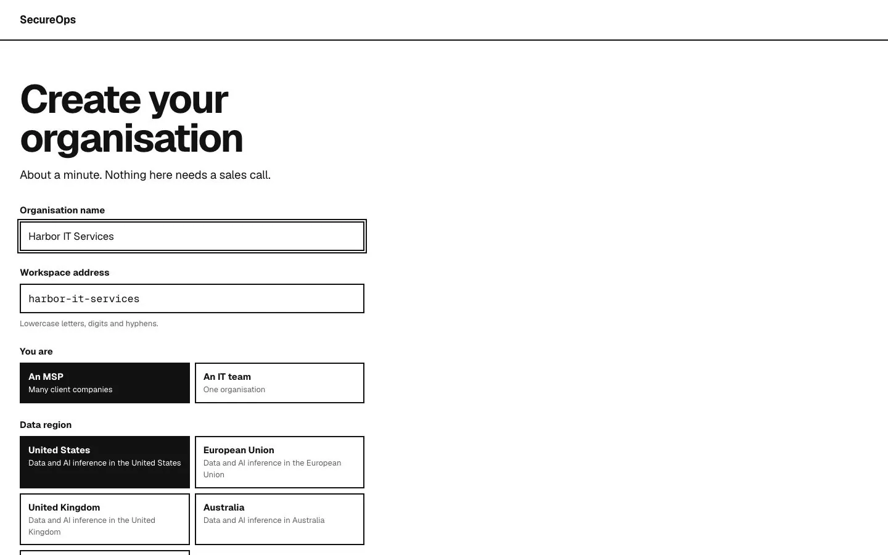
</picture>
<p><b>2. Create the organisation</b><br><sub>An MSP or an IT team, and the data region, the one choice that never changes. Then sample data or a real setup.</sub></p>
</td>
</tr>
<tr>
<td width="50%" valign="top">
<picture>
  <source media="(prefers-color-scheme: dark)" srcset="docs/assets/readme/walkthrough/start-inbox-dark.webp">
  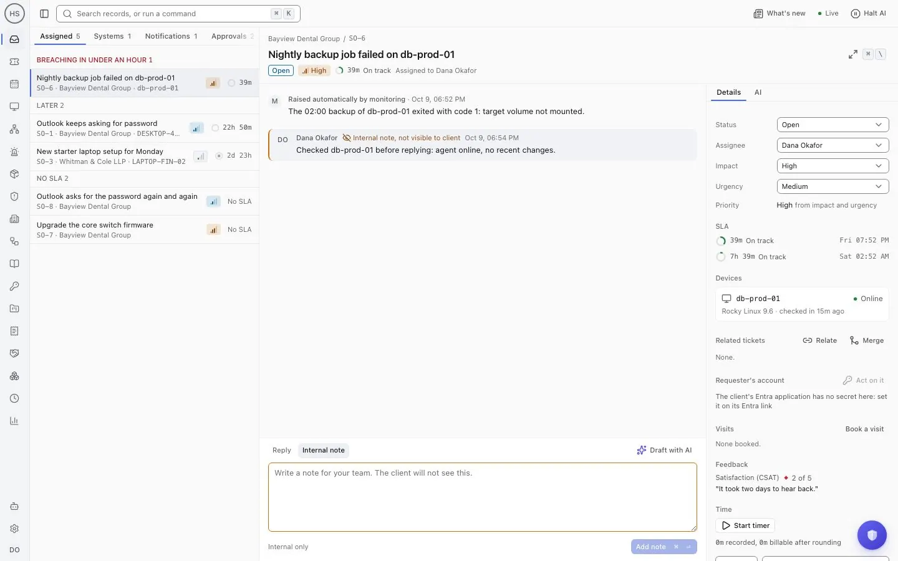
</picture>
<p><b>3. Land in the inbox</b><br><sub>The workspace opens on what needs a person first, most urgent at the top, with the selected ticket beside the list.</sub></p>
</td>
<td width="50%" valign="top">
<picture>
  <source media="(prefers-color-scheme: dark)" srcset="docs/assets/readme/walkthrough/start-palette-dark.webp">
  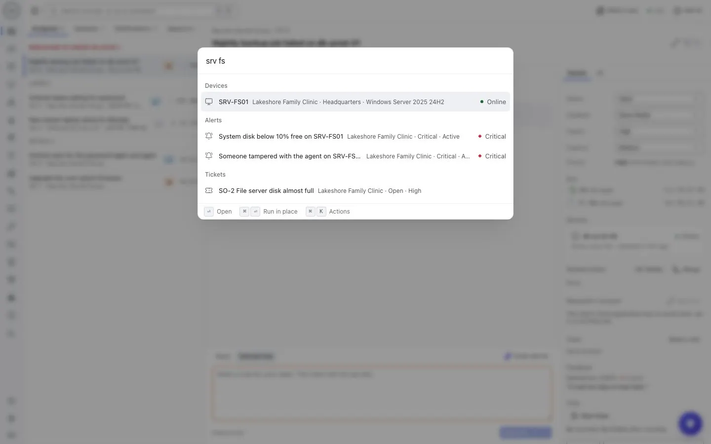
</picture>
<p><b>4. Find anything in one keystroke</b><br><sub>Command K searches records across every module, typing mistakes and all, and opens them where they belong.</sub></p>
</td>
</tr>
</table>

<p align="right"><sub><a href="#every-capability-step-by-step">Back to the walkthroughs</a></sub></p>

### 2. Deploy the agent

One dialog binds every way in to a client, a site and what the agent may do, then the device checks in by itself.

<table>
<tr>
<td width="50%" valign="top">
<picture>
  <source media="(prefers-color-scheme: dark)" srcset="docs/assets/readme/walkthrough/deploy-dialog-dark.webp">
  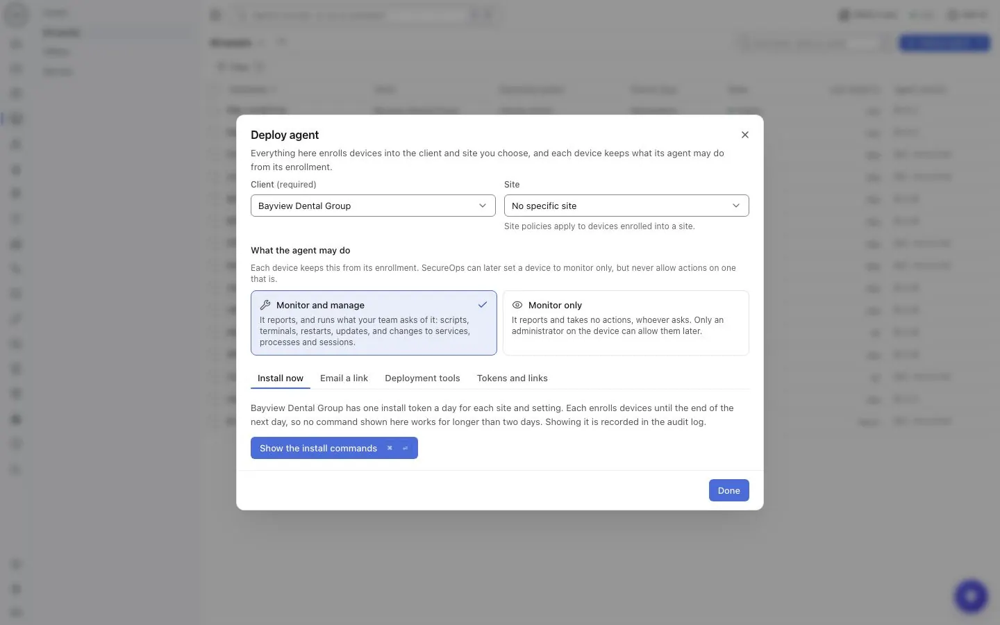
</picture>
<p><b>1. Choose the client and what the agent may do</b><br><sub>Monitor and manage, or monitor only. The token carries the choice and the device keeps it: the platform can lower it, never raise it.</sub></p>
</td>
<td width="50%" valign="top">
<picture>
  <source media="(prefers-color-scheme: dark)" srcset="docs/assets/readme/walkthrough/deploy-command-dark.webp">
  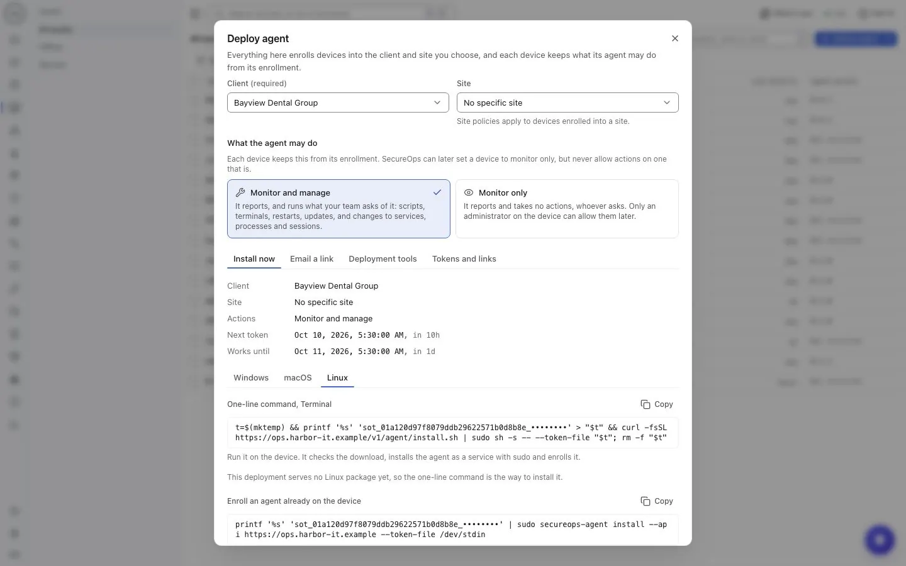
</picture>
<p><b>2. Copy the one-line command</b><br><sub>Today's install token for the client, shown only when asked and audited, inside a command that checks the download's SHA-256 and installs the agent as a service.</sub></p>
</td>
</tr>
<tr>
<td width="50%" valign="top">
<picture>
  <source media="(prefers-color-scheme: dark)" srcset="docs/assets/readme/walkthrough/deploy-email-dark.webp">
  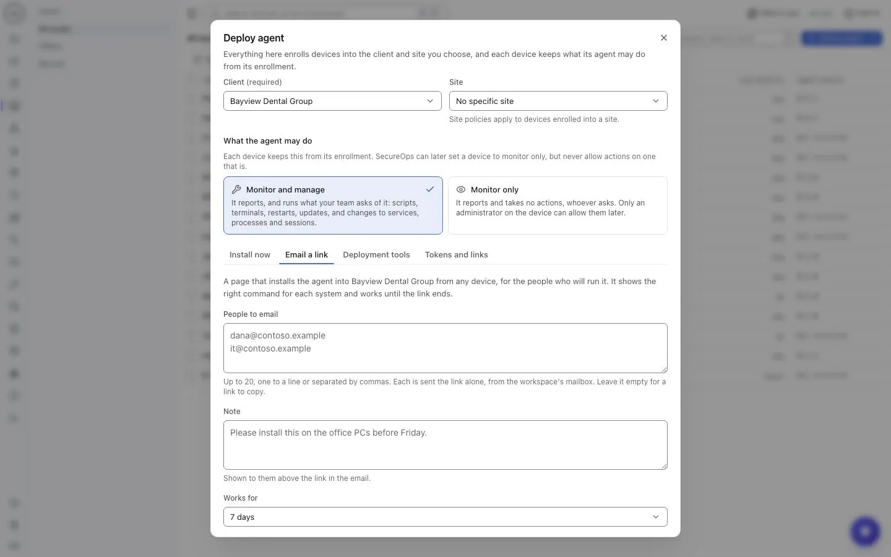
</picture>
<p><b>3. Or email an install link</b><br><sub>Up to 20 people, each sent a link of their own that works for the days chosen and opens the right steps for the system they use.</sub></p>
</td>
<td width="50%" valign="top">
<picture>
  <source media="(prefers-color-scheme: dark)" srcset="docs/assets/readme/walkthrough/deploy-tools-dark.webp">
  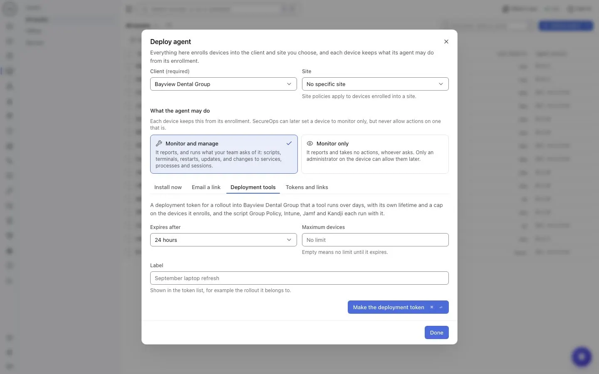
</picture>
<p><b>4. Or roll it out with a deployment tool</b><br><sub>A token made for the rollout, capped and labelled, with the script for Group Policy, Intune, Jamf or Kandji and where each goes.</sub></p>
</td>
</tr>
<tr>
<td width="50%" valign="top">
<picture>
  <source media="(prefers-color-scheme: dark)" srcset="docs/assets/readme/walkthrough/deploy-tokens-dark.webp">
  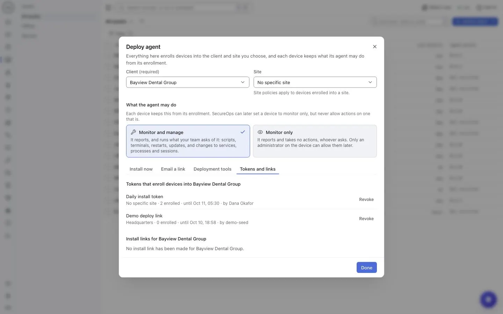
</picture>
<p><b>5. See every way in that is open</b><br><sub>Each token and link that enrolls devices into the client, with how many it enrolled, revoked or ended in a click.</sub></p>
</td>
<td width="50%" valign="top">
<picture>
  <source media="(prefers-color-scheme: dark)" srcset="docs/assets/readme/walkthrough/deploy-arrived-dark.webp">
  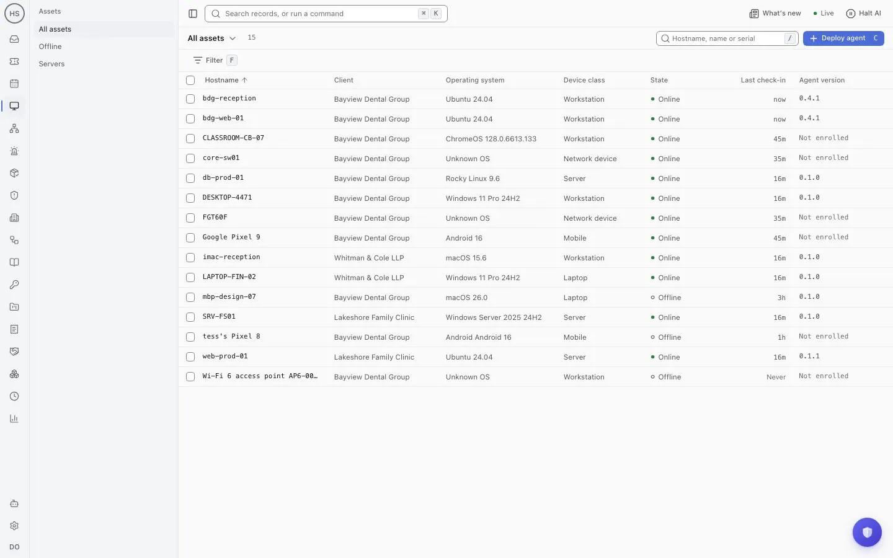
</picture>
<p><b>6. The device checks in</b><br><sub>Seconds after the command runs, the machine is on the Assets grid, online, with its system and the agent it runs.</sub></p>
</td>
</tr>
<tr>
<td width="50%" valign="top">
<picture>
  <source media="(prefers-color-scheme: dark)" srcset="docs/assets/readme/walkthrough/deploy-device-dark.webp">
  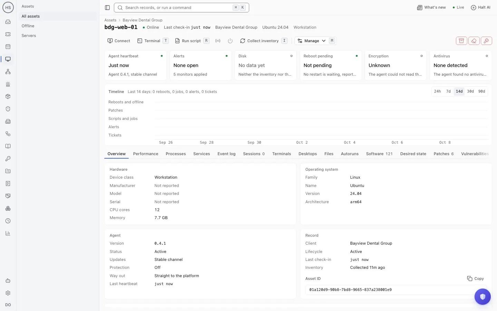
</picture>
<p><b>7. Its Device 360 is live</b><br><sub>The new server reports its health, inventory and timeline at once, and every action on it is a signed job on its ladder.</sub></p>
</td>
</tr>
</table>

<p align="right"><sub><a href="#every-capability-step-by-step">Back to the walkthroughs</a></sub></p>

### 3. Device 360

Whether a machine is healthy in one screen, and every tool a technician reaches for on a call, each a signed job that only reads unless asked otherwise.

<table>
<tr>
<td width="50%" valign="top">
<picture>
  <source media="(prefers-color-scheme: dark)" srcset="docs/assets/readme/walkthrough/device-overview-dark.webp">
  
</picture>
<p><b>1. Read a machine in one screen</b><br><sub>Who is connected to it now, what the policy asks before a terminal or desktop, the health strip, and 14 days of reboots, patches, jobs, alerts and tickets in lanes.</sub></p>
</td>
<td width="50%" valign="top">
<picture>
  <source media="(prefers-color-scheme: dark)" srcset="docs/assets/readme/walkthrough/device-performance-dark.webp">
  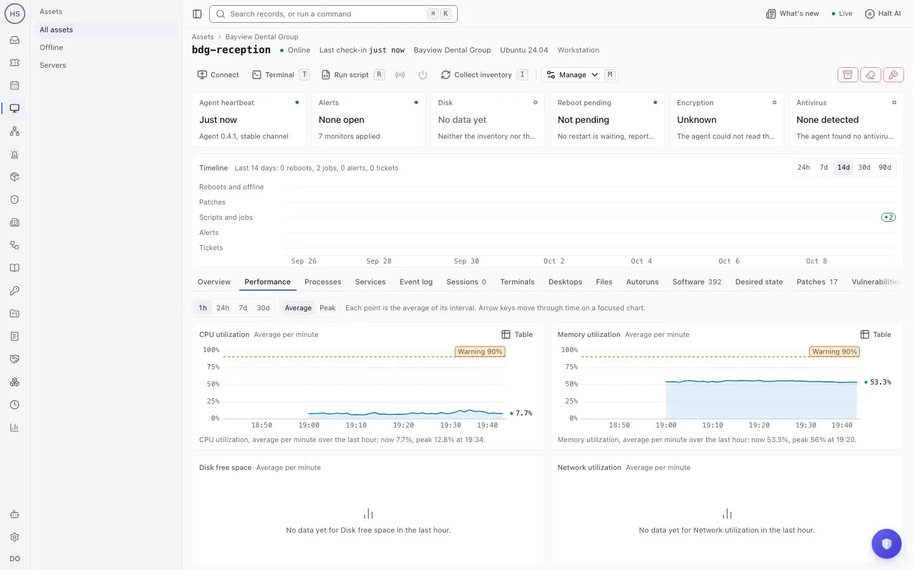
</picture>
<p><b>2. Its performance over time</b><br><sub>CPU, memory, disks and network over any range, with older days read from the averages the platform keeps.</sub></p>
</td>
</tr>
<tr>
<td width="50%" valign="top">
<picture>
  <source media="(prefers-color-scheme: dark)" srcset="docs/assets/readme/walkthrough/device-processes-dark.webp">
  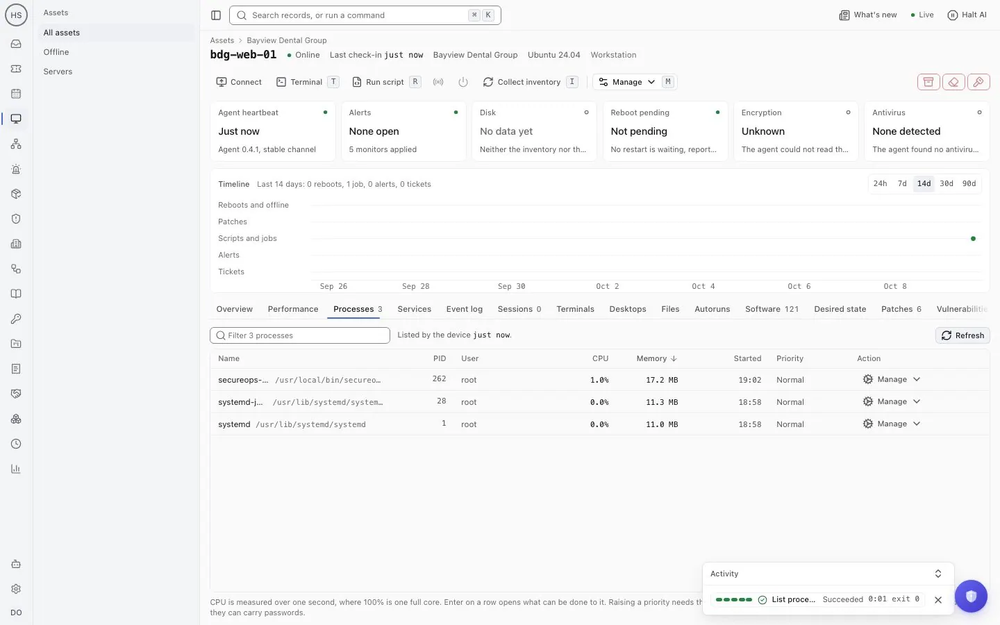
</picture>
<p><b>3. What it is running</b><br><sub>The device lists its processes when asked, the biggest users of memory first, and a process is ended or reprioritised as a signed job.</sub></p>
</td>
<td width="50%" valign="top">
<picture>
  <source media="(prefers-color-scheme: dark)" srcset="docs/assets/readme/walkthrough/device-services-dark.webp">
  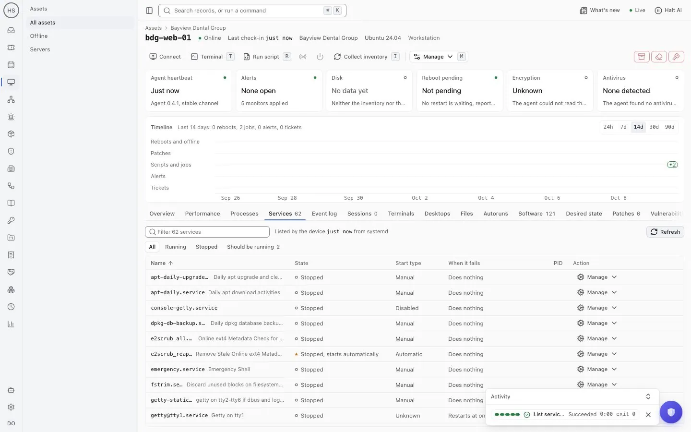
</picture>
<p><b>4. Its services</b><br><sub>Every service with its state and start type, those that should be running but are not called out, each started, stopped, restarted or reconfigured from here.</sub></p>
</td>
</tr>
<tr>
<td width="50%" valign="top">
<picture>
  <source media="(prefers-color-scheme: dark)" srcset="docs/assets/readme/walkthrough/device-eventlog-dark.webp">
  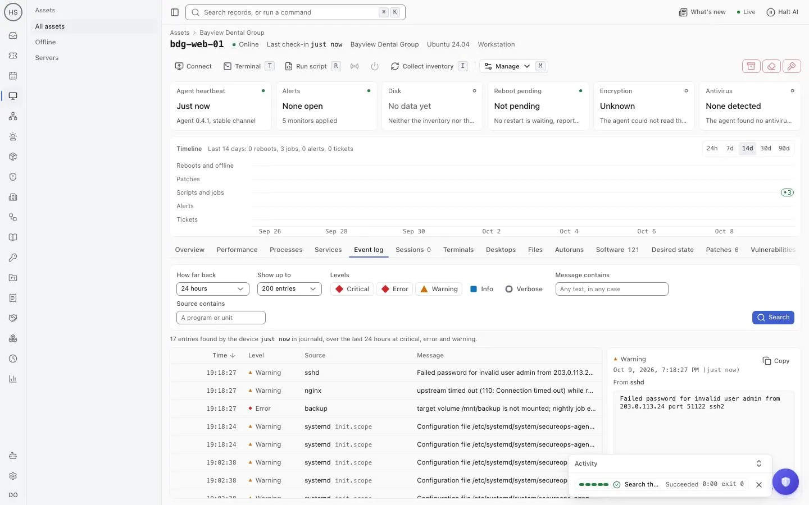
</picture>
<p><b>5. Search its log</b><br><sub>journald, the macOS unified log or the Windows event log, searched on the device by level, source and text, with secrets masked before anything leaves it.</sub></p>
</td>
<td width="50%" valign="top">
<picture>
  <source media="(prefers-color-scheme: dark)" srcset="docs/assets/readme/walkthrough/device-sessions-dark.webp">
  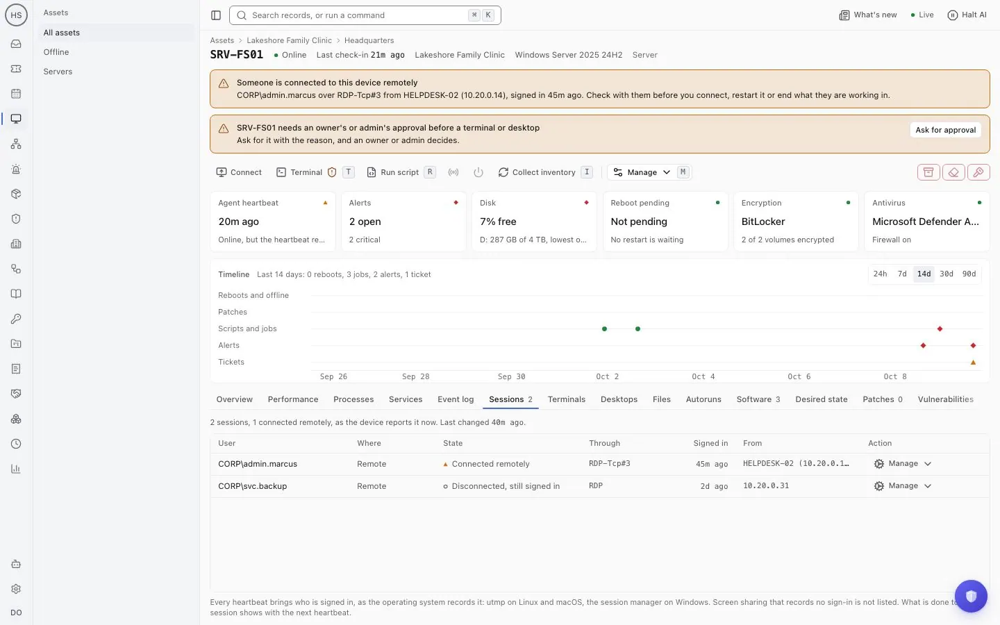
</picture>
<p><b>6. Who is signed in</b><br><sub>Every session at the console, in a terminal or remote, from where and since when, with a message, log off or disconnect a click away.</sub></p>
</td>
</tr>
<tr>
<td width="50%" valign="top">
<picture>
  <source media="(prefers-color-scheme: dark)" srcset="docs/assets/readme/walkthrough/device-autoruns-dark.webp">
  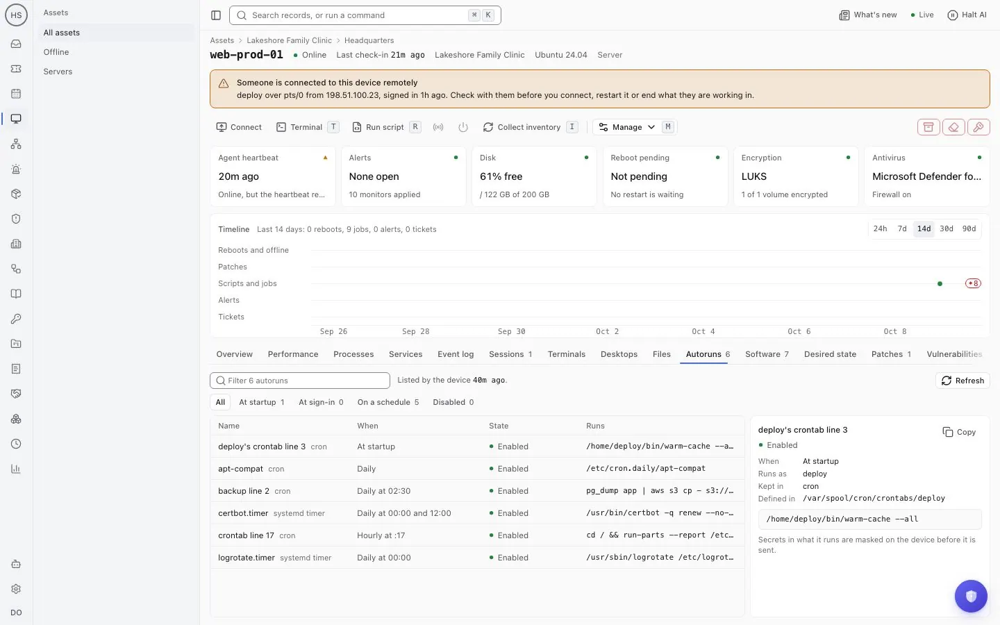
</picture>
<p><b>7. What runs by itself</b><br><sub>Cron, systemd timers, launchd, Task Scheduler, Run keys and Startup folders in one list, each schedule in words and a password in a command masked on the device.</sub></p>
</td>
<td width="50%" valign="top">
<picture>
  <source media="(prefers-color-scheme: dark)" srcset="docs/assets/readme/walkthrough/device-software-dark.webp">
  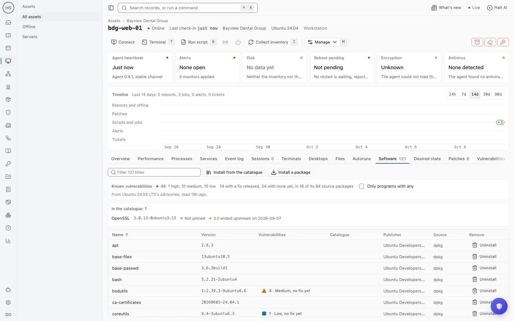
</picture>
<p><b>8. What is installed, and what is vulnerable</b><br><sub>The inventory from the device's own package manager, each package with its known vulnerabilities from its distribution's advisories.</sub></p>
</td>
</tr>
<tr>
<td width="50%" valign="top">
<picture>
  <source media="(prefers-color-scheme: dark)" srcset="docs/assets/readme/walkthrough/device-install-dark.webp">
  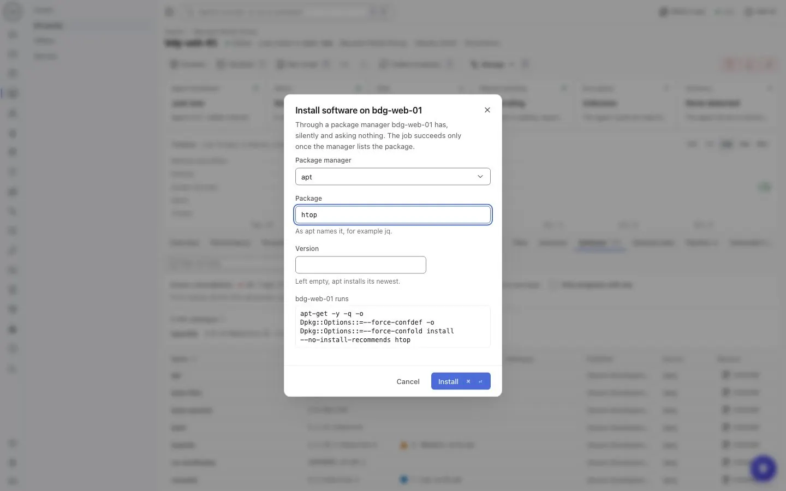
</picture>
<p><b>9. Install a package</b><br><sub>Through a manager the device has (apt here), with the exact command it will run shown before it is asked for.</sub></p>
</td>
<td width="50%" valign="top">
<picture>
  <source media="(prefers-color-scheme: dark)" srcset="docs/assets/readme/walkthrough/device-checks-dark.webp">
  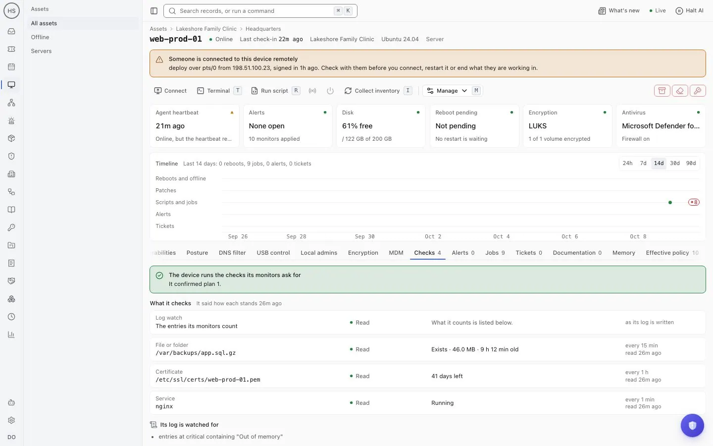
</picture>
<p><b>10. The checks it runs for its monitors</b><br><sub>Files, services, certificates, its log and script results, read by the device on a plan the platform signs, with what each last read.</sub></p>
</td>
</tr>
</table>

<p align="right"><sub><a href="#every-capability-step-by-step">Back to the walkthroughs</a></sub></p>

### 4. Remote access

Its own desktop, terminal and file transfer over the agent's connection: no remote-desktop licence, no open port, every session recorded on the server.

<table>
<tr>
<td width="50%" valign="top">
<picture>
  <source media="(prefers-color-scheme: dark)" srcset="docs/assets/readme/walkthrough/remote-preflight-dark.webp">
  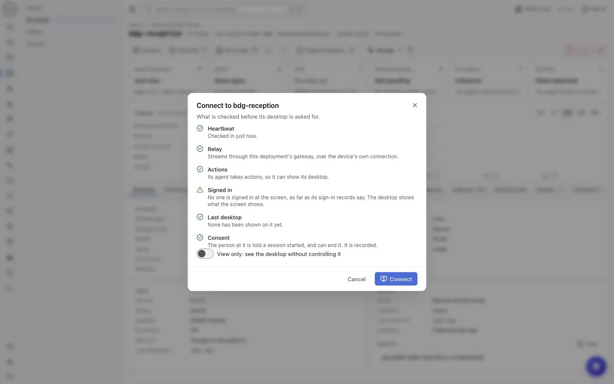
</picture>
<p><b>1. Check before connecting</b><br><sub>The heartbeat, the relay, what the agent may do, who is at the screen, how the last desktop ended and what the person there is told, before the desktop is asked for.</sub></p>
</td>
<td width="50%" valign="top">
<picture>
  <source media="(prefers-color-scheme: dark)" srcset="docs/assets/readme/walkthrough/remote-desktop-dark.webp">
  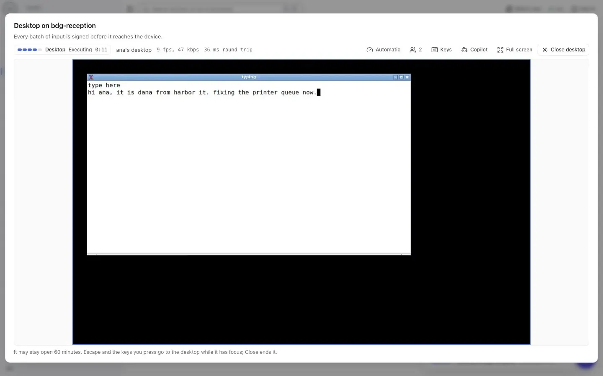
</picture>
<p><b>2. Drive the desktop</b><br><sub>VP9 from the device, decoded in the browser, with the frame rate, bitrate and round trip shown; keystrokes go back signed, and the person at the screen can end it.</sub></p>
</td>
</tr>
<tr>
<td width="50%" valign="top">
<picture>
  <source media="(prefers-color-scheme: dark)" srcset="docs/assets/readme/walkthrough/remote-terminal-dark.webp">
  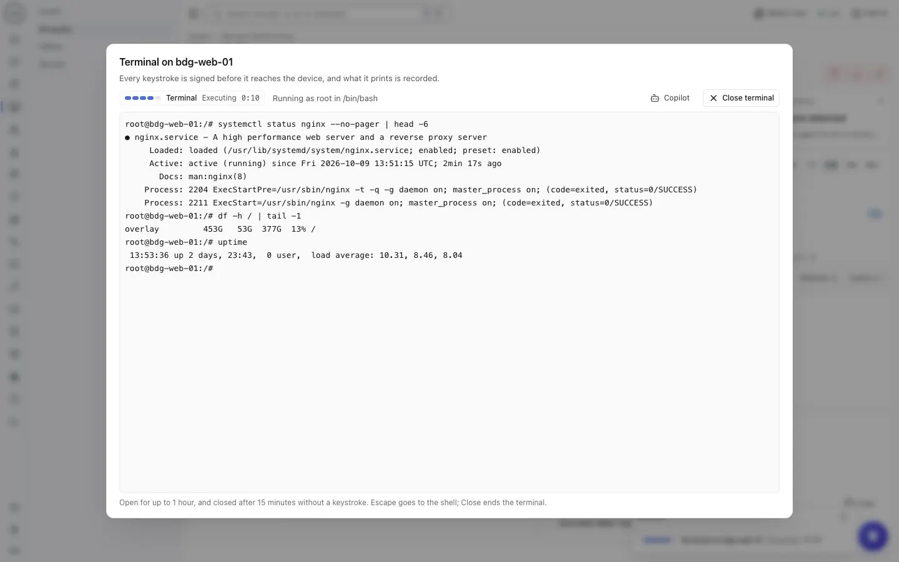
</picture>
<p><b>3. Open a terminal</b><br><sub>A shell on the device in a panel, every keystroke signed by the platform and checked by the agent, what it prints recorded on the server.</sub></p>
</td>
<td width="50%" valign="top">
<picture>
  <source media="(prefers-color-scheme: dark)" srcset="docs/assets/readme/walkthrough/remote-recordings-dark.webp">
  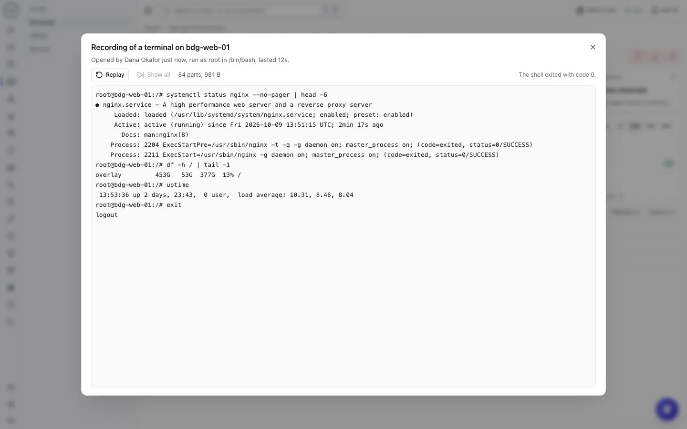
</picture>
<p><b>4. Every terminal kept and played back</b><br><sub>Who opened each terminal, as whom, for how long and how it ended, with its recording played back whole or as it happened, for an admin or its opener.</sub></p>
</td>
</tr>
<tr>
<td width="50%" valign="top">
<picture>
  <source media="(prefers-color-scheme: dark)" srcset="docs/assets/readme/walkthrough/remote-files-dark.webp">
  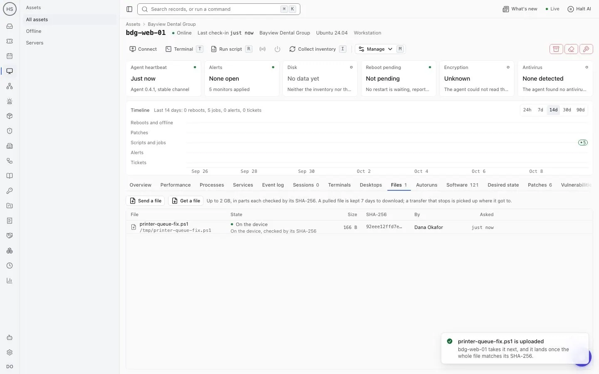
</picture>
<p><b>5. Move a file</b><br><sub>Sent from the browser in parts, each sealed and checked by its SHA-256, landing on the device whole or picked up where it stopped.</sub></p>
</td>
<td width="50%" valign="top">
<picture>
  <source media="(prefers-color-scheme: dark)" srcset="docs/assets/readme/walkthrough/remote-desktops-dark.webp">
  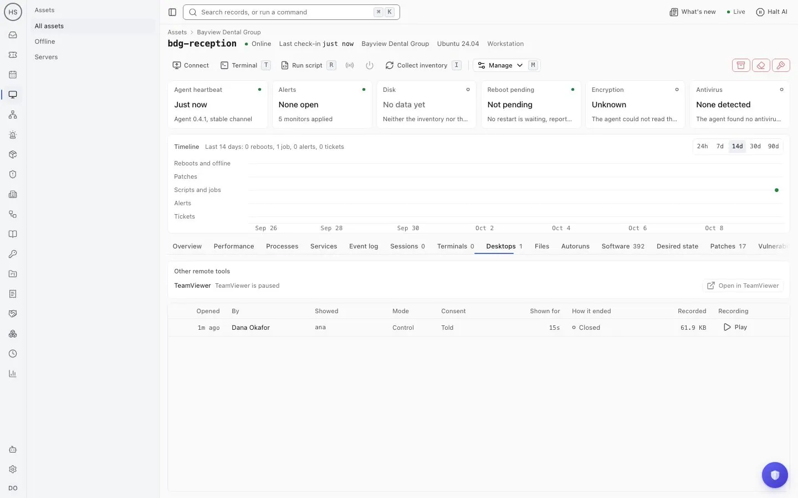
</picture>
<p><b>6. Every desktop recorded</b><br><sub>Each desktop with who opened it, whose desktop it showed, its consent and how it ended, played back part by part at 1x, 2x or 4x.</sub></p>
</td>
</tr>
</table>

<p align="right"><sub><a href="#every-capability-step-by-step">Back to the walkthroughs</a></sub></p>

### 5. Scripts and jobs

A signed script registry where approval is kept apart from authoring, run on a device with typed parameters and followed on its job ladder to its exit code.

<table>
<tr>
<td width="50%" valign="top">
<picture>
  <source media="(prefers-color-scheme: dark)" srcset="docs/assets/readme/walkthrough/scripts-library-dark.webp">
  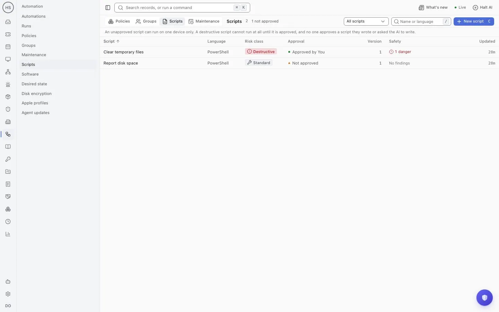
</picture>
<p><b>1. The script library</b><br><sub>Every script with its language, risk class and the version approved to run, and who approved it.</sub></p>
</td>
<td width="50%" valign="top">
<picture>
  <source media="(prefers-color-scheme: dark)" srcset="docs/assets/readme/walkthrough/scripts-script-dark.webp">
  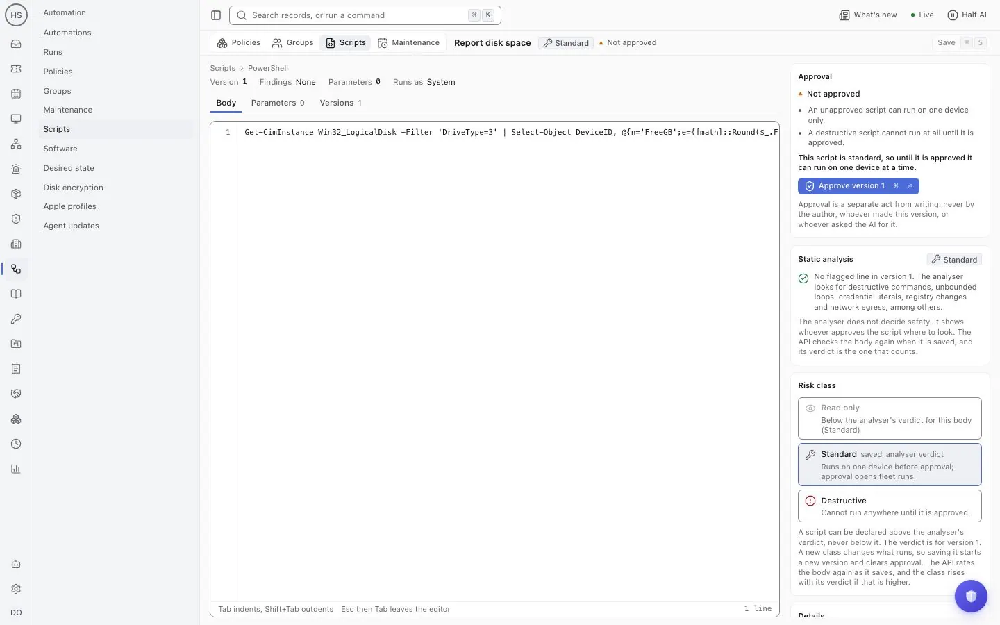
</picture>
<p><b>2. A script, versioned and approved</b><br><sub>Its body with a content hash, its typed parameters, every version with its diff, and approval that its author can never give.</sub></p>
</td>
</tr>
<tr>
<td width="50%" valign="top">
<picture>
  <source media="(prefers-color-scheme: dark)" srcset="docs/assets/readme/walkthrough/scripts-run-dark.webp">
  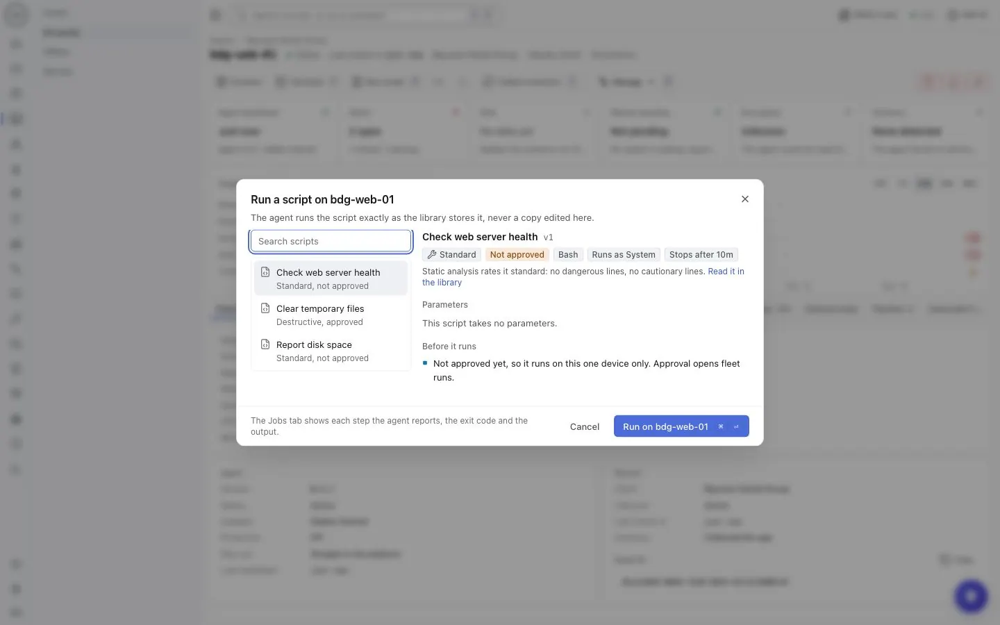
</picture>
<p><b>3. Run it on a device</b><br><sub>The parameters as a checked form, run as the system or the signed-in user, and the device told exactly what was approved.</sub></p>
</td>
<td width="50%" valign="top">
<picture>
  <source media="(prefers-color-scheme: dark)" srcset="docs/assets/readme/walkthrough/scripts-result-dark.webp">
  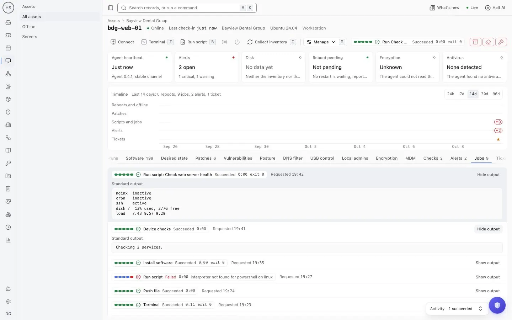
</picture>
<p><b>4. Follow it to its exit code</b><br><sub>Queued, sent, acknowledged, executing, then succeeded or failed with the code the device returned, and what it printed.</sub></p>
</td>
</tr>
</table>

<p align="right"><sub><a href="#every-capability-step-by-step">Back to the walkthroughs</a></sub></p>

### 6. Policies, monitors and alerts

One policy tree from the workspace down to a device, monitors on anything a device reads, and alerts grouped by their root cause.

<table>
<tr>
<td width="50%" valign="top">
<picture>
  <source media="(prefers-color-scheme: dark)" srcset="docs/assets/readme/walkthrough/mon-policies-dark.webp">
  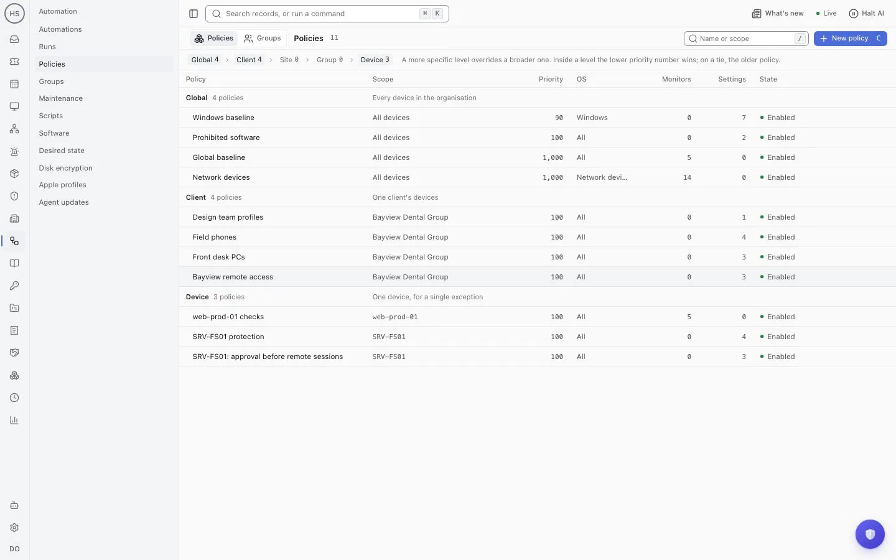
</picture>
<p><b>1. One policy tree</b><br><sub>Global, client, site, group and device policies with their priority, each setting resolved one at a time down to the device.</sub></p>
</td>
<td width="50%" valign="top">
<picture>
  <source media="(prefers-color-scheme: dark)" srcset="docs/assets/readme/walkthrough/mon-policy-dark.webp">
  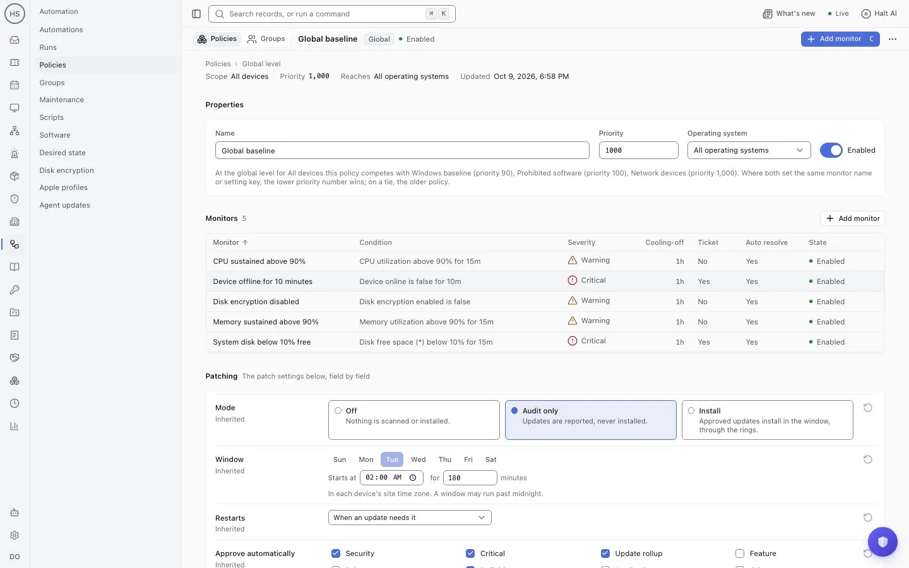
</picture>
<p><b>2. A policy and its monitors</b><br><sub>What it sets and the monitors it holds, each with its condition, duration, cooling-off and severity, and a dry run before any change.</sub></p>
</td>
</tr>
<tr>
<td width="50%" valign="top">
<picture>
  <source media="(prefers-color-scheme: dark)" srcset="docs/assets/readme/walkthrough/mon-monitor-dark.webp">
  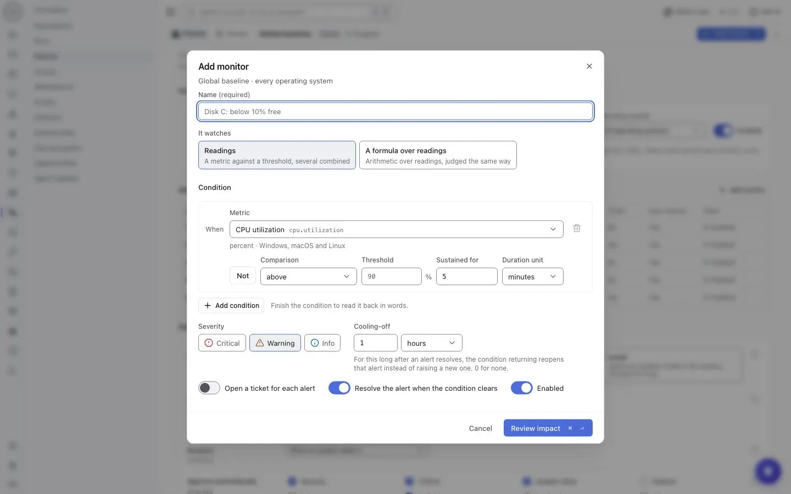
</picture>
<p><b>3. Add a monitor</b><br><sub>A reading or a formula over readings, its comparison, how it is judged and for how long, on any metric of the catalogue or anything the device reads by itself.</sub></p>
</td>
<td width="50%" valign="top">
<picture>
  <source media="(prefers-color-scheme: dark)" srcset="docs/assets/readme/walkthrough/mon-alerts-dark.webp">
  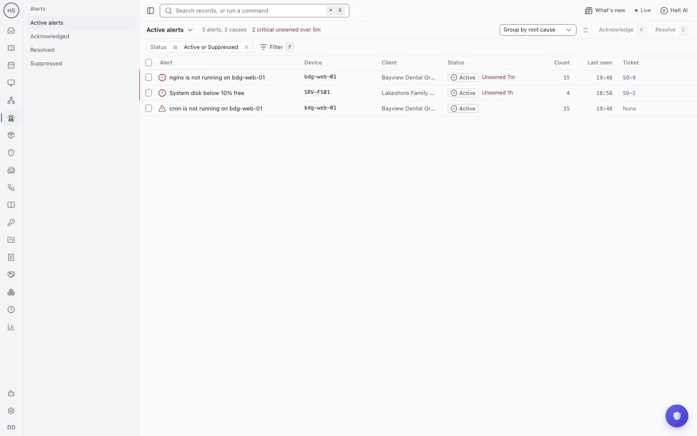
</picture>
<p><b>4. Alerts grouped by their cause</b><br><sub>Correlated alerts fold into one row with their count and sparkline, suppressed children shown rather than hidden, the unowned critical ones edged in red.</sub></p>
</td>
</tr>
<tr>
<td width="50%" valign="top">
<picture>
  <source media="(prefers-color-scheme: dark)" srcset="docs/assets/readme/walkthrough/mon-alert-dark.webp">
  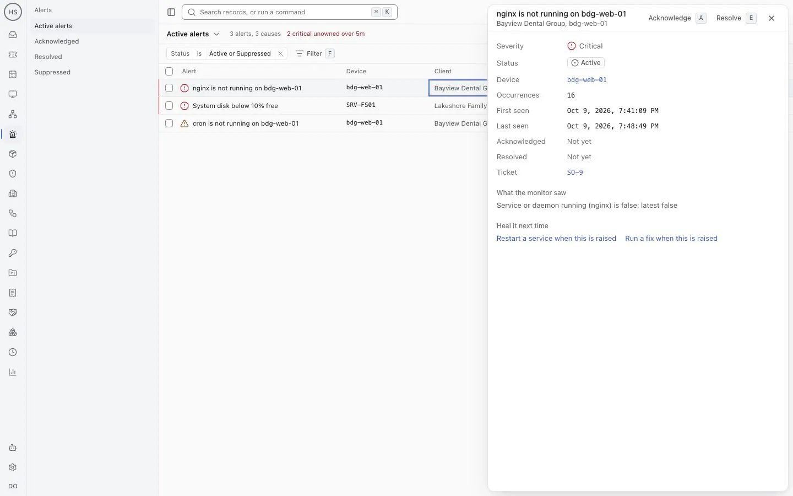
</picture>
<p><b>5. Peek at an alert</b><br><sub>What fired, on which device, with its readings, its ticket, and whether a self-healing automation should take it next time.</sub></p>
</td>
<td width="50%" valign="top">
<picture>
  <source media="(prefers-color-scheme: dark)" srcset="docs/assets/readme/walkthrough/mon-maintenance-dark.webp">
  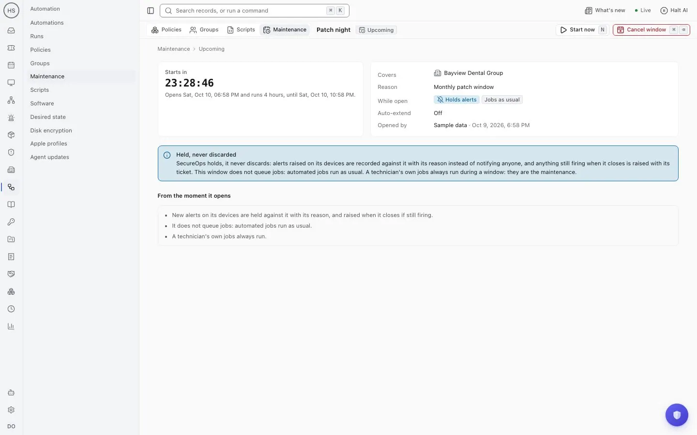
</picture>
<p><b>6. Maintenance that loses nothing</b><br><sub>A window over clients, sites or devices that holds alerts and jobs as suppressed with their reason, and runs what waited once it closes.</sub></p>
</td>
</tr>
<tr>
<td width="50%" valign="top">
<picture>
  <source media="(prefers-color-scheme: dark)" srcset="docs/assets/readme/walkthrough/mon-groups-dark.webp">
  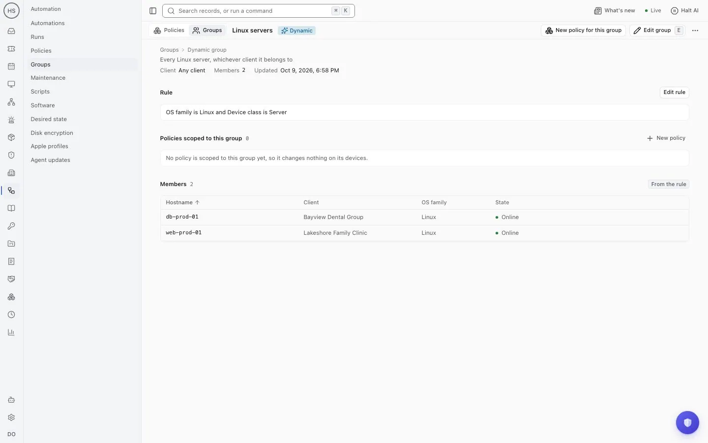
</picture>
<p><b>7. Static and dynamic groups</b><br><sub>Groups of devices by hand or by a rule over their facts, with the members a rule takes in right now.</sub></p>
</td>
</tr>
</table>

<p align="right"><sub><a href="#every-capability-step-by-step">Back to the walkthroughs</a></sub></p>

### 7. Automation and desired state

Triggers, branches, loops and approvals over every platform action, self-healing presets that act, verify and escalate, and devices held to how they should be.

<table>
<tr>
<td width="50%" valign="top">
<picture>
  <source media="(prefers-color-scheme: dark)" srcset="docs/assets/readme/walkthrough/auto-list-dark.webp">
  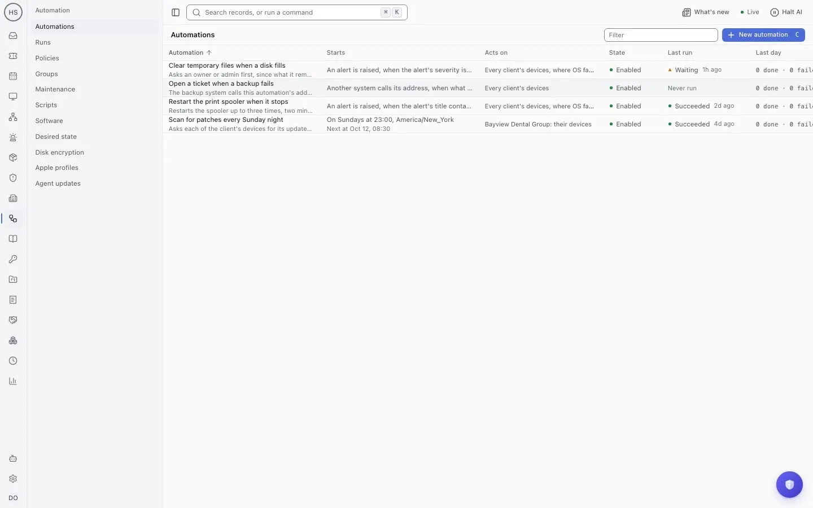
</picture>
<p><b>1. Automations</b><br><sub>Each automation with what starts it, what it acts on, how its last run went and its runs over the last day.</sub></p>
</td>
<td width="50%" valign="top">
<picture>
  <source media="(prefers-color-scheme: dark)" srcset="docs/assets/readme/walkthrough/auto-gallery-dark.webp">
  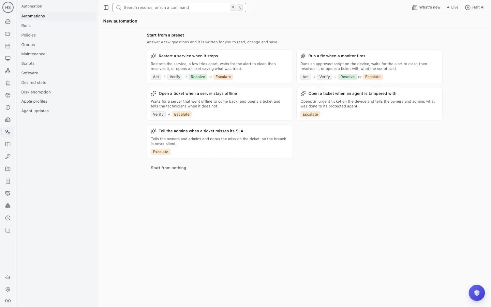
</picture>
<p><b>2. Start from a self-healing preset</b><br><sub>Act, verify, then resolve or escalate: restart a stopped service, run a fix when a monitor fires, open a ticket when a server stays down.</sub></p>
</td>
</tr>
<tr>
<td width="50%" valign="top">
<picture>
  <source media="(prefers-color-scheme: dark)" srcset="docs/assets/readme/walkthrough/auto-editor-dark.webp">
  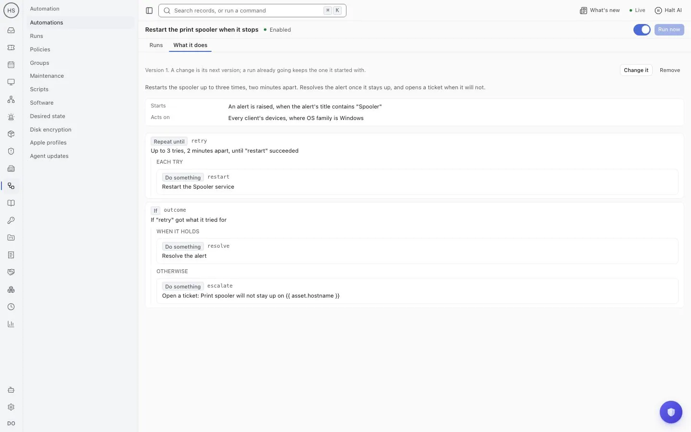
</picture>
<p><b>3. Edit its steps</b><br><sub>A tree of actions, branches, loops, waits and approvals, checked by the platform as it is written, every change a new version.</sub></p>
</td>
<td width="50%" valign="top">
<picture>
  <source media="(prefers-color-scheme: dark)" srcset="docs/assets/readme/walkthrough/auto-runs-dark.webp">
  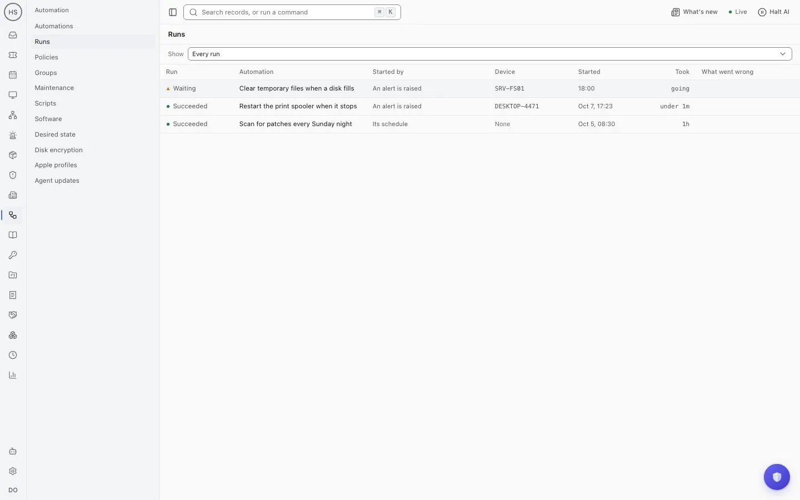
</picture>
<p><b>4. Every run</b><br><sub>What each run did, how long it took, and the ones waiting for a person.</sub></p>
</td>
</tr>
<tr>
<td width="50%" valign="top">
<picture>
  <source media="(prefers-color-scheme: dark)" srcset="docs/assets/readme/walkthrough/auto-run-dark.webp">
  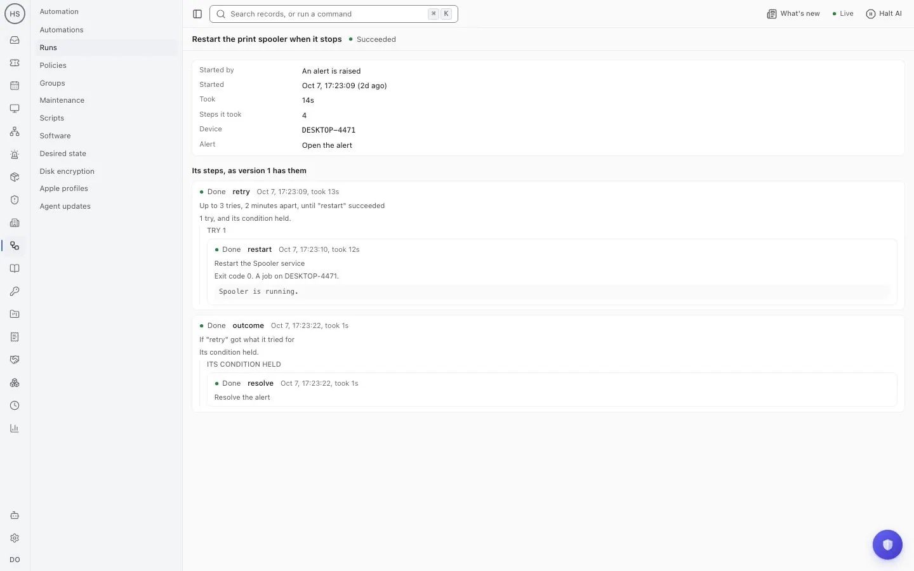
</picture>
<p><b>5. A run laid over its tree</b><br><sub>Each step with how it ended, the job it asked for and the device it acted on, replayable step by step.</sub></p>
</td>
<td width="50%" valign="top">
<picture>
  <source media="(prefers-color-scheme: dark)" srcset="docs/assets/readme/walkthrough/auto-desired-dark.webp">
  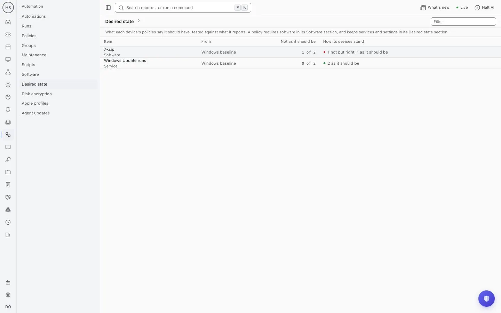
</picture>
<p><b>6. Desired state across the fleet</b><br><sub>Software kept installed at its pin, services kept running, and any setting kept with a test and a fix, with how every device stands.</sub></p>
</td>
</tr>
<tr>
<td width="50%" valign="top">
<picture>
  <source media="(prefers-color-scheme: dark)" srcset="docs/assets/readme/walkthrough/auto-desired-item-dark.webp">
  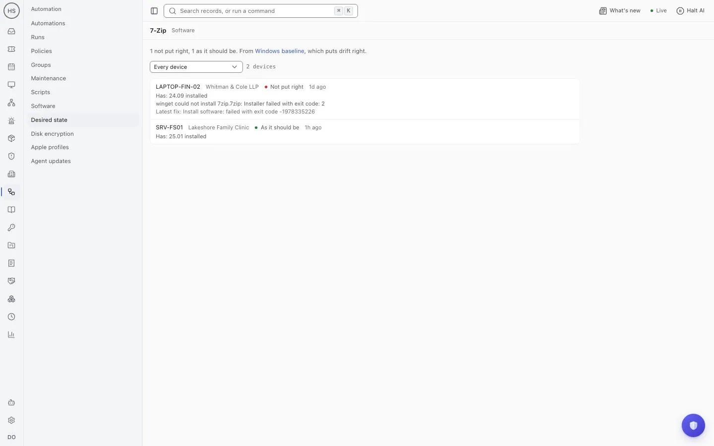
</picture>
<p><b>7. One item, device by device</b><br><sub>What it asks, what each device has, the fix it was sent and whether the device read it as right afterwards.</sub></p>
</td>
</tr>
</table>

<p align="right"><sub><a href="#every-capability-step-by-step">Back to the walkthroughs</a></sub></p>

### 8. Patching

Windows Update, macOS softwareupdate, apt and dnf in one update model, released ring by ring and counted as installed only when the next scan proves it.

<table>
<tr>
<td width="50%" valign="top">
<picture>
  <source media="(prefers-color-scheme: dark)" srcset="docs/assets/readme/walkthrough/patch-updates-dark.webp">
  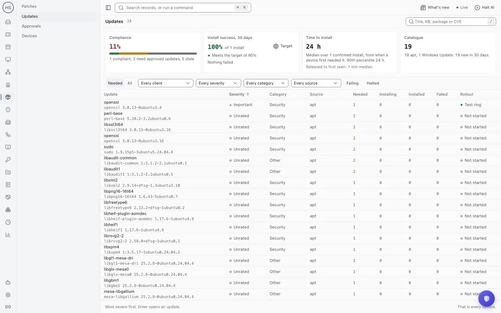
</picture>
<p><b>1. What the fleet needs</b><br><sub>Every update most severe first, under compliance, install success against the target, time to install and the catalogue.</sub></p>
</td>
<td width="50%" valign="top">
<picture>
  <source media="(prefers-color-scheme: dark)" srcset="docs/assets/readme/walkthrough/patch-update-dark.webp">
  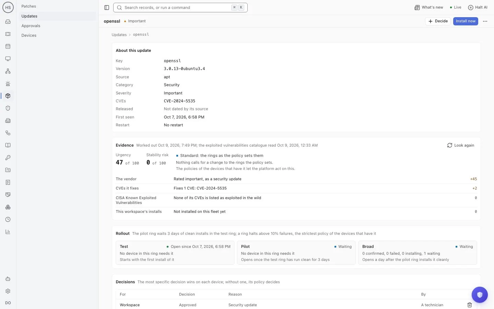
</picture>
<p><b>2. One update, ring by ring</b><br><sub>Its rollout by ring with the gates that apply, its Evidence Card scored from advisories, CISA KEV and the fleet's own installs, and every device that reported it.</sub></p>
</td>
</tr>
<tr>
<td width="50%" valign="top">
<picture>
  <source media="(prefers-color-scheme: dark)" srcset="docs/assets/readme/walkthrough/patch-queue-dark.webp">
  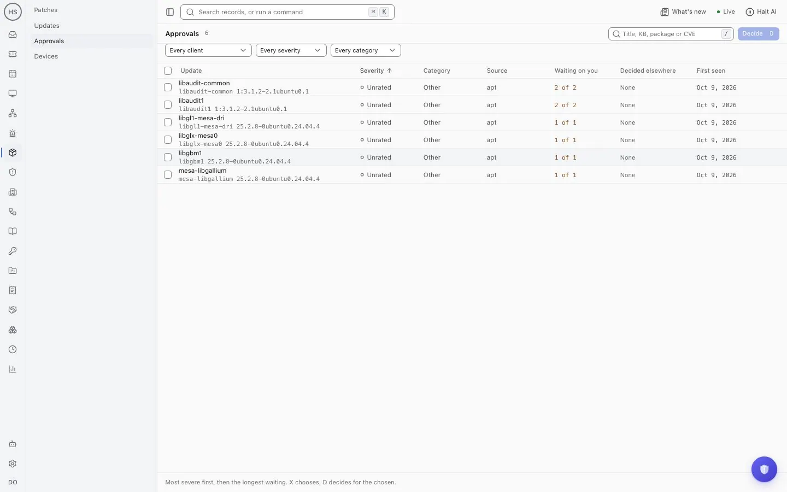
</picture>
<p><b>3. Approve in one decision</b><br><sub>The updates waiting for a person, decided for the workspace or a client at once.</sub></p>
</td>
<td width="50%" valign="top">
<picture>
  <source media="(prefers-color-scheme: dark)" srcset="docs/assets/readme/walkthrough/patch-devices-dark.webp">
  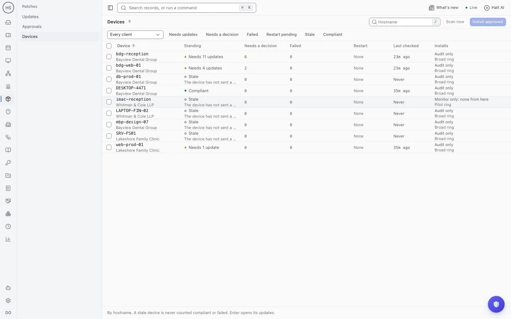
</picture>
<p><b>4. Each device's standing</b><br><sub>Compliant, needs updates, or stale with the reason, never counted compliant on a scan that checked nothing.</sub></p>
</td>
</tr>
<tr>
<td width="50%" valign="top">
<picture>
  <source media="(prefers-color-scheme: dark)" srcset="docs/assets/readme/walkthrough/patch-device-dark.webp">
  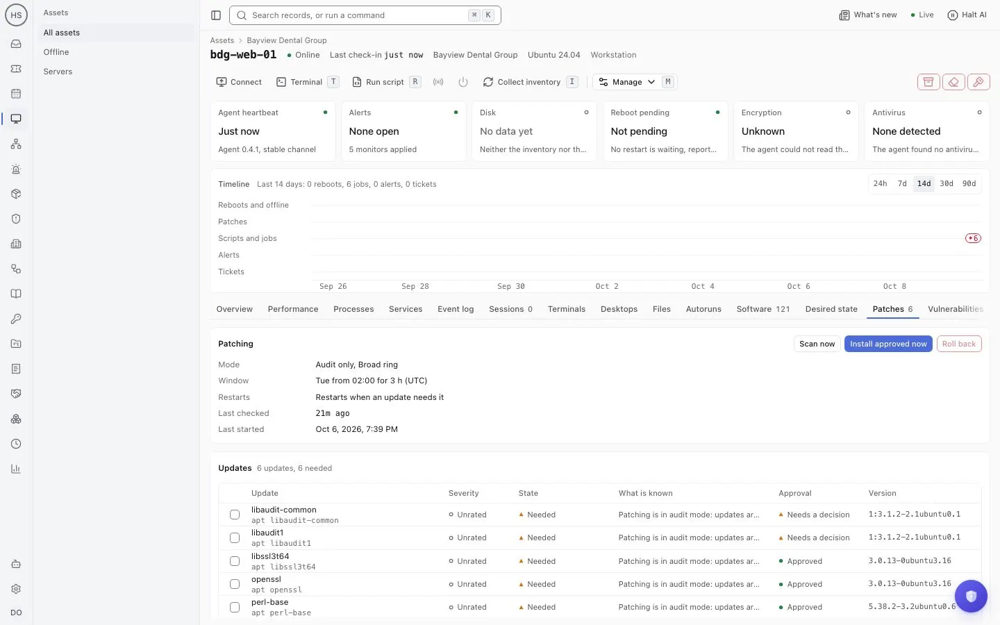
</picture>
<p><b>5. Patches on Device 360</b><br><sub>The last real check, each update with its evidence or typed failure, rollback where the system allows, and its history.</sub></p>
</td>
<td width="50%" valign="top">
<picture>
  <source media="(prefers-color-scheme: dark)" srcset="docs/assets/readme/walkthrough/patch-policy-dark.webp">
  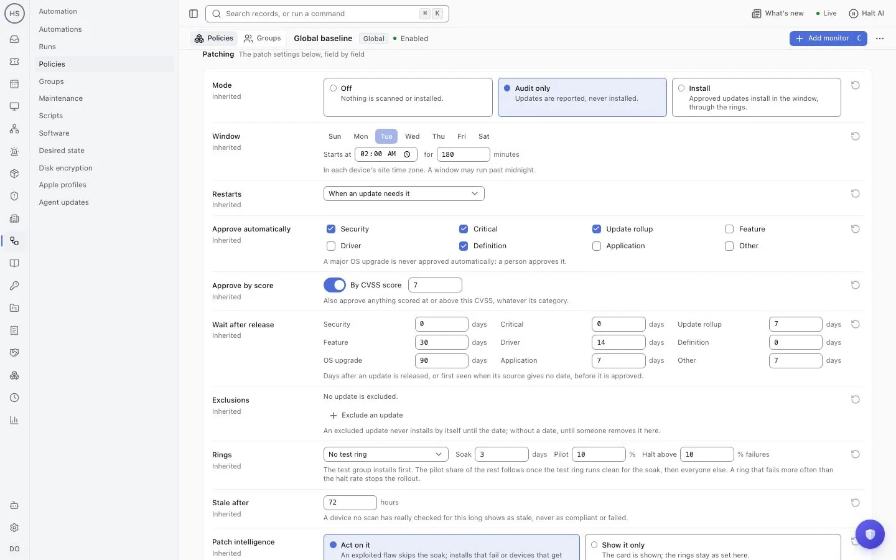
</picture>
<p><b>6. The patch policy</b><br><sub>Mode, window, restarts, automatic approval by score, waits per category, exclusions with end dates, rings and when a device counts as stale.</sub></p>
</td>
</tr>
</table>

<p align="right"><sub><a href="#every-capability-step-by-step">Back to the walkthroughs</a></sub></p>

### 9. Software

A versioned catalogue over winget, Chocolatey, Homebrew, apt and dnf, with pins, rollback, end-of-life flags, a blocklist and packages of your own up to 4 GiB.

<table>
<tr>
<td width="50%" valign="top">
<picture>
  <source media="(prefers-color-scheme: dark)" srcset="docs/assets/readme/walkthrough/sw-catalogue-dark.webp">
  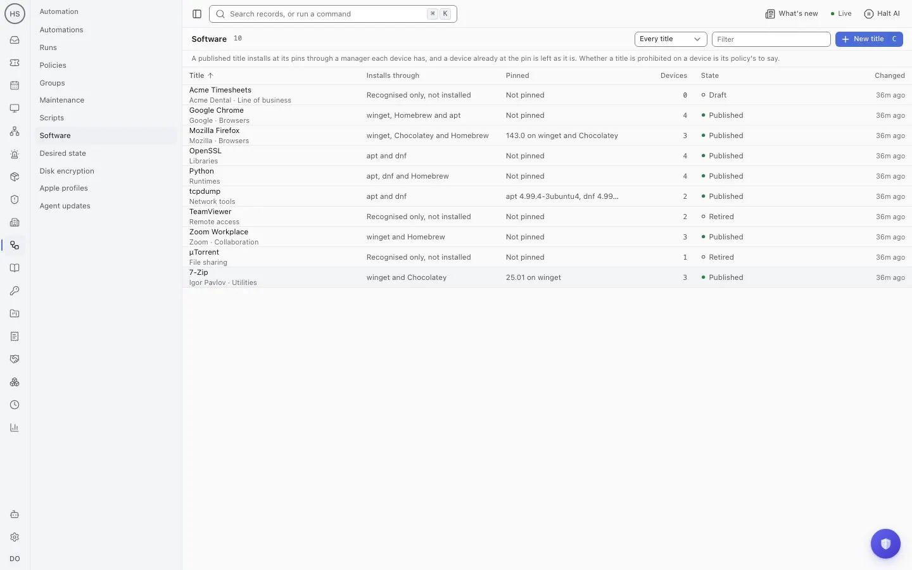
</picture>
<p><b>1. The catalogue</b><br><sub>Each title with the version pinned, the devices that have it and how many are behind, end of life flagged.</sub></p>
</td>
<td width="50%" valign="top">
<picture>
  <source media="(prefers-color-scheme: dark)" srcset="docs/assets/readme/walkthrough/sw-title-dark.webp">
  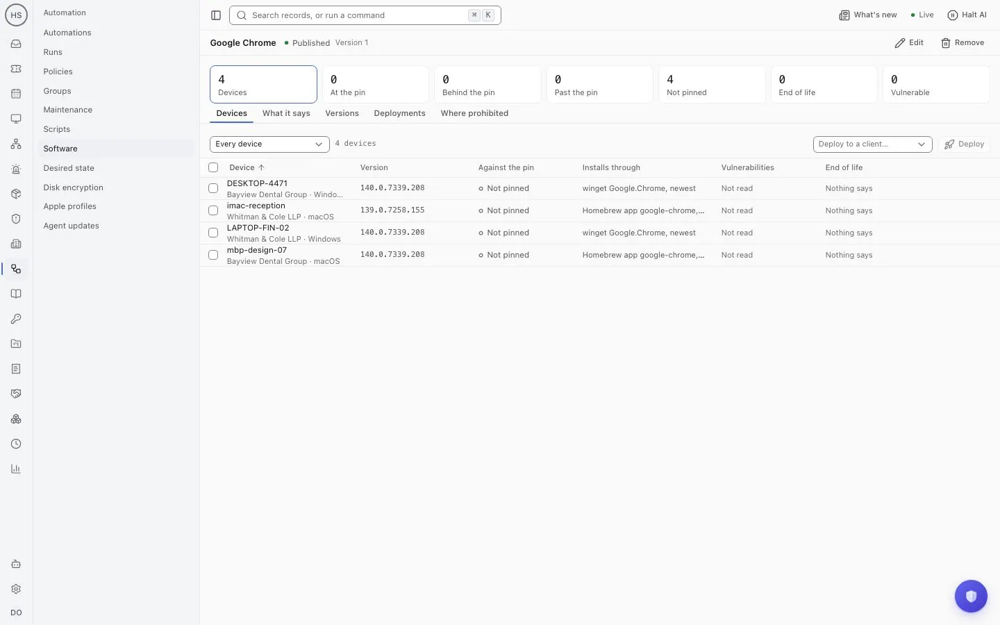
</picture>
<p><b>2. A title and its installers</b><br><sub>How each manager installs it, how a device that has it is recognised, its versions and where it is prohibited.</sub></p>
</td>
</tr>
<tr>
<td width="50%" valign="top">
<picture>
  <source media="(prefers-color-scheme: dark)" srcset="docs/assets/readme/walkthrough/sw-installed-dark.webp">
  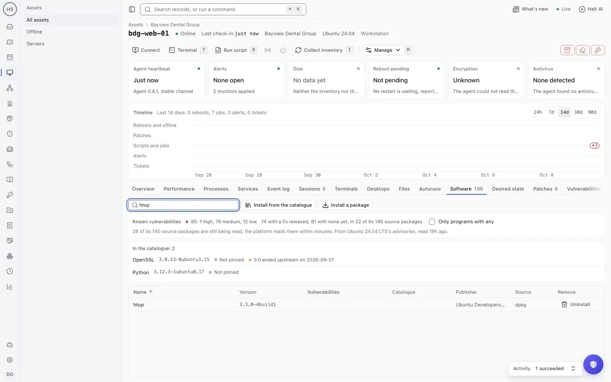
</picture>
<p><b>3. Installed, on the device's word</b><br><sub>The install runs as a signed job, and the program is on the list only once the device's next inventory says so.</sub></p>
</td>
</tr>
</table>

<p align="right"><sub><a href="#every-capability-step-by-step">Back to the walkthroughs</a></sub></p>

### 10. Agent updates, protection and encryption

Agents updated only to builds the release signed, ring by ring; protected against removal; and every disk's recovery key escrowed and rotated after each read.

<table>
<tr>
<td width="50%" valign="top">
<picture>
  <source media="(prefers-color-scheme: dark)" srcset="docs/assets/readme/walkthrough/agent-updates-dark.webp">
  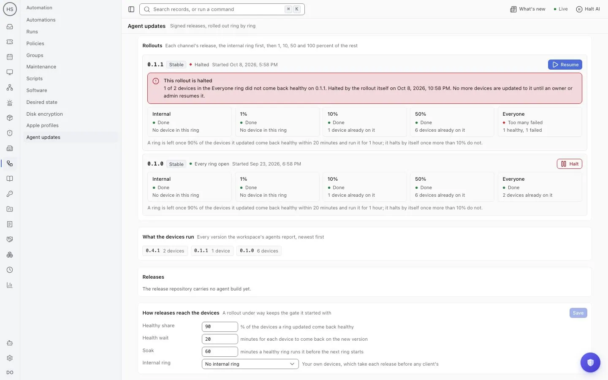
</picture>
<p><b>1. Agent releases, ring by ring</b><br><sub>Each channel's release and how the devices following it stand, every rollout by ring with its gate, and what the fleet runs.</sub></p>
</td>
<td width="50%" valign="top">
<picture>
  <source media="(prefers-color-scheme: dark)" srcset="docs/assets/readme/walkthrough/agent-protection-dark.webp">
  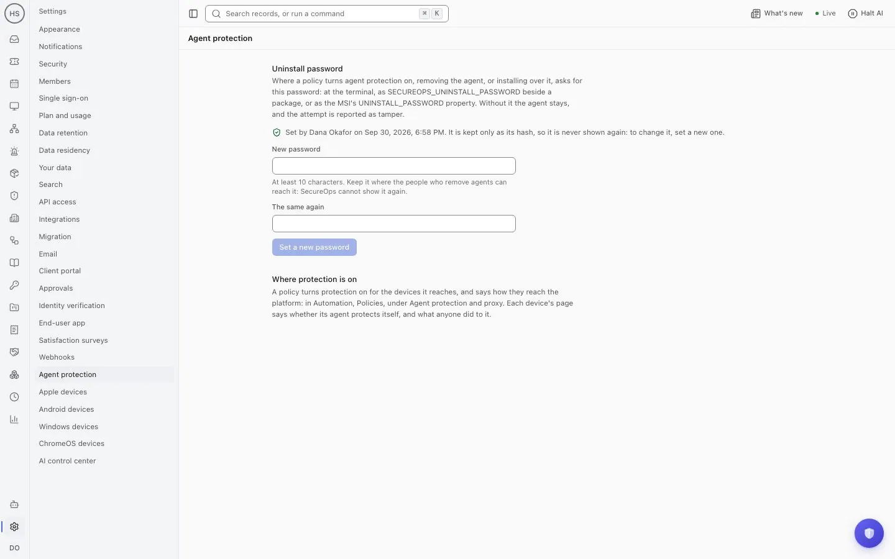
</picture>
<p><b>2. Agent protection</b><br><sub>The uninstall password, kept only as its hash, that a protected agent asks for before it is removed, with tamper raised as one alert.</sub></p>
</td>
</tr>
<tr>
<td width="50%" valign="top">
<picture>
  <source media="(prefers-color-scheme: dark)" srcset="docs/assets/readme/walkthrough/agent-encryption-dark.webp">
  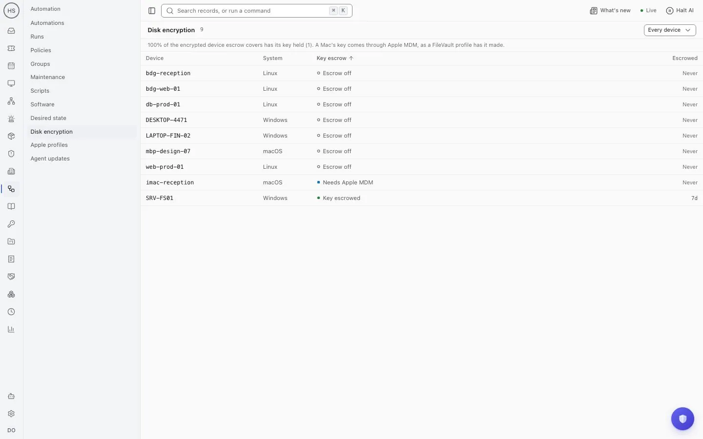
</picture>
<p><b>3. Disk encryption and key escrow</b><br><sub>BitLocker, FileVault and LUKS across the fleet: the share escrowed, every device by what needs a person, each key read only with a reason.</sub></p>
</td>
</tr>
</table>

<p align="right"><sub><a href="#every-capability-step-by-step">Back to the walkthroughs</a></sub></p>

### 11. Network monitoring

Any agent becomes a probe: SNMP v1 to v3, traps, syslog, NetFlow and sFlow, configuration backups over SSH, and a topology drawn from LLDP, CDP and ARP.

<table>
<tr>
<td width="50%" valign="top">
<picture>
  <source media="(prefers-color-scheme: dark)" srcset="docs/assets/readme/walkthrough/net-credential-dark.webp">
  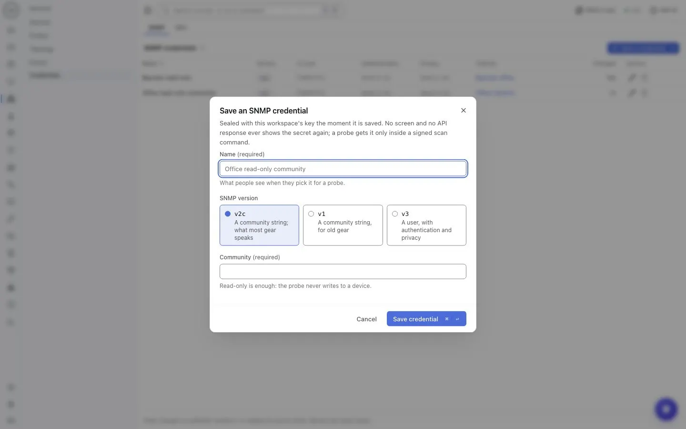
</picture>
<p><b>1. Save an SNMP credential</b><br><sub>SNMP v1, v2c or v3 (and SSH for configuration backups), write-only and sealed with the workspace's key, sent to a probe only inside its signed plan.</sub></p>
</td>
<td width="50%" valign="top">
<picture>
  <source media="(prefers-color-scheme: dark)" srcset="docs/assets/readme/walkthrough/net-probe-new-dark.webp">
  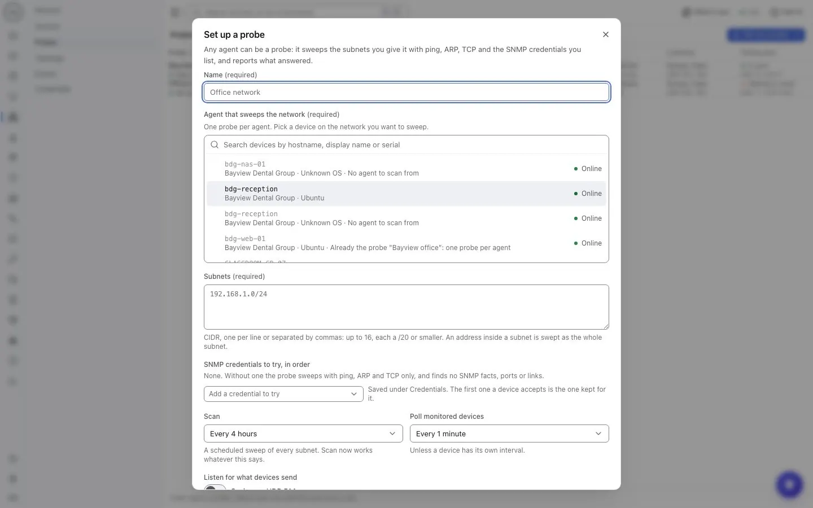
</picture>
<p><b>2. Make any agent a probe</b><br><sub>The agent on a machine at the site sweeps the subnets named with the credentials given, on a schedule, and listens for syslog and traps.</sub></p>
</td>
</tr>
<tr>
<td width="50%" valign="top">
<picture>
  <source media="(prefers-color-scheme: dark)" srcset="docs/assets/readme/walkthrough/net-probe-dark.webp">
  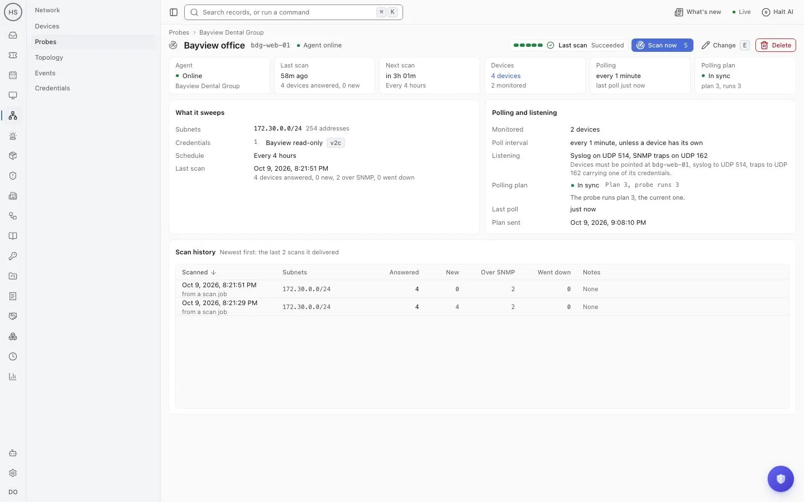
</picture>
<p><b>3. Its scans</b><br><sub>What it sweeps, what each scan found by ICMP, ARP and SNMP, and the polling plan its agent confirmed.</sub></p>
</td>
<td width="50%" valign="top">
<picture>
  <source media="(prefers-color-scheme: dark)" srcset="docs/assets/readme/walkthrough/net-devices-dark.webp">
  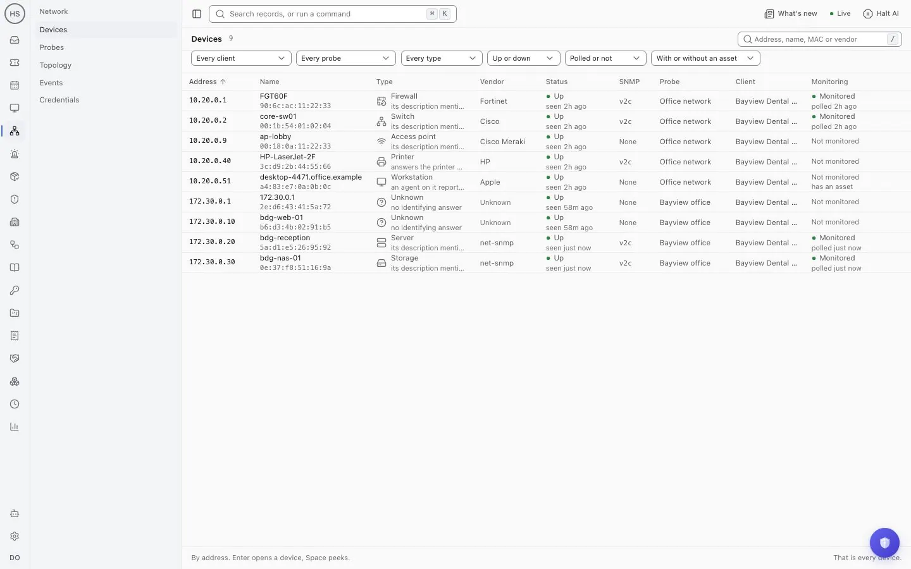
</picture>
<p><b>4. Every network device</b><br><sub>Firewalls, switches, access points, printers and the rest, with what each is, how it stands and whether it is watched.</sub></p>
</td>
</tr>
<tr>
<td width="50%" valign="top">
<picture>
  <source media="(prefers-color-scheme: dark)" srcset="docs/assets/readme/walkthrough/net-device-dark.webp">
  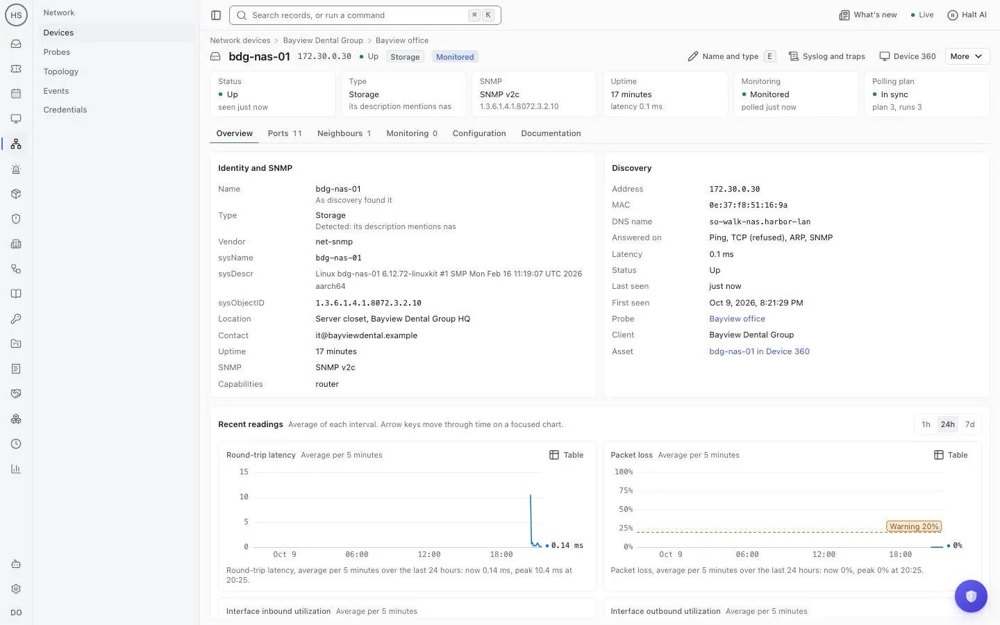
</picture>
<p><b>5. A device under monitoring</b><br><sub>Reachability, latency and loss, uptime and polling as the probe reads them, with its identity from SNMP.</sub></p>
</td>
<td width="50%" valign="top">
<picture>
  <source media="(prefers-color-scheme: dark)" srcset="docs/assets/readme/walkthrough/net-ports-dark.webp">
  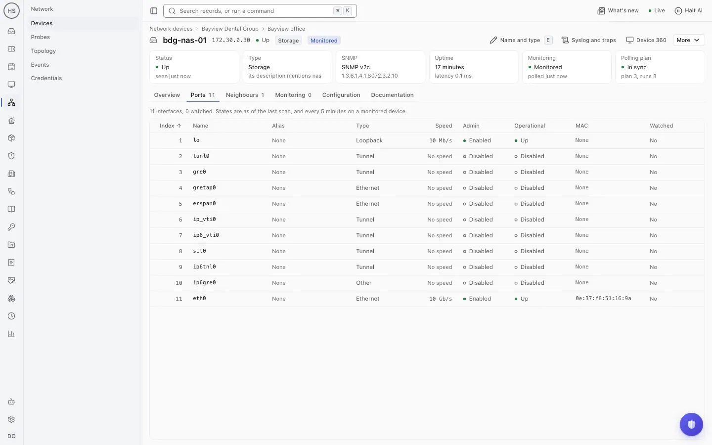
</picture>
<p><b>6. Its ports</b><br><sub>Each interface with its status, speed, utilization and errors, polled on the probe's plan.</sub></p>
</td>
</tr>
<tr>
<td width="50%" valign="top">
<picture>
  <source media="(prefers-color-scheme: dark)" srcset="docs/assets/readme/walkthrough/net-events-dark.webp">
  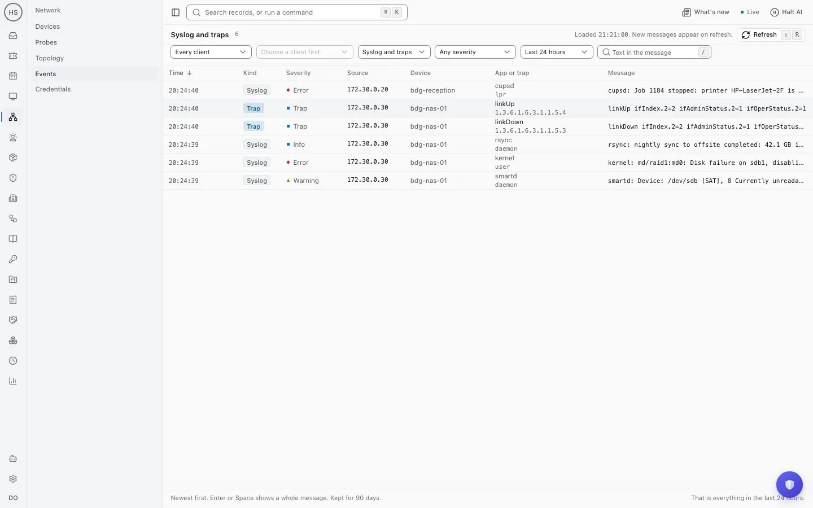
</picture>
<p><b>7. Syslog and traps</b><br><sub>What the devices sent, by severity and facility, taken only from devices the probe watches.</sub></p>
</td>
<td width="50%" valign="top">
<picture>
  <source media="(prefers-color-scheme: dark)" srcset="docs/assets/readme/walkthrough/net-topology-dark.webp">
  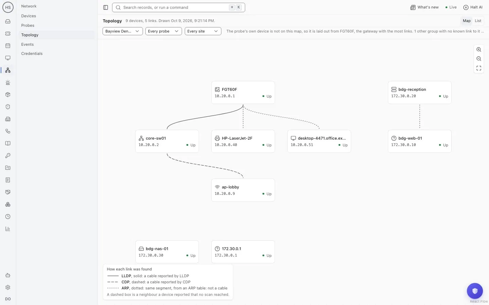
</picture>
<p><b>8. The topology</b><br><sub>Drawn from LLDP, CDP and ARP, each link by how it was found; a device behind a failed switch is held rather than paged.</sub></p>
</td>
</tr>
</table>

<p align="right"><sub><a href="#every-capability-step-by-step">Back to the walkthroughs</a></sub></p>

### 12. Mobile device management

Apple through its MDM protocol and declarative management, Android Enterprise, Windows through OMA-DM, and ChromeOS through Google's own APIs.

<table>
<tr>
<td width="50%" valign="top">
<picture>
  <source media="(prefers-color-scheme: dark)" srcset="docs/assets/readme/walkthrough/mdm-apple-dark.webp">
  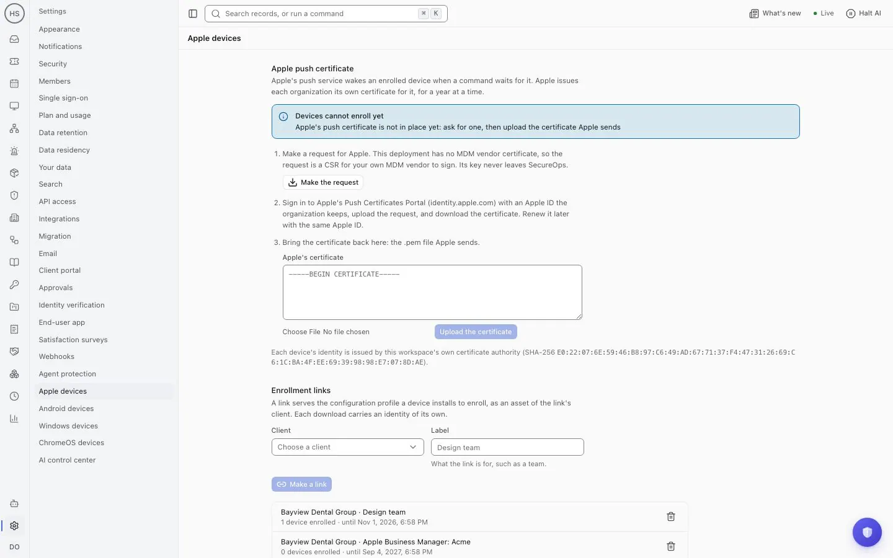
</picture>
<p><b>1. Apple devices</b><br><sub>The push certificate in three steps, enrollment links with their QR codes, Apple Business Manager with ADE, and Apps and Books, each token watched before it ends.</sub></p>
</td>
<td width="50%" valign="top">
<picture>
  <source media="(prefers-color-scheme: dark)" srcset="docs/assets/readme/walkthrough/mdm-profiles-dark.webp">
  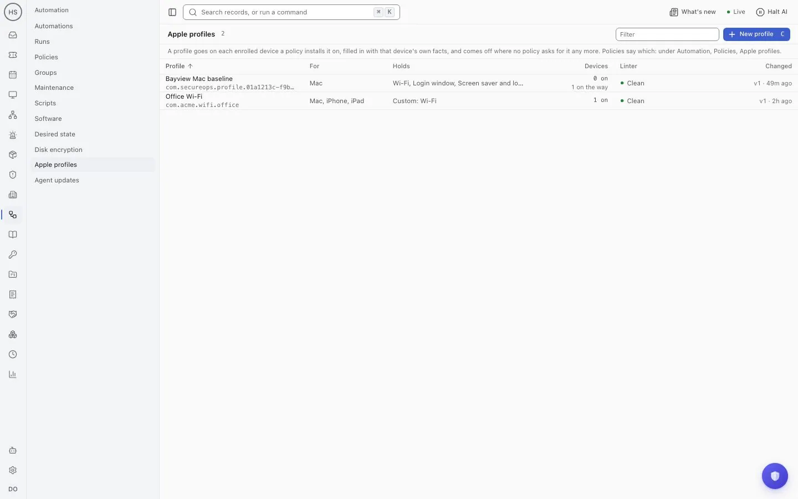
</picture>
<p><b>2. Configuration profiles</b><br><sub>Profiles built from a typed catalogue of payloads and declarations, or a .mobileconfig of your own, linted for what would stop a device.</sub></p>
</td>
</tr>
<tr>
<td width="50%" valign="top">
<picture>
  <source media="(prefers-color-scheme: dark)" srcset="docs/assets/readme/walkthrough/mdm-profile-dark.webp">
  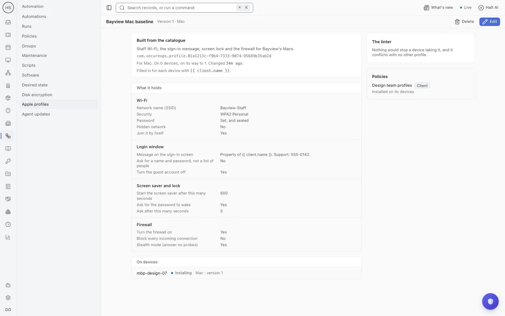
</picture>
<p><b>3. A profile and its linter</b><br><sub>What it holds, what two profiles on one device would fight over, the policies that install it and each device's standing.</sub></p>
</td>
<td width="50%" valign="top">
<picture>
  <source media="(prefers-color-scheme: dark)" srcset="docs/assets/readme/walkthrough/mdm-android-dark.webp">
  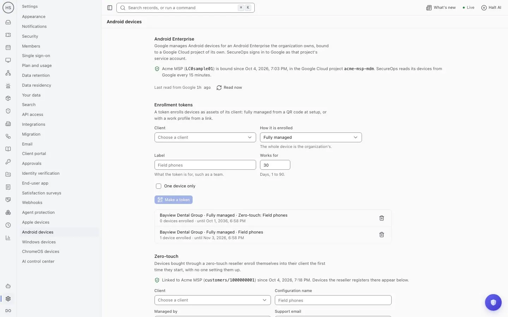
</picture>
<p><b>4. Android Enterprise</b><br><sub>The enterprise bound to your own Google Cloud project, enrollment tokens with their QR codes, managed Google Play apps and zero-touch.</sub></p>
</td>
</tr>
<tr>
<td width="50%" valign="top">
<picture>
  <source media="(prefers-color-scheme: dark)" srcset="docs/assets/readme/walkthrough/mdm-phone-dark.webp">
  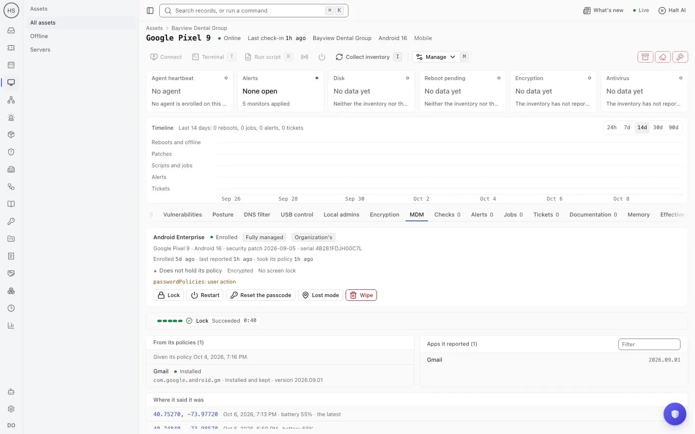
</picture>
<p><b>5. A managed phone</b><br><sub>How Google says it stands, its commands on their ladders (lock, restart, passcode reset, lost mode, wipe), its apps and where it said it was.</sub></p>
</td>
<td width="50%" valign="top">
<picture>
  <source media="(prefers-color-scheme: dark)" srcset="docs/assets/readme/walkthrough/mdm-windows-dark.webp">
  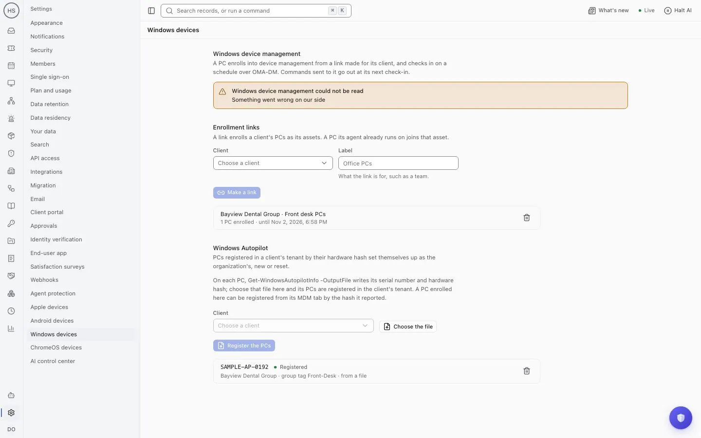
</picture>
<p><b>6. Windows devices</b><br><sub>Enrollment links, Entra join for each client's tenant, Autopilot registration, and CSP settings and compliance rules from the policy.</sub></p>
</td>
</tr>
<tr>
<td width="50%" valign="top">
<picture>
  <source media="(prefers-color-scheme: dark)" srcset="docs/assets/readme/walkthrough/mdm-chromeos-dark.webp">
  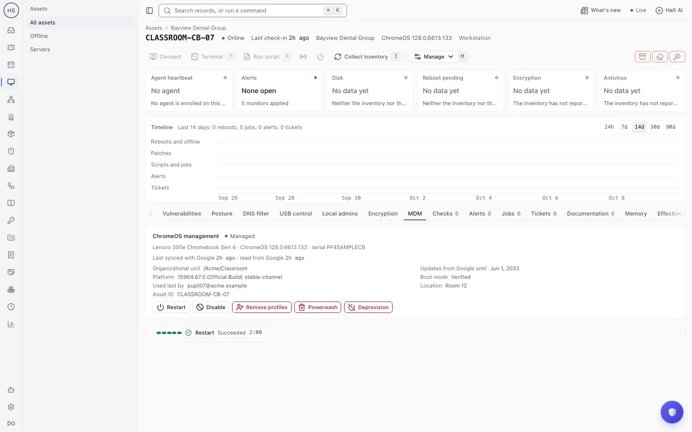
</picture>
<p><b>7. Chromebooks</b><br><sub>Read through the Google Admin SDK by its organizational unit: how Google says it stands, when Google stops updating it, and restart, powerwash or disable on their ladders.</sub></p>
</td>
</tr>
</table>

<p align="right"><sub><a href="#every-capability-step-by-step">Back to the walkthroughs</a></sub></p>

### 13. Service desk

Ticket types and statuses that carry behaviour, SLA timers from the engine, approvals, and replies the AI drafts from what fixed things before.

<table>
<tr>
<td width="50%" valign="top">
<picture>
  <source media="(prefers-color-scheme: dark)" srcset="docs/assets/readme/walkthrough/desk-tickets-dark.webp">
  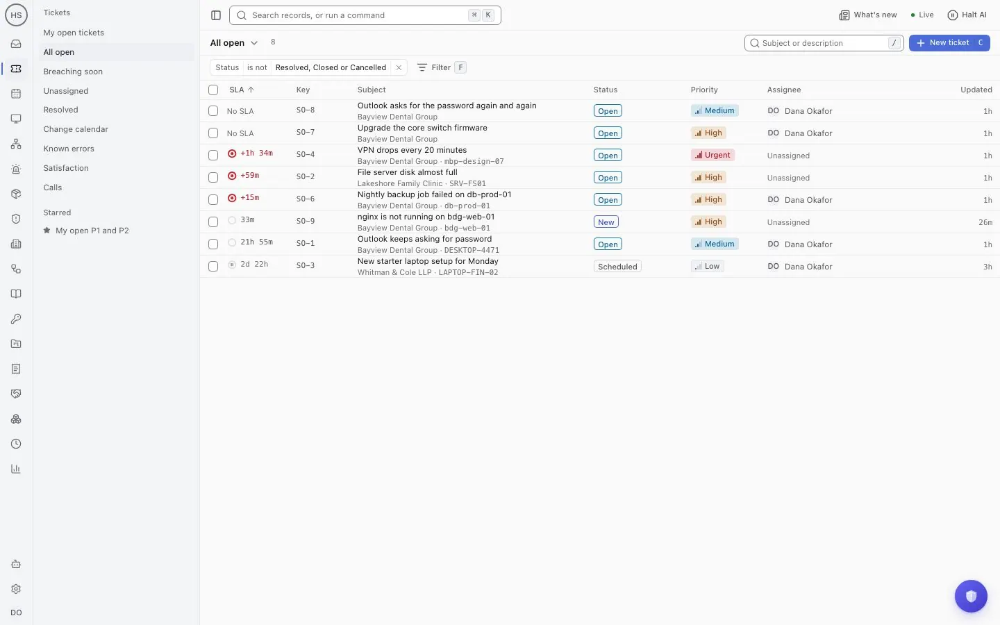
</picture>
<p><b>1. Tickets, by saved view</b><br><sub>Filters answered by the server and kept in an address people can share, saved and starred as views, paged as it scrolls.</sub></p>
</td>
<td width="50%" valign="top">
<picture>
  <source media="(prefers-color-scheme: dark)" srcset="docs/assets/readme/walkthrough/desk-alert-ticket-dark.webp">
  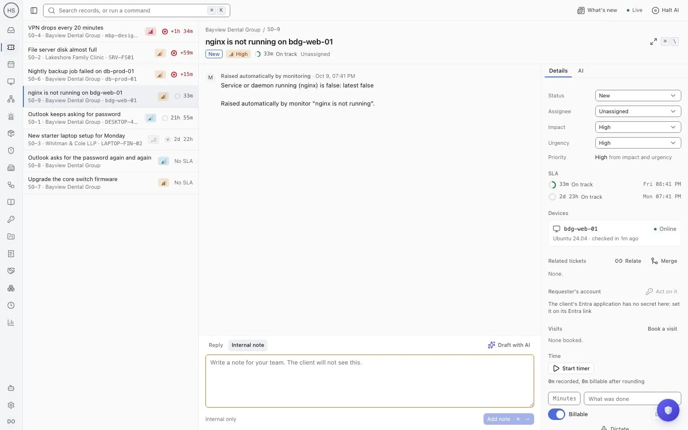
</picture>
<p><b>2. A ticket a monitor opened</b><br><sub>The alert on the live server opened it by itself, with the device beside the conversation and its SLA running from the engine.</sub></p>
</td>
</tr>
<tr>
<td width="50%" valign="top">
<picture>
  <source media="(prefers-color-scheme: dark)" srcset="docs/assets/readme/walkthrough/desk-draft-dark.webp">
  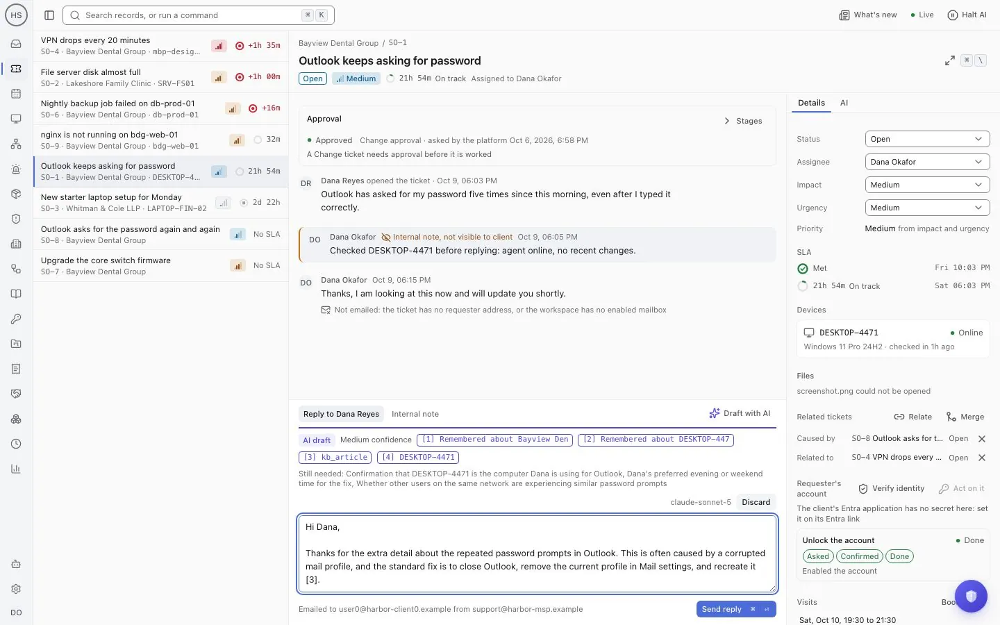
</picture>
<p><b>3. A reply drafted by the AI</b><br><sub>Drafted from the client's own guides and the tickets that fixed this before, every claim cited, for the technician to read and send.</sub></p>
</td>
<td width="50%" valign="top">
<picture>
  <source media="(prefers-color-scheme: dark)" srcset="docs/assets/readme/walkthrough/desk-approvals-dark.webp">
  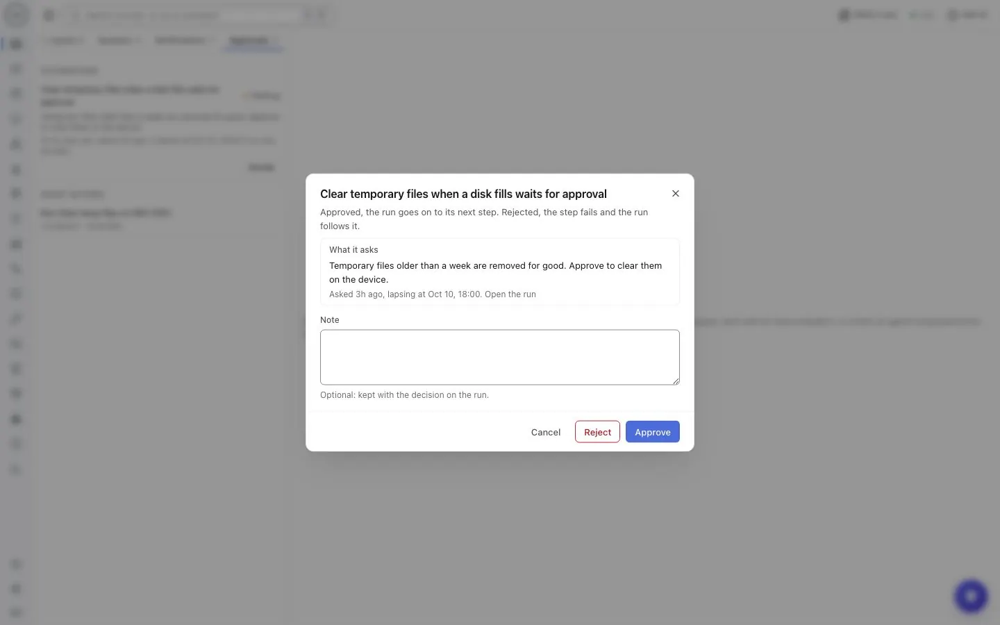
</picture>
<p><b>4. Approvals in the inbox</b><br><sub>Processes of stages, each asking named people, a role or the client's own approvers, decided here or from an emailed link.</sub></p>
</td>
</tr>
<tr>
<td width="50%" valign="top">
<picture>
  <source media="(prefers-color-scheme: dark)" srcset="docs/assets/readme/walkthrough/desk-satisfaction-dark.webp">
  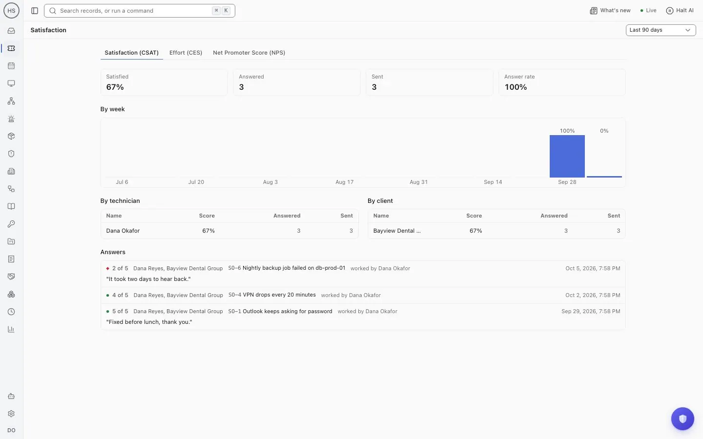
</picture>
<p><b>5. Satisfaction</b><br><sub>CSAT, CES and NPS week by week, by technician and by client, every answer with its comment and the follow-up a low one opened.</sub></p>
</td>
<td width="50%" valign="top">
<picture>
  <source media="(prefers-color-scheme: dark)" srcset="docs/assets/readme/walkthrough/desk-calls-dark.webp">
  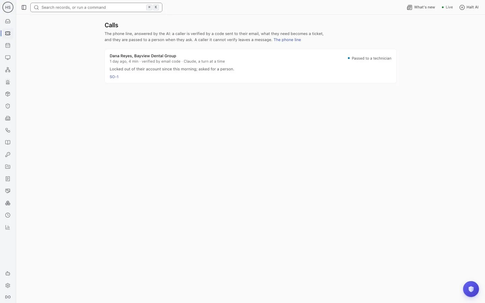
</picture>
<p><b>6. Calls the AI answered</b><br><sub>The phone line verifies a caller by a code to their email, opens their ticket and passes them to a technician with a whispered summary.</sub></p>
</td>
</tr>
</table>

<p align="right"><sub><a href="#every-capability-step-by-step">Back to the walkthroughs</a></sub></p>

### 14. Changes and problems

Change records with their risk, plans and window, kept out of freezes and decided by the change advisory board; problems that resolve their incidents.

<table>
<tr>
<td width="50%" valign="top">
<picture>
  <source media="(prefers-color-scheme: dark)" srcset="docs/assets/readme/walkthrough/change-ticket-dark.webp">
  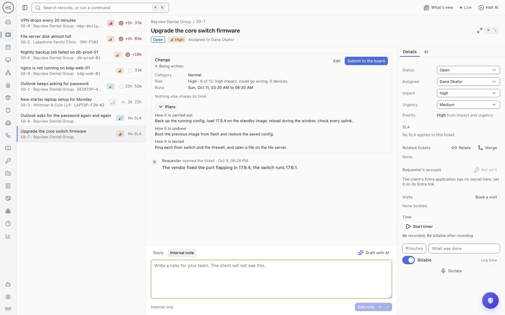
</picture>
<p><b>1. A change and its risk</b><br><sub>Its category, risk worked out of 12 from impact and likelihood, its window and plans, and what else shares its time.</sub></p>
</td>
<td width="50%" valign="top">
<picture>
  <source media="(prefers-color-scheme: dark)" srcset="docs/assets/readme/walkthrough/change-calendar-dark.webp">
  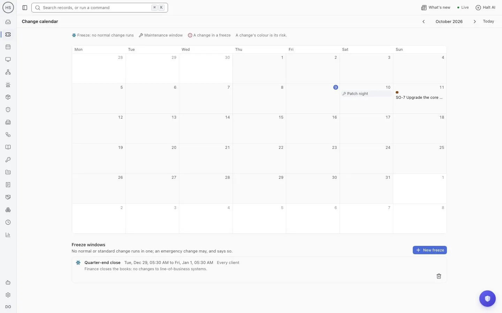
</picture>
<p><b>2. The change calendar</b><br><sub>A month of changes coloured by risk beside freeze windows and maintenance windows, a change in a freeze refused before it is submitted.</sub></p>
</td>
</tr>
<tr>
<td width="50%" valign="top">
<picture>
  <source media="(prefers-color-scheme: dark)" srcset="docs/assets/readme/walkthrough/change-known-dark.webp">
  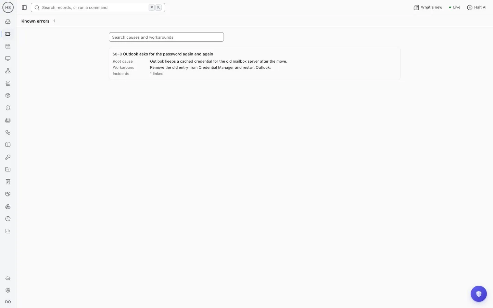
</picture>
<p><b>3. Known errors</b><br><sub>Problems with their root cause and workaround, searched by their words; resolving one resolves the incidents it caused and tells each requester.</sub></p>
</td>
</tr>
</table>

<p align="right"><sub><a href="#every-capability-step-by-step">Back to the walkthroughs</a></sub></p>

### 15. Dispatch and time

Technicians by day with their skills, hours and calendars, visits checked in and out on a phone, and time and expenses approved and billed.

<table>
<tr>
<td width="50%" valign="top">
<picture>
  <source media="(prefers-color-scheme: dark)" srcset="docs/assets/readme/walkthrough/disp-board-dark.webp">
  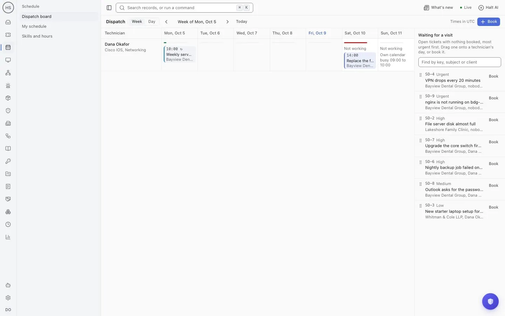
</picture>
<p><b>1. The dispatch board</b><br><sub>Technicians by day with their bookings, time off and the busy hours their own calendars publish, beside the tickets waiting for a visit.</sub></p>
</td>
<td width="50%" valign="top">
<picture>
  <source media="(prefers-color-scheme: dark)" srcset="docs/assets/readme/walkthrough/disp-book-dark.webp">
  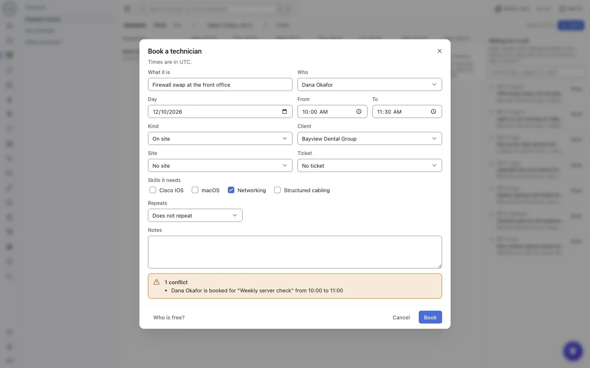
</picture>
<p><b>2. Book a visit</b><br><sub>Conflicts named as it is written, the technicians free for the slot suggested with their skills, and a recurring series in the technician's own zone.</sub></p>
</td>
</tr>
<tr>
<td width="50%" valign="top">
<picture>
  <source media="(prefers-color-scheme: dark)" srcset="docs/assets/readme/walkthrough/disp-people-dark.webp">
  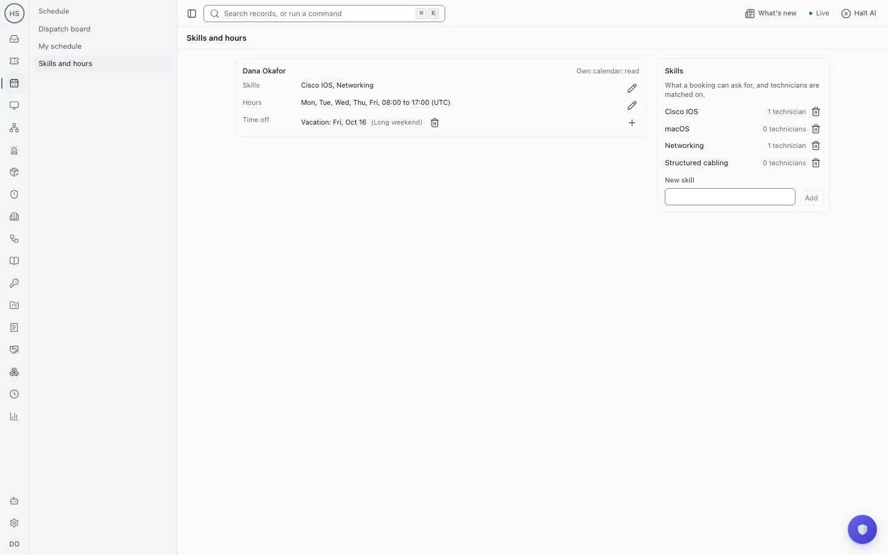
</picture>
<p><b>3. Skills and hours</b><br><sub>Each technician's skills, working hours in their own zone and time off, which the board books against.</sub></p>
</td>
<td width="50%" valign="top">
<picture>
  <source media="(prefers-color-scheme: dark)" srcset="docs/assets/readme/walkthrough/time-week-dark.webp">
  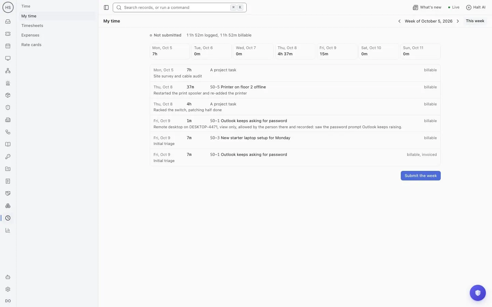
</picture>
<p><b>4. My time</b><br><sub>The week by day from every worklog, on tickets and project tasks alike, submitted with a note for approval.</sub></p>
</td>
</tr>
<tr>
<td width="50%" valign="top">
<picture>
  <source media="(prefers-color-scheme: dark)" srcset="docs/assets/readme/walkthrough/time-sheets-dark.webp">
  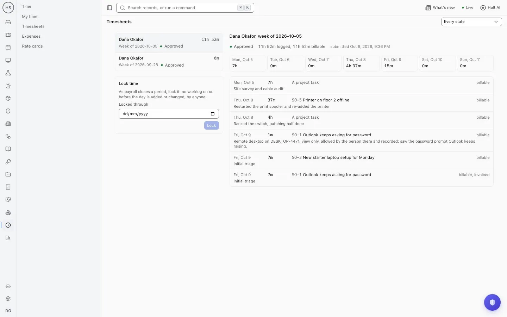
</picture>
<p><b>5. Timesheets</b><br><sub>Every submitted week through the approvals engine, and time locked through a day as payroll closes.</sub></p>
</td>
<td width="50%" valign="top">
<picture>
  <source media="(prefers-color-scheme: dark)" srcset="docs/assets/readme/walkthrough/time-expenses-dark.webp">
  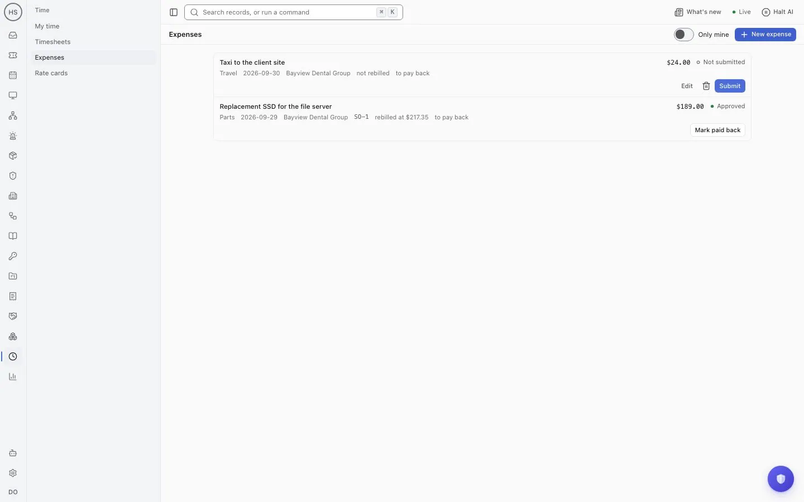
</picture>
<p><b>6. Expenses</b><br><sub>Against a client's ticket or project, billable at a markup or paid back, rebilled on the client's next invoice.</sub></p>
</td>
</tr>
<tr>
<td width="50%" valign="top">
<picture>
  <source media="(prefers-color-scheme: dark)" srcset="docs/assets/readme/walkthrough/time-rates-dark.webp">
  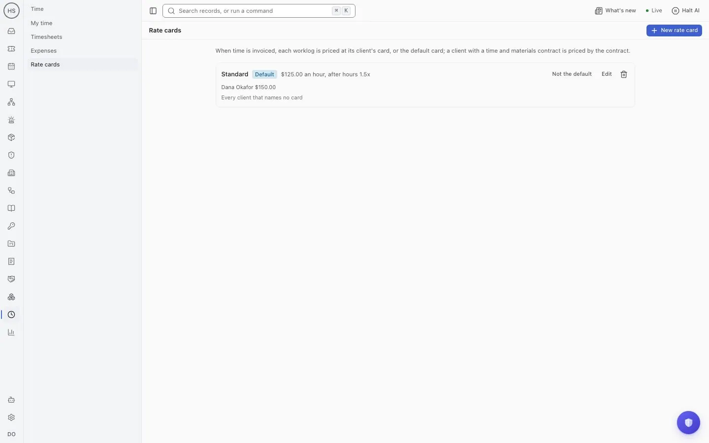
</picture>
<p><b>7. Rate cards</b><br><sub>An hourly rate per technician and an after-hours multiplier, for the clients that name the card or the whole workspace.</sub></p>
</td>
</tr>
</table>

<p align="right"><sub><a href="#every-capability-step-by-step">Back to the walkthroughs</a></sub></p>

### 16. Sales

Leads and opportunities on a pipeline of your own stages, a forecast weighted by each one's chance, and the path from an opportunity to its quote, order and invoice.

<table>
<tr>
<td width="50%" valign="top">
<picture>
  <source media="(prefers-color-scheme: dark)" srcset="docs/assets/readme/walkthrough/sales-pipeline-dark.webp">
  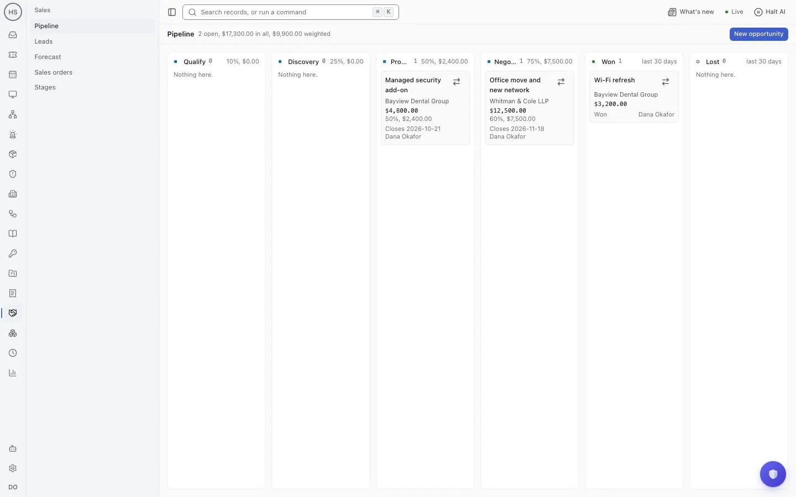
</picture>
<p><b>1. The pipeline</b><br><sub>A column per stage with its count, chance and weighted value; cards dragged between stages, a lost one asked why.</sub></p>
</td>
<td width="50%" valign="top">
<picture>
  <source media="(prefers-color-scheme: dark)" srcset="docs/assets/readme/walkthrough/sales-opportunity-dark.webp">
  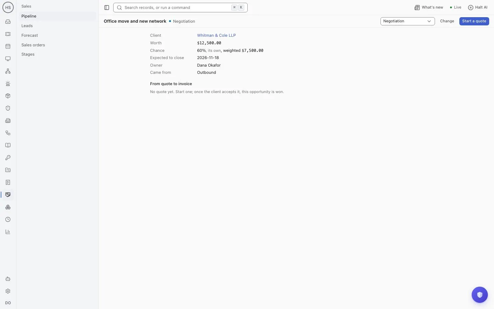
</picture>
<p><b>2. An opportunity</b><br><sub>Its value, chance and close date, and the path from its quotes to the sales orders and invoices they became.</sub></p>
</td>
</tr>
<tr>
<td width="50%" valign="top">
<picture>
  <source media="(prefers-color-scheme: dark)" srcset="docs/assets/readme/walkthrough/sales-leads-dark.webp">
  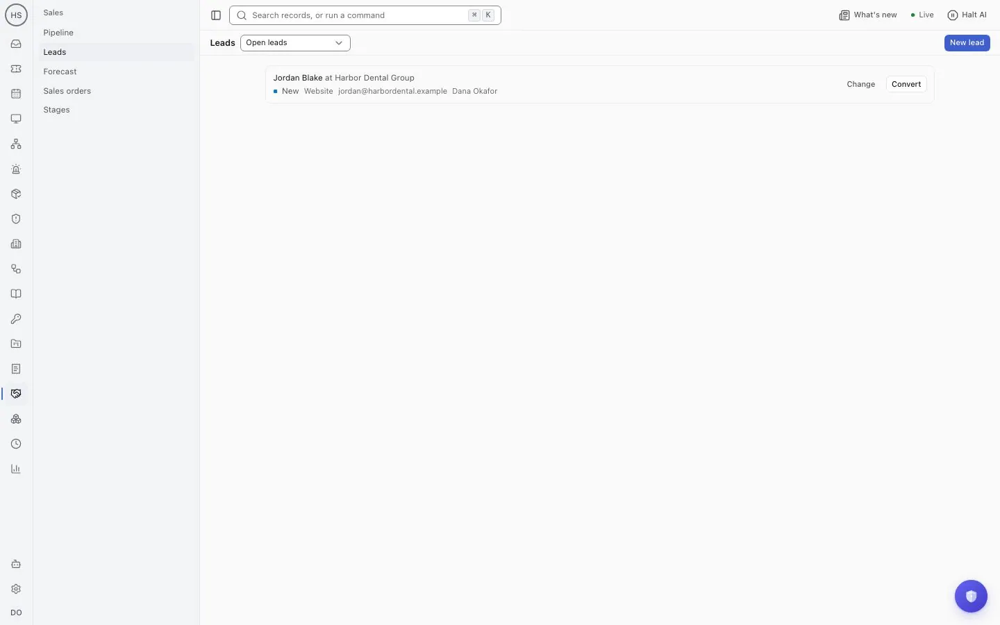
</picture>
<p><b>3. Leads</b><br><sub>Each lead with where it came from and its owner, converted into a prospect client with its contact and an opportunity.</sub></p>
</td>
<td width="50%" valign="top">
<picture>
  <source media="(prefers-color-scheme: dark)" srcset="docs/assets/readme/walkthrough/sales-forecast-dark.webp">
  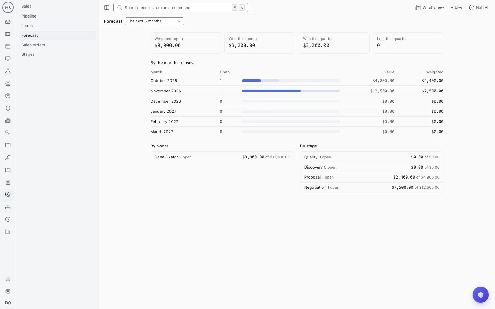
</picture>
<p><b>4. The forecast</b><br><sub>Open opportunities by the month they should close, by owner and by stage, weighted by their chance, beside what was won and lost.</sub></p>
</td>
</tr>
</table>

<p align="right"><sub><a href="#every-capability-step-by-step">Back to the walkthroughs</a></sub></p>

### 17. Quotes and orders

Good, better and best quotes the client signs at a link with the options they chose, converted into a sales order, an invoice and a contract.

<table>
<tr>
<td width="50%" valign="top">
<picture>
  <source media="(prefers-color-scheme: dark)" srcset="docs/assets/readme/walkthrough/quote-list-dark.webp">
  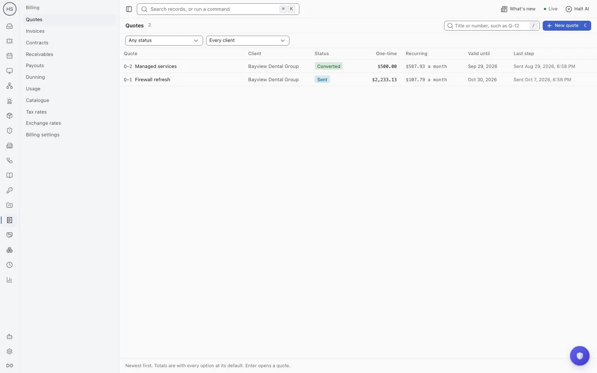
</picture>
<p><b>1. Quotes</b><br><sub>Each quote with its status, one-time and recurring totals, validity and the last thing that happened to it.</sub></p>
</td>
<td width="50%" valign="top">
<picture>
  <source media="(prefers-color-scheme: dark)" srcset="docs/assets/readme/walkthrough/quote-editor-dark.webp">
  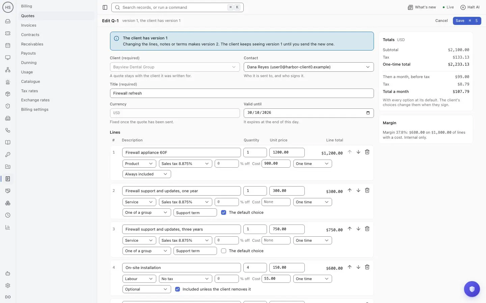
</picture>
<p><b>2. Write a quote</b><br><sub>Catalogue lines, optional items, good, better and best choices, discounts, tax and what recurs, with cost and margin kept internal.</sub></p>
</td>
</tr>
<tr>
<td width="50%" valign="top">
<picture>
  <source media="(prefers-color-scheme: dark)" srcset="docs/assets/readme/walkthrough/quote-page-dark.webp">
  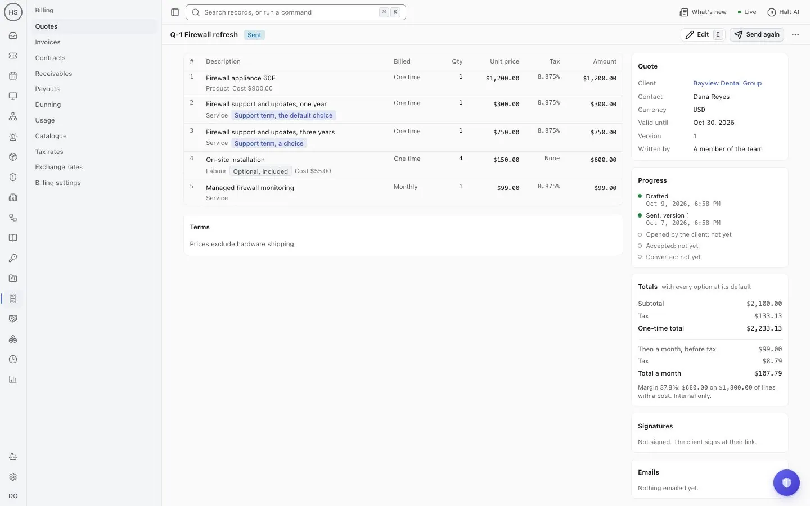
</picture>
<p><b>3. Send it</b><br><sub>By email or published for its link, approved first where its value needs it, with every version the client had and what they signed.</sub></p>
</td>
<td width="50%" valign="top">
<picture>
  <source media="(prefers-color-scheme: dark)" srcset="docs/assets/readme/walkthrough/quote-client-dark.webp">
  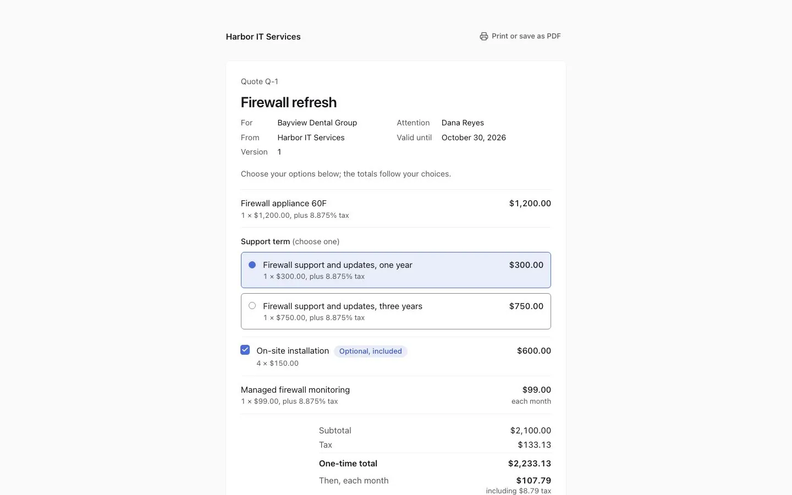
</picture>
<p><b>4. The client signs at the link</b><br><sub>On a phone or a desktop, in the brand they know, with totals that follow their choices and a signature over exactly what they saw.</sub></p>
</td>
</tr>
<tr>
<td width="50%" valign="top">
<picture>
  <source media="(prefers-color-scheme: dark)" srcset="docs/assets/readme/walkthrough/quote-converted-dark.webp">
  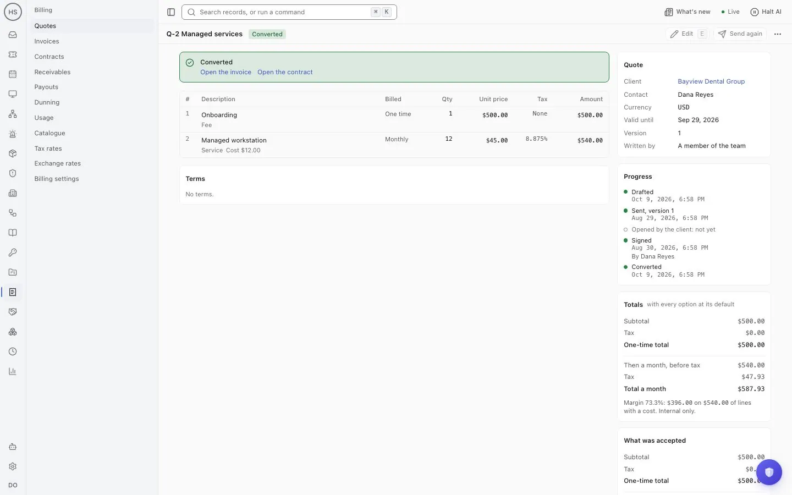
</picture>
<p><b>5. Converted for billing</b><br><sub>An accepted quote becomes a draft invoice for what is due now and a contract for what recurs, each a click away.</sub></p>
</td>
<td width="50%" valign="top">
<picture>
  <source media="(prefers-color-scheme: dark)" srcset="docs/assets/readme/walkthrough/quote-order-dark.webp">
  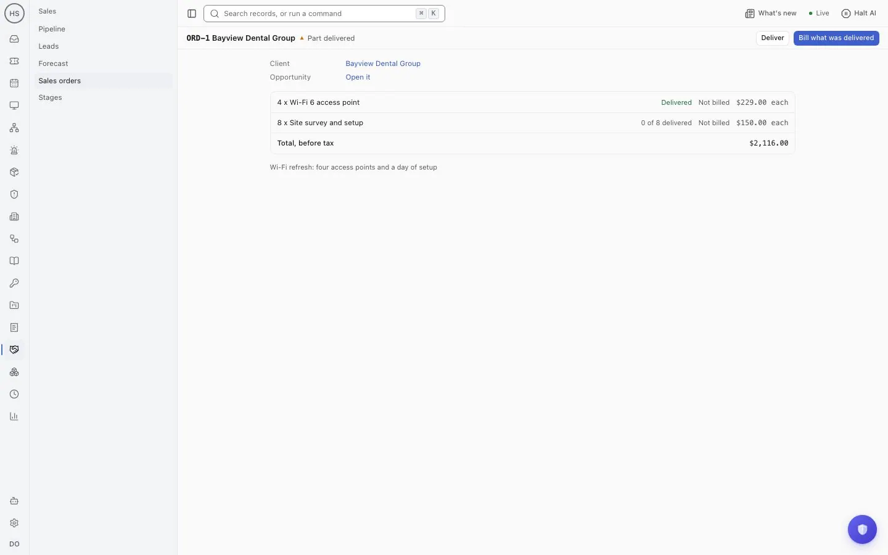
</picture>
<p><b>6. A sales order</b><br><sub>Exactly what the client accepted, delivered line by line from stock and billed for what was delivered.</sub></p>
</td>
</tr>
</table>

<p align="right"><sub><a href="#every-capability-step-by-step">Back to the walkthroughs</a></sub></p>

### 18. Invoices and payments

Invoices with gapless numbers, paid online through Stripe or GoCardless and recorded only on the provider's signed word, chased by a dunning ladder of your own.

<table>
<tr>
<td width="50%" valign="top">
<picture>
  <source media="(prefers-color-scheme: dark)" srcset="docs/assets/readme/walkthrough/inv-list-dark.webp">
  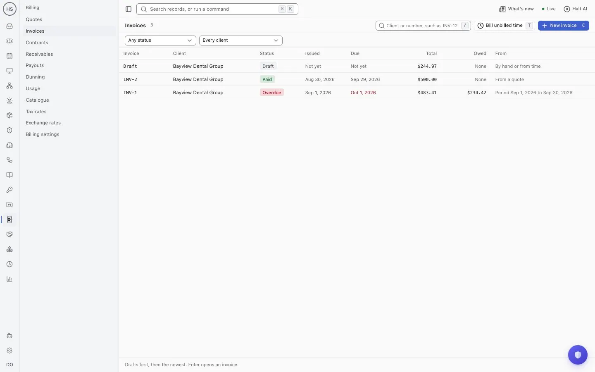
</picture>
<p><b>1. Invoices</b><br><sub>Each invoice with its status, what is owed and whether it is overdue, paid online or by hand.</sub></p>
</td>
<td width="50%" valign="top">
<picture>
  <source media="(prefers-color-scheme: dark)" srcset="docs/assets/readme/walkthrough/inv-page-dark.webp">
  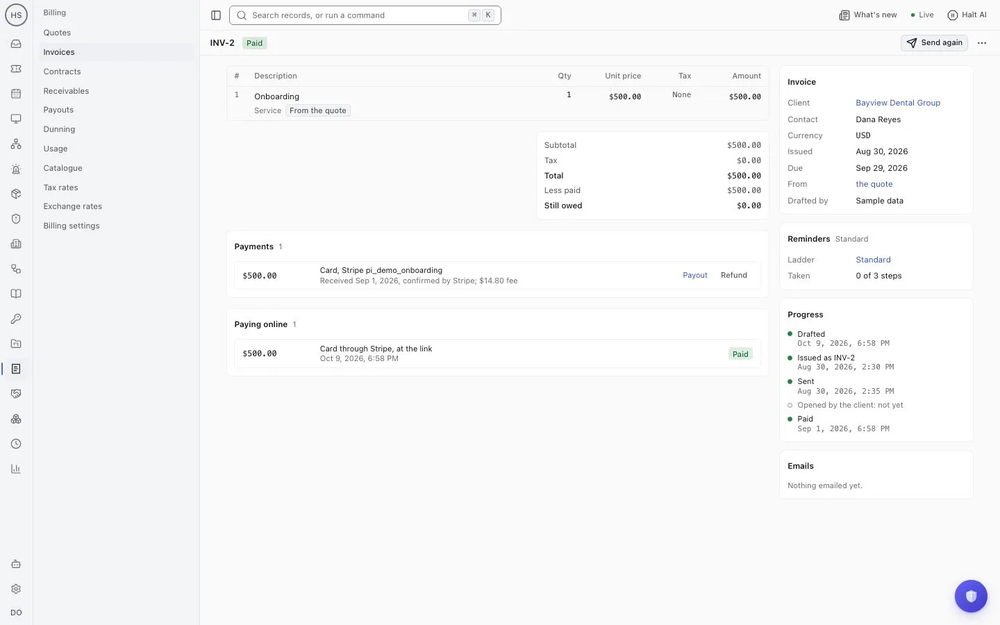
</picture>
<p><b>2. An invoice and its payments</b><br><sub>Its lines, the payments and credit notes against it, what the provider confirmed with its fee and payout, and its reminders.</sub></p>
</td>
</tr>
<tr>
<td width="50%" valign="top">
<picture>
  <source media="(prefers-color-scheme: dark)" srcset="docs/assets/readme/walkthrough/inv-client-dark.webp">
  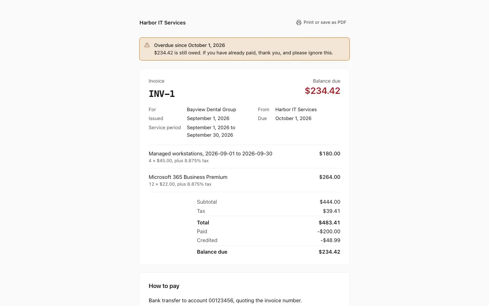
</picture>
<p><b>3. The client pays at the link</b><br><sub>No sign-in: what it charges, what was paid and credited, what is still owed and how to pay, or Pay online where Stripe or GoCardless is connected.</sub></p>
</td>
<td width="50%" valign="top">
<picture>
  <source media="(prefers-color-scheme: dark)" srcset="docs/assets/readme/walkthrough/inv-receivables-dark.webp">
  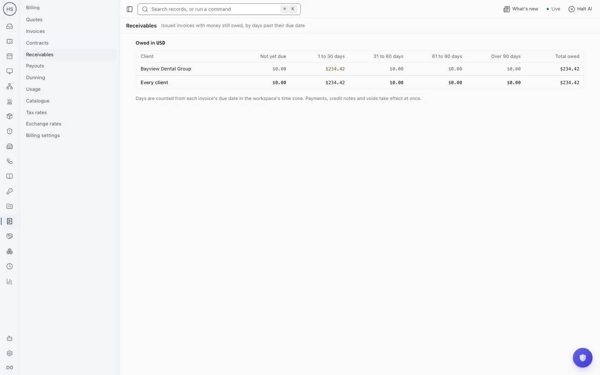
</picture>
<p><b>4. Receivables</b><br><sub>What each client owes by days past due, in each currency, with each total in the workspace's own.</sub></p>
</td>
</tr>
<tr>
<td width="50%" valign="top">
<picture>
  <source media="(prefers-color-scheme: dark)" srcset="docs/assets/readme/walkthrough/inv-dunning-dark.webp">
  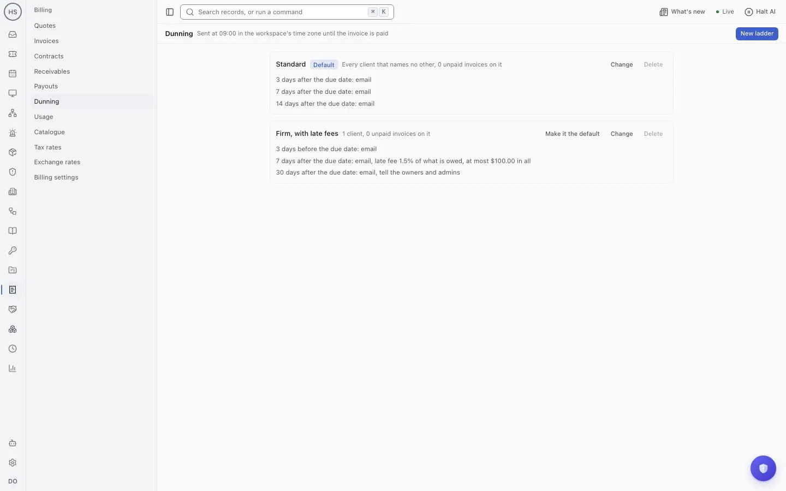
</picture>
<p><b>5. The dunning ladder</b><br><sub>Steps before and after the due date, each an email written with the invoice's facts and a late fee within its cap, per client if needed.</sub></p>
</td>
<td width="50%" valign="top">
<picture>
  <source media="(prefers-color-scheme: dark)" srcset="docs/assets/readme/walkthrough/inv-payouts-dark.webp">
  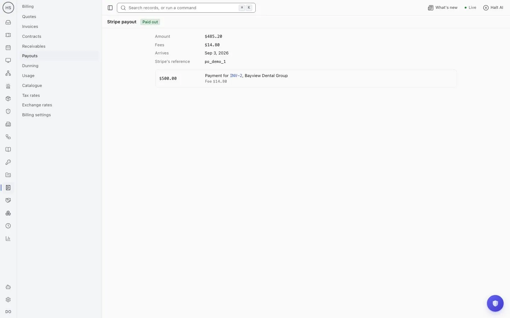
</picture>
<p><b>6. Payouts reconciled</b><br><sub>Each payout from the provider with every payment it carried and its fee, and any payment with no record here named.</sub></p>
</td>
</tr>
</table>

<p align="right"><sub><a href="#every-capability-step-by-step">Back to the walkthroughs</a></sub></p>

### 19. Contracts, usage and accounting

Contracts that bill live device counts, per site if you like, distributor usage reconciled before it is invoiced, several currencies at each day's rate, and the ledger kept in sync.

<table>
<tr>
<td width="50%" valign="top">
<picture>
  <source media="(prefers-color-scheme: dark)" srcset="docs/assets/readme/walkthrough/con-list-dark.webp">
  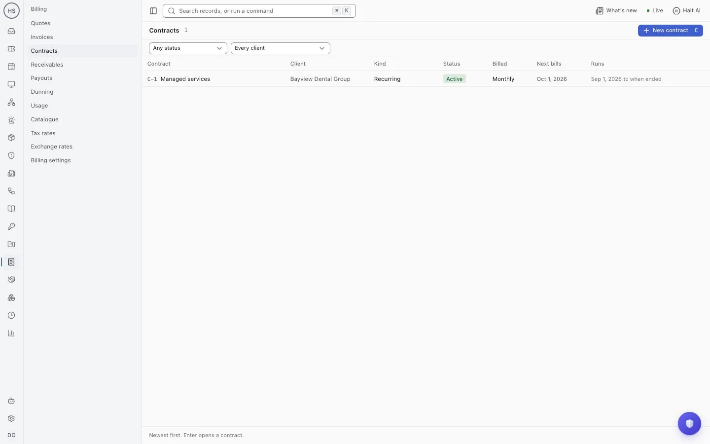
</picture>
<p><b>1. Contracts</b><br><sub>Recurring, block-hours and time and materials contracts, with what each bills and when it next bills.</sub></p>
</td>
<td width="50%" valign="top">
<picture>
  <source media="(prefers-color-scheme: dark)" srcset="docs/assets/readme/walkthrough/con-page-dark.webp">
  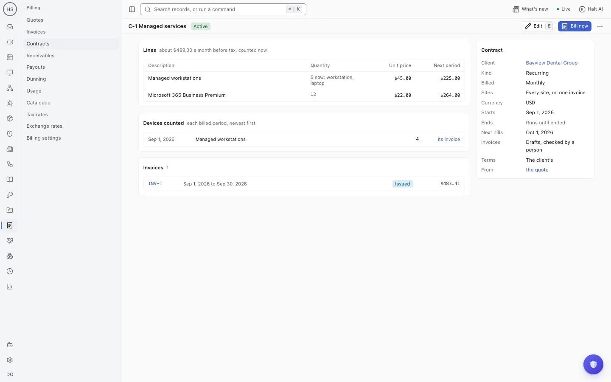
</picture>
<p><b>2. A contract counting live devices</b><br><sub>Each line counting the client's devices by system and kind as they stand, what it would bill now, and the devices each billed period counted.</sub></p>
</td>
</tr>
<tr>
<td width="50%" valign="top">
<picture>
  <source media="(prefers-color-scheme: dark)" srcset="docs/assets/readme/walkthrough/con-usage-dark.webp">
  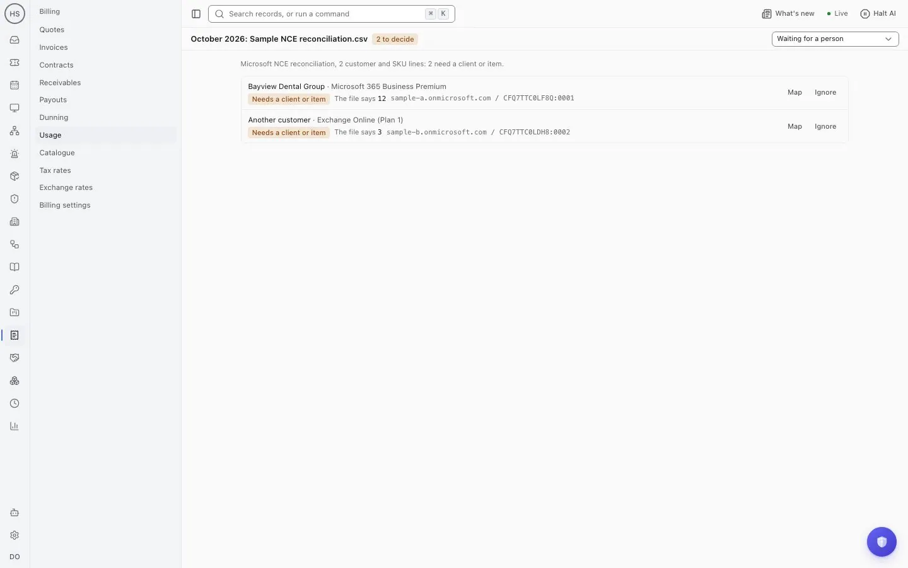
</picture>
<p><b>3. Usage reconciled</b><br><sub>A Microsoft NCE, Pax8 or distributor file set against what each contract bills, a difference accepted or ignored with a reason before invoicing.</sub></p>
</td>
<td width="50%" valign="top">
<picture>
  <source media="(prefers-color-scheme: dark)" srcset="docs/assets/readme/walkthrough/con-rates-dark.webp">
  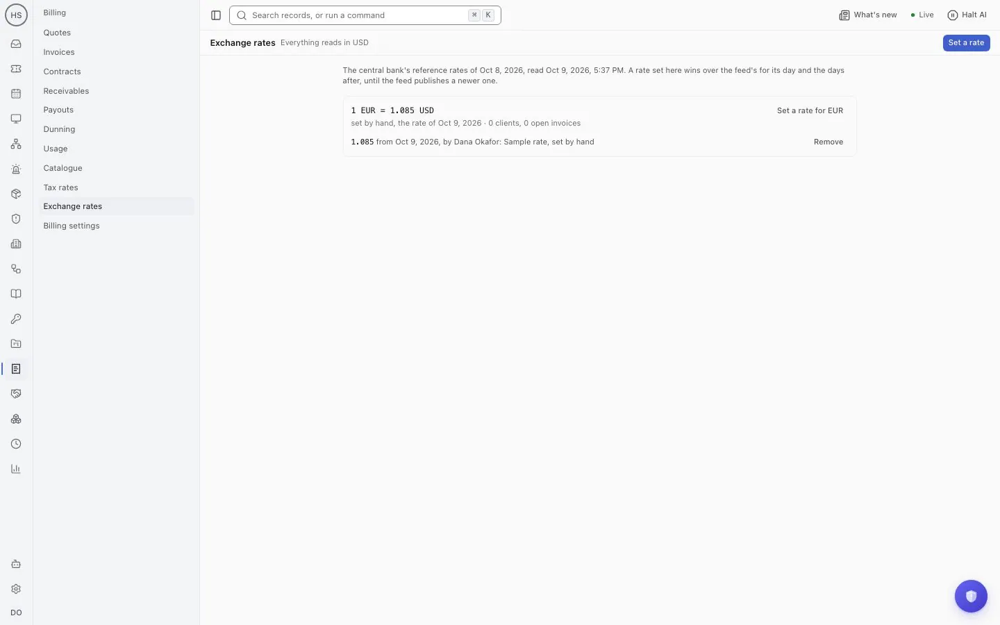
</picture>
<p><b>4. Exchange rates</b><br><sub>The European Central Bank's daily rates, a rate set by hand where needed, and every document keeping the rate of its own day.</sub></p>
</td>
</tr>
<tr>
<td width="50%" valign="top">
<picture>
  <source media="(prefers-color-scheme: dark)" srcset="docs/assets/readme/walkthrough/con-accounting-dark.webp">
  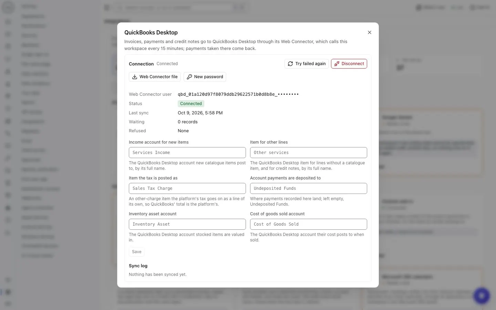
</picture>
<p><b>5. The ledger in sync</b><br><sub>QuickBooks Online, Xero, or QuickBooks Desktop through its Web Connector: invoices and payments sent, and payments taken there brought back.</sub></p>
</td>
</tr>
</table>

<p align="right"><sub><a href="#every-capability-step-by-step">Back to the walkthroughs</a></sub></p>

### 20. Procurement, stock and custody

Requisitions approved by value, purchase orders received with serials that become the client's assets, stock by location, and devices in a person's custody.

<table>
<tr>
<td width="50%" valign="top">
<picture>
  <source media="(prefers-color-scheme: dark)" srcset="docs/assets/readme/walkthrough/stock-levels-dark.webp">
  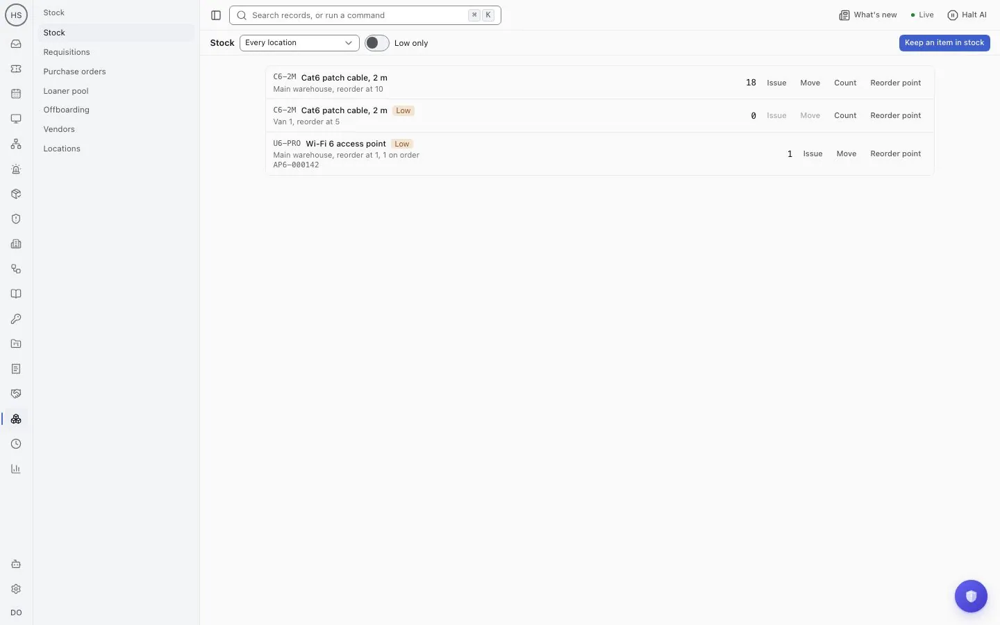
</picture>
<p><b>1. Stock by location</b><br><sub>What is on hand and on order at each location, the serials on the shelf, and a reorder point that tells the admins once.</sub></p>
</td>
<td width="50%" valign="top">
<picture>
  <source media="(prefers-color-scheme: dark)" srcset="docs/assets/readme/walkthrough/stock-requisitions-dark.webp">
  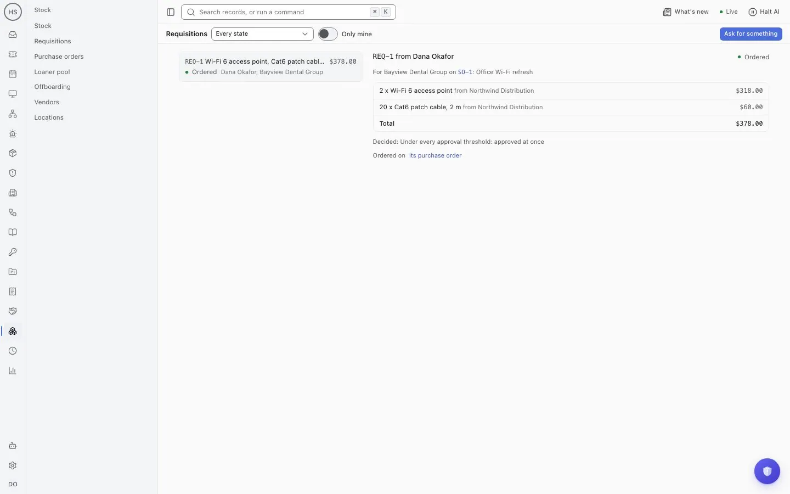
</picture>
<p><b>2. Requisitions</b><br><sub>What a ticket or the stock needs, decided through the approvals engine by its total, then ordered from each vendor.</sub></p>
</td>
</tr>
<tr>
<td width="50%" valign="top">
<picture>
  <source media="(prefers-color-scheme: dark)" srcset="docs/assets/readme/walkthrough/stock-order-dark.webp">
  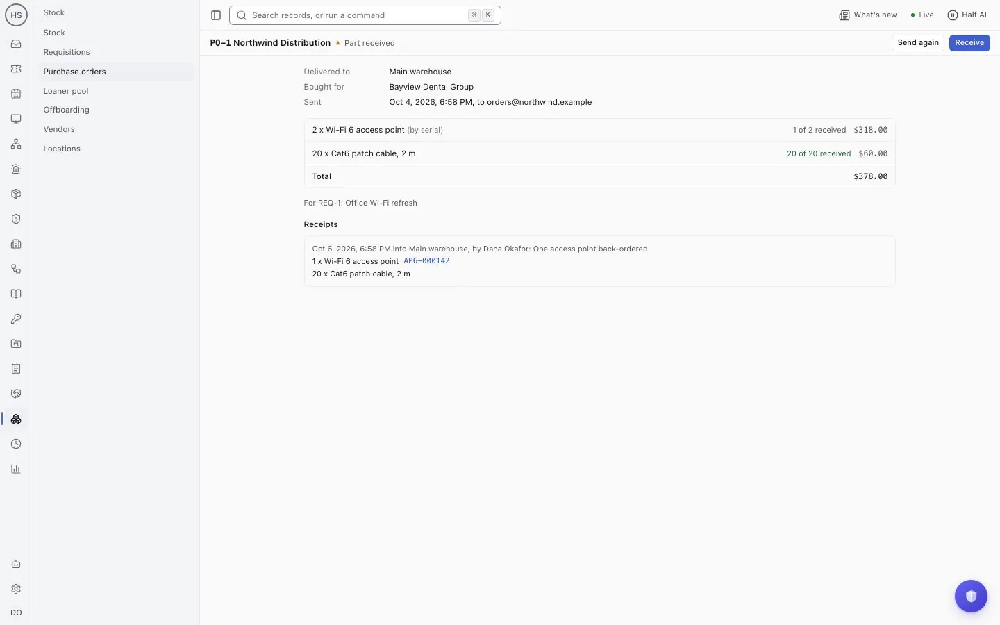
</picture>
<p><b>3. A purchase order, received</b><br><sub>Emailed to the vendor, received in parts with a serial for each unit, every serial becoming the client's asset at once.</sub></p>
</td>
<td width="50%" valign="top">
<picture>
  <source media="(prefers-color-scheme: dark)" srcset="docs/assets/readme/walkthrough/stock-loaners-dark.webp">
  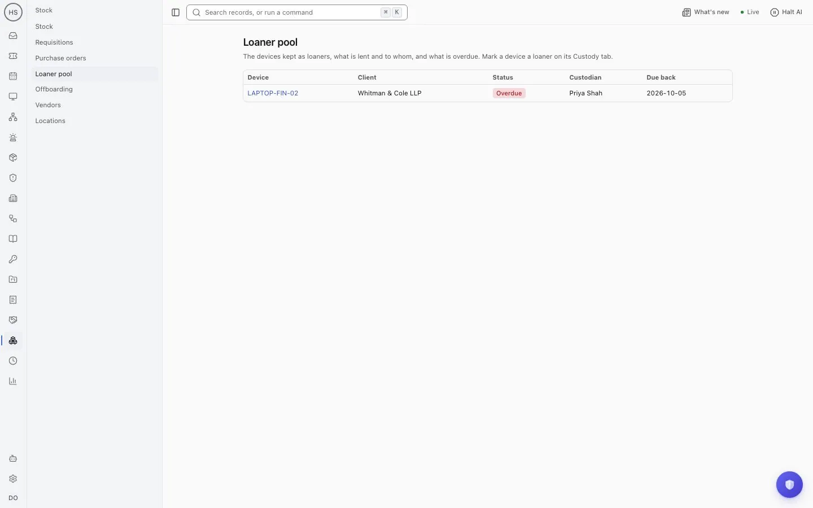
</picture>
<p><b>4. The loaner pool</b><br><sub>Devices kept as loaners, lent or available, overdue first, each lent with a signed acceptance at a link.</sub></p>
</td>
</tr>
<tr>
<td width="50%" valign="top">
<picture>
  <source media="(prefers-color-scheme: dark)" srcset="docs/assets/readme/walkthrough/stock-offboarding-dark.webp">
  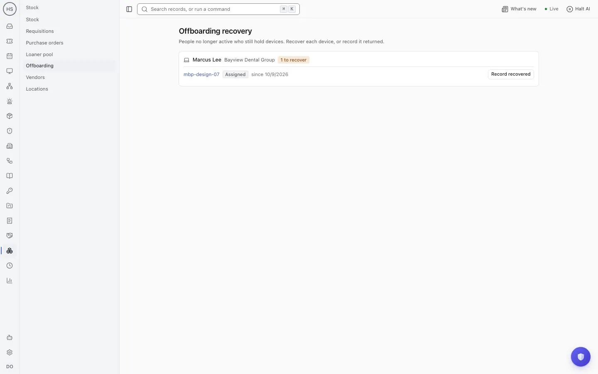
</picture>
<p><b>5. Offboarding recovery</b><br><sub>People no longer at the client who still hold its devices, each device recovered from here.</sub></p>
</td>
</tr>
</table>

<p align="right"><sub><a href="#every-capability-step-by-step">Back to the walkthroughs</a></sub></p>

### 21. Projects

A Gantt from the schedule the server computed: the critical path, baseline slip in working days, float, milestone billing and the budget burning.

<table>
<tr>
<td width="50%" valign="top">
<picture>
  <source media="(prefers-color-scheme: dark)" srcset="docs/assets/readme/walkthrough/proj-list-dark.webp">
  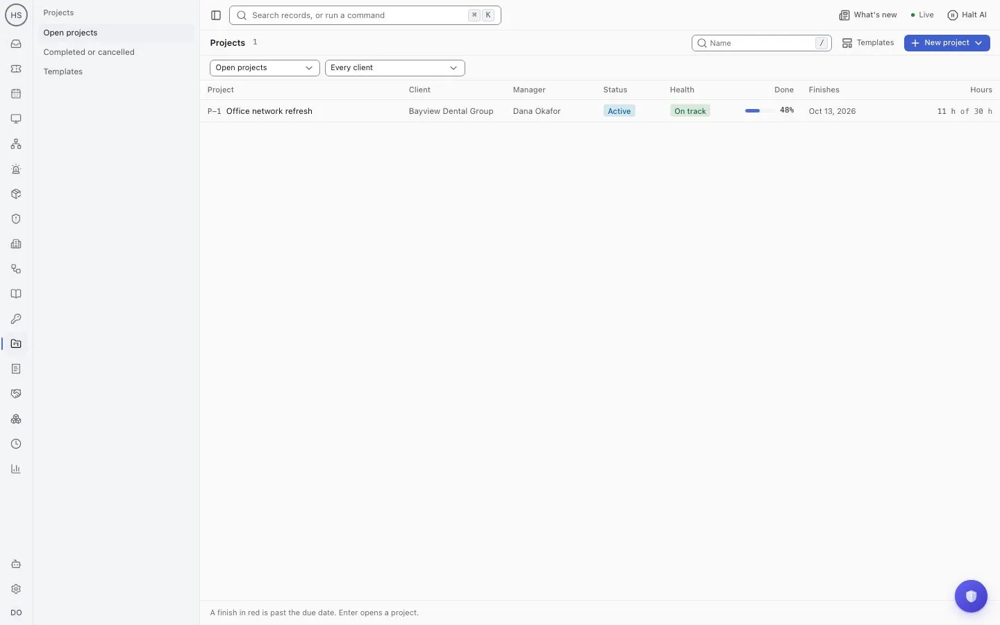
</picture>
<p><b>1. Projects</b><br><sub>Each project with its client, manager, health, progress, when the schedule finishes against its due date, and hours against budget.</sub></p>
</td>
<td width="50%" valign="top">
<picture>
  <source media="(prefers-color-scheme: dark)" srcset="docs/assets/readme/walkthrough/proj-gantt-dark.webp">
  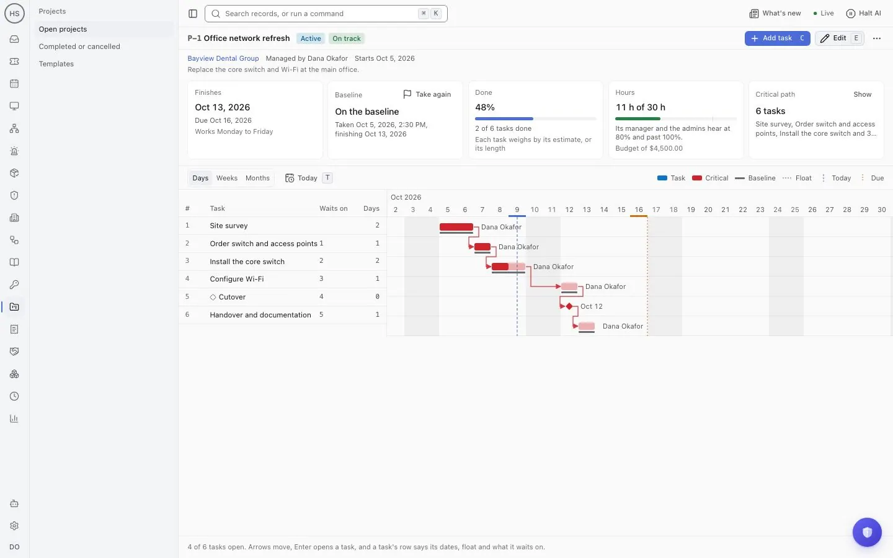
</picture>
<p><b>2. The Gantt</b><br><sub>Critical tasks and their links in the critical colour, baselines under the bars, float as whiskers, milestones as diamonds, weekends and today marked.</sub></p>
</td>
</tr>
<tr>
<td width="50%" valign="top">
<picture>
  <source media="(prefers-color-scheme: dark)" srcset="docs/assets/readme/walkthrough/proj-task-dark.webp">
  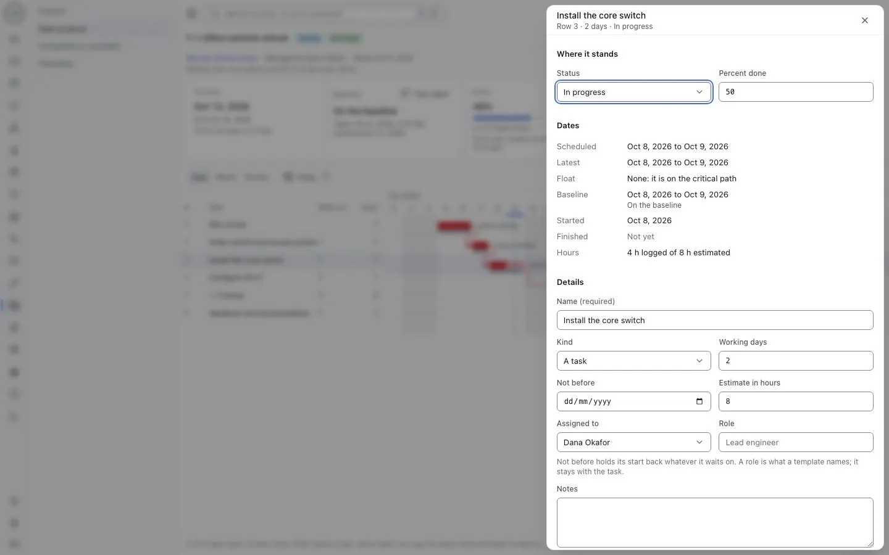
</picture>
<p><b>3. A task</b><br><sub>Its dates as scheduled, at the latest, at the baseline and as they happened, what it waits on, and time logged as people type it.</sub></p>
</td>
<td width="50%" valign="top">
<picture>
  <source media="(prefers-color-scheme: dark)" srcset="docs/assets/readme/walkthrough/proj-template-dark.webp">
  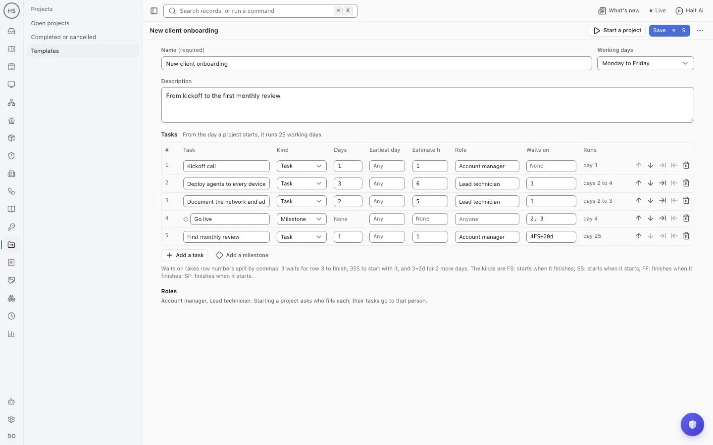
</picture>
<p><b>4. A project template</b><br><sub>Tasks with their kinds, lengths and roles, waits typed by row number as schedulers write them, previewed by the same scheduler the server runs.</sub></p>
</td>
</tr>
</table>

<p align="right"><sub><a href="#every-capability-step-by-step">Back to the walkthroughs</a></sub></p>

### 22. Documentation and knowledge

Typed pages that link the devices and credentials they describe, every version kept with its diff, and a knowledge base the AI drafts from resolved tickets.

<table>
<tr>
<td width="50%" valign="top">
<picture>
  <source media="(prefers-color-scheme: dark)" srcset="docs/assets/readme/walkthrough/docs-pages-dark.webp">
  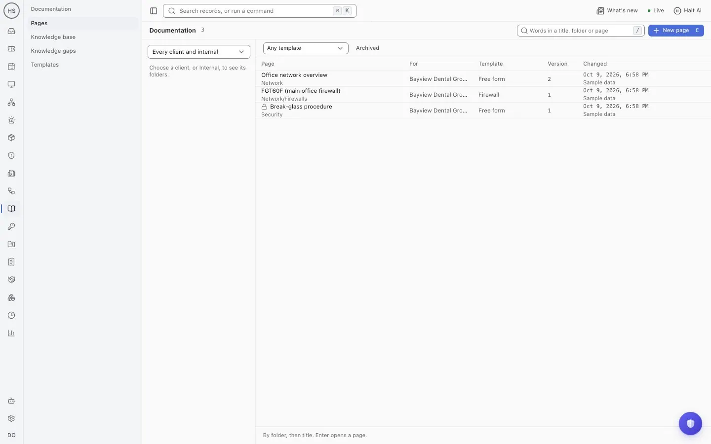
</picture>
<p><b>1. Pages, by client</b><br><sub>Client and internal documentation in folders, searched anywhere in a page, filtered by template, restricted pages for the people named.</sub></p>
</td>
<td width="50%" valign="top">
<picture>
  <source media="(prefers-color-scheme: dark)" srcset="docs/assets/readme/walkthrough/docs-page-dark.webp">
  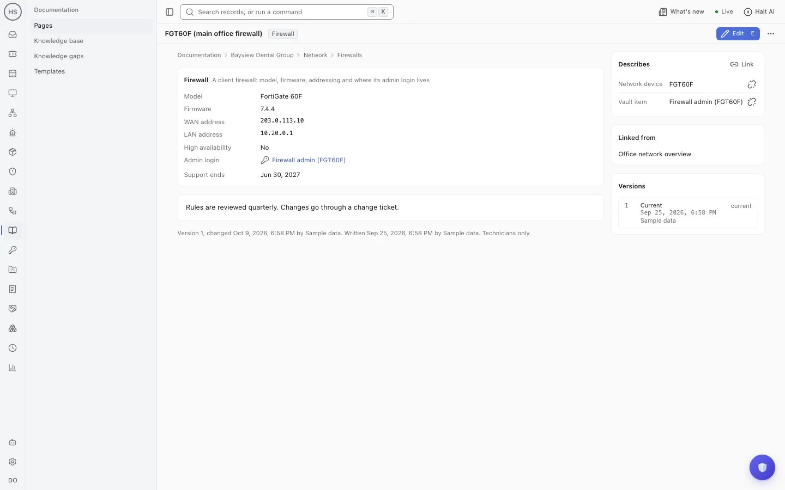
</picture>
<p><b>2. A typed page</b><br><sub>Its fields from its template, the network device it describes, the vault login it links (named, never shown), and every version.</sub></p>
</td>
</tr>
<tr>
<td width="50%" valign="top">
<picture>
  <source media="(prefers-color-scheme: dark)" srcset="docs/assets/readme/walkthrough/docs-editor-dark.webp">
  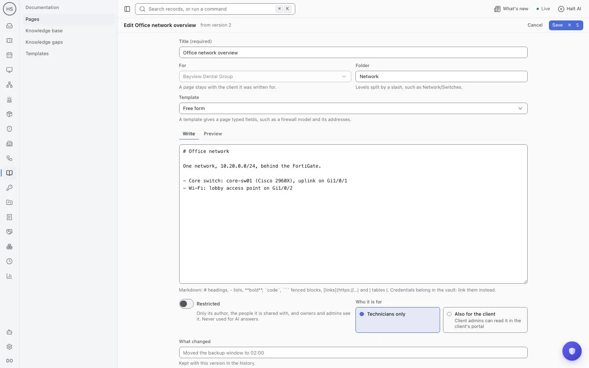
</picture>
<p><b>3. Edit it</b><br><sub>Each field checked as the API checks it, Markdown with a preview, and a save refused when someone saved first, keeping the draft to compare.</sub></p>
</td>
<td width="50%" valign="top">
<picture>
  <source media="(prefers-color-scheme: dark)" srcset="docs/assets/readme/walkthrough/docs-article-dark.webp">
  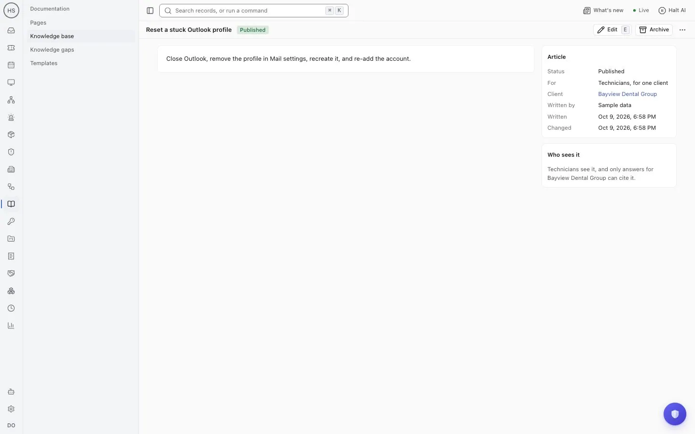
</picture>
<p><b>4. A knowledge article</b><br><sub>For technicians or written for clients, for one client or all, published only after a confirmation that says who will see it.</sub></p>
</td>
</tr>
<tr>
<td width="50%" valign="top">
<picture>
  <source media="(prefers-color-scheme: dark)" srcset="docs/assets/readme/walkthrough/docs-gaps-dark.webp">
  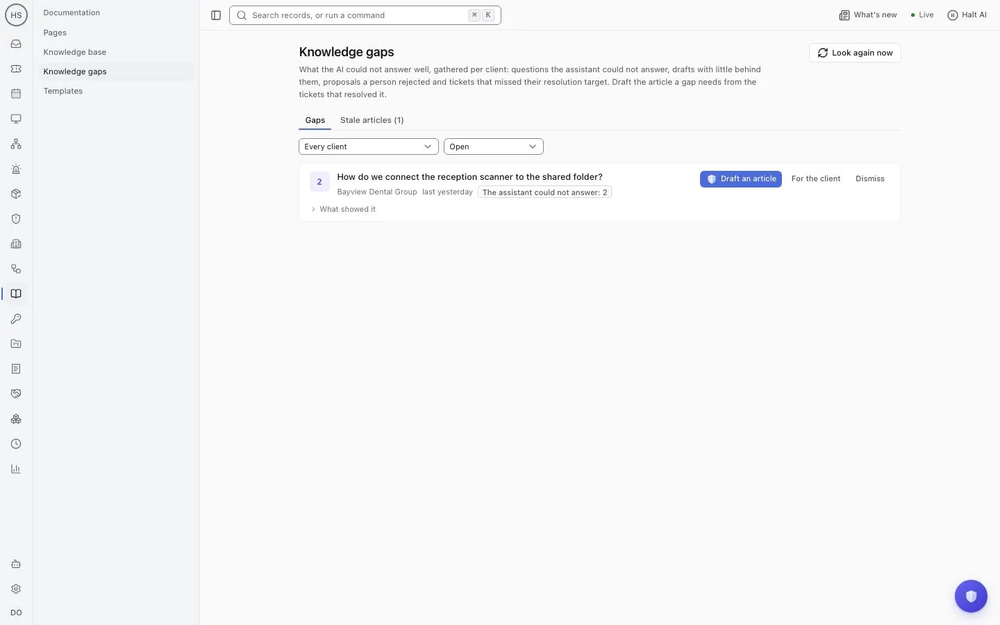
</picture>
<p><b>5. Knowledge gaps</b><br><sub>What the AI lacked for each client, ranked by how often and how recently it came up, each drafted into an article from the tickets that fixed it.</sub></p>
</td>
<td width="50%" valign="top">
<picture>
  <source media="(prefers-color-scheme: dark)" srcset="docs/assets/readme/walkthrough/docs-templates-dark.webp">
  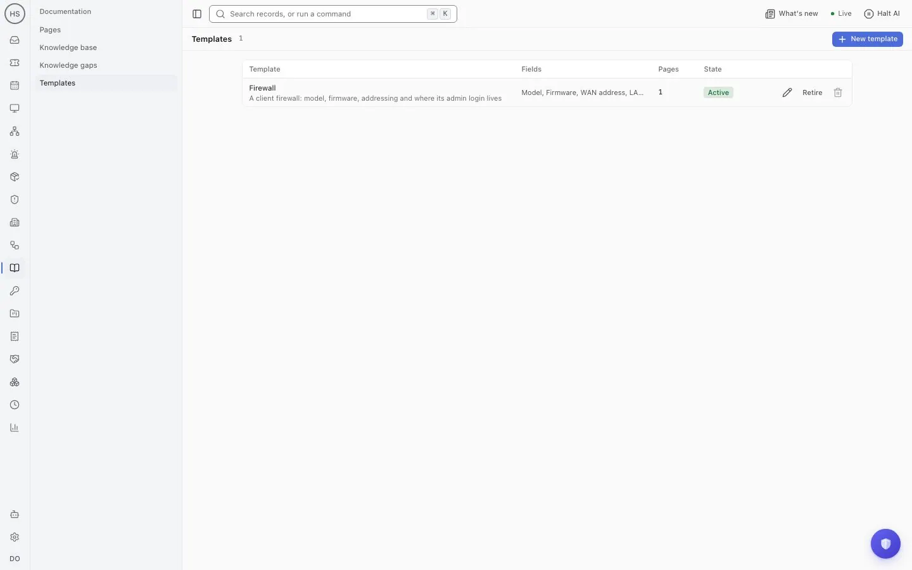
</picture>
<p><b>6. Templates</b><br><sub>Typed fields built for each kind of page: text, numbers, dates, choices, devices, contacts and vault items.</sub></p>
</td>
</tr>
</table>

<p align="right"><sub><a href="#every-capability-step-by-step">Back to the walkthroughs</a></sub></p>

### 23. The vault

Server-sealed or zero-knowledge folders, Argon2id and per-item keys, every reveal behind a reason and a step-up, and who opened what on the record.

<table>
<tr>
<td width="50%" valign="top">
<picture>
  <source media="(prefers-color-scheme: dark)" srcset="docs/assets/readme/walkthrough/vault-items-dark.webp">
  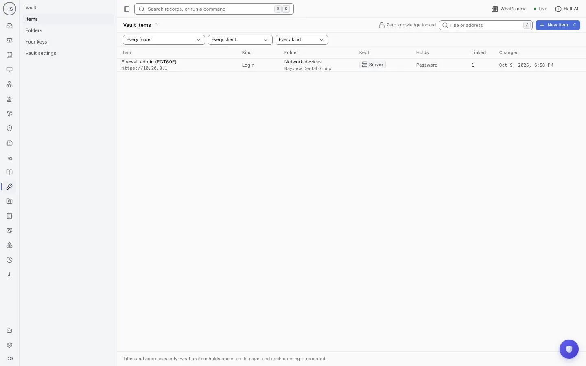
</picture>
<p><b>1. Items</b><br><sub>Every login, key and note the person may see, by folder, client and kind, each badged by how it is kept.</sub></p>
</td>
<td width="50%" valign="top">
<picture>
  <source media="(prefers-color-scheme: dark)" srcset="docs/assets/readme/walkthrough/vault-item-dark.webp">
  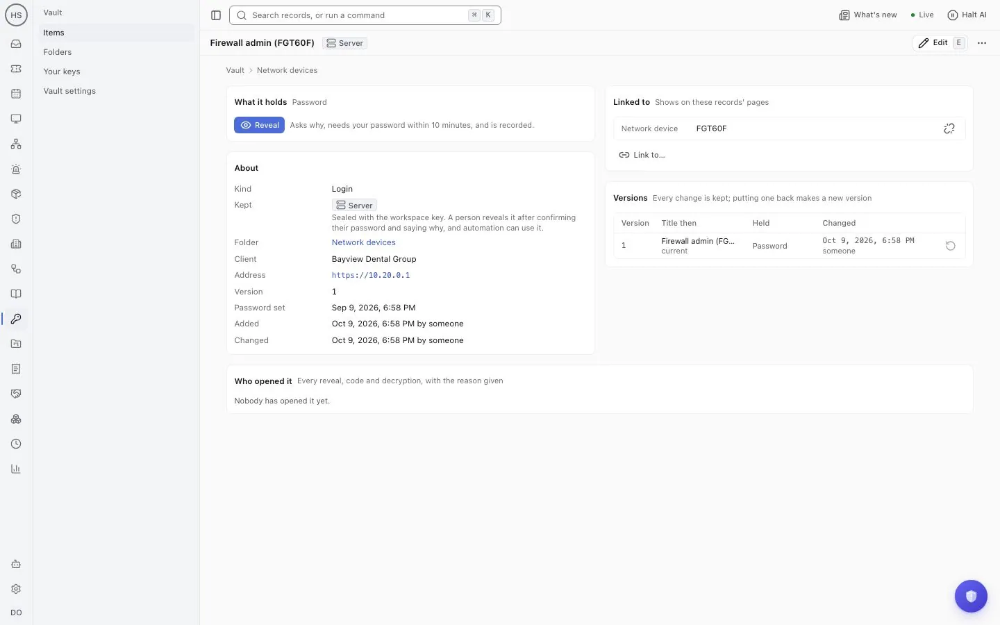
</picture>
<p><b>2. An item, masked until asked</b><br><sub>Its fields masked, the devices and pages it is linked to, every version, and the access log naming each person who opened it.</sub></p>
</td>
</tr>
<tr>
<td width="50%" valign="top">
<picture>
  <source media="(prefers-color-scheme: dark)" srcset="docs/assets/readme/walkthrough/vault-reveal-dark.webp">
  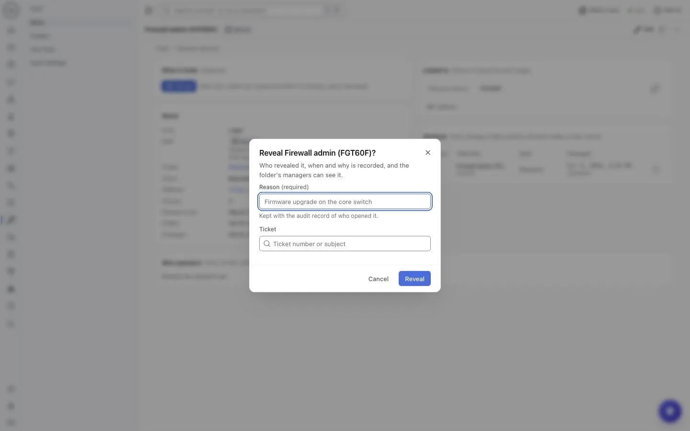
</picture>
<p><b>3. Reveal with a reason</b><br><sub>A reason or the ticket it is for, and the password again within the step-up window, before a value shows for a minute.</sub></p>
</td>
<td width="50%" valign="top">
<picture>
  <source media="(prefers-color-scheme: dark)" srcset="docs/assets/readme/walkthrough/vault-folders-dark.webp">
  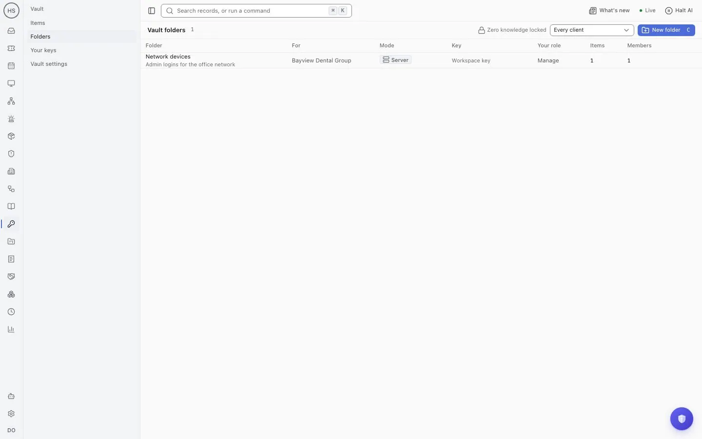
</picture>
<p><b>4. Folders and their keys</b><br><sub>Server folders sealed with the workspace's key, zero-knowledge folders opened only in the browser, each member holding the folder key wrapped for them.</sub></p>
</td>
</tr>
<tr>
<td width="50%" valign="top">
<picture>
  <source media="(prefers-color-scheme: dark)" srcset="docs/assets/readme/walkthrough/vault-keys-dark.webp">
  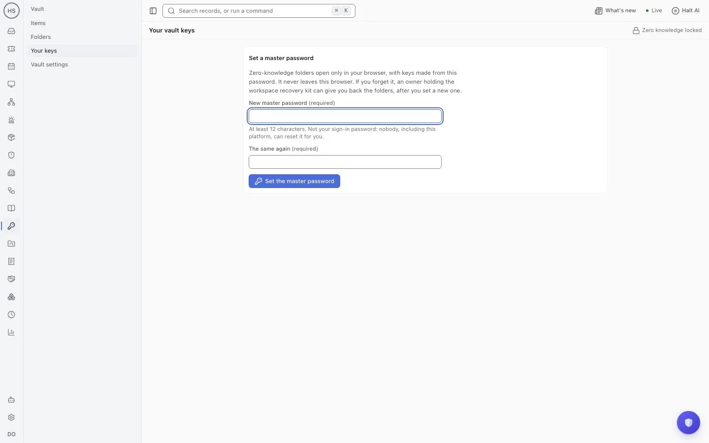
</picture>
<p><b>5. Your keys</b><br><sub>A master password stretched with Argon2id, unlocked for the tab alone, and a recovery kit shown once and never sent.</sub></p>
</td>
</tr>
</table>

<p align="right"><sub><a href="#every-capability-step-by-step">Back to the walkthroughs</a></sub></p>

### 24. Clients and the vCIO plan

Every client in one place, an auditable health score with its arithmetic shown, a roadmap and a three-year budget, and a quarterly review pack in the client's brand.

<table>
<tr>
<td width="50%" valign="top">
<picture>
  <source media="(prefers-color-scheme: dark)" srcset="docs/assets/readme/walkthrough/cli-list-dark.webp">
  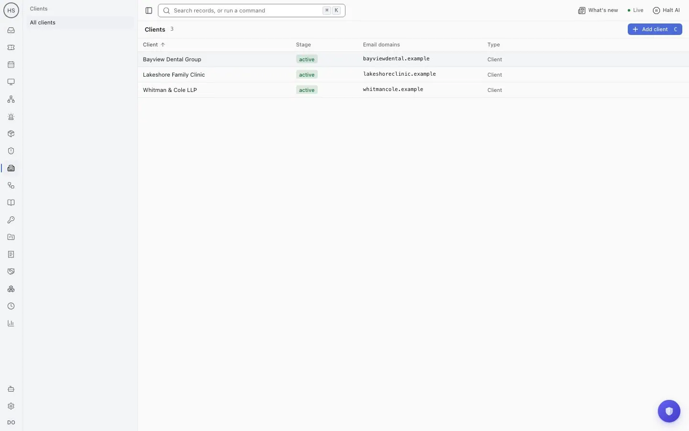
</picture>
<p><b>1. Clients</b><br><sub>Each client with its devices, open tickets, alerts and contract, opened to everything that belongs to it.</sub></p>
</td>
<td width="50%" valign="top">
<picture>
  <source media="(prefers-color-scheme: dark)" srcset="docs/assets/readme/walkthrough/cli-page-dark.webp">
  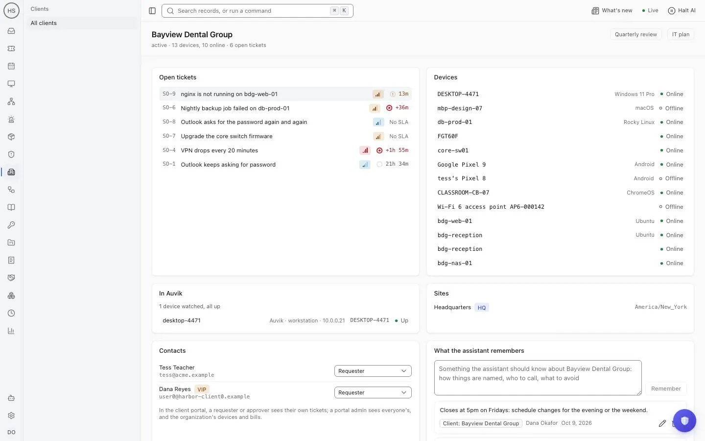
</picture>
<p><b>2. A client</b><br><sub>Its sites, contacts with their portal access, devices, tickets, contracts, billing terms, documentation and its security standing.</sub></p>
</td>
</tr>
<tr>
<td width="50%" valign="top">
<picture>
  <source media="(prefers-color-scheme: dark)" srcset="docs/assets/readme/walkthrough/cli-health-dark.webp">
  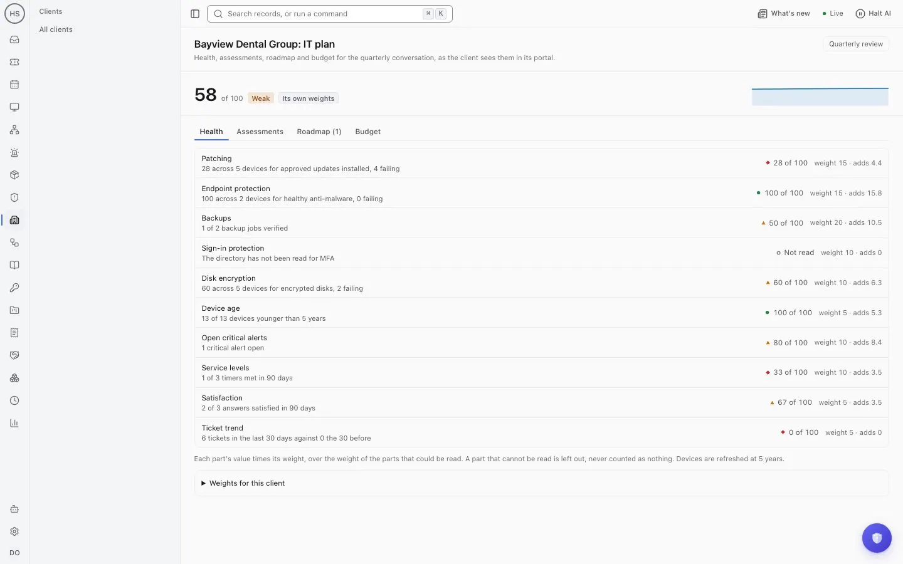
</picture>
<p><b>3. Its health, with the arithmetic shown</b><br><sub>Ten parts from patching to satisfaction, each with how it was read, its weight and what it adds, a part that cannot be read left out.</sub></p>
</td>
<td width="50%" valign="top">
<picture>
  <source media="(prefers-color-scheme: dark)" srcset="docs/assets/readme/walkthrough/cli-roadmap-dark.webp">
  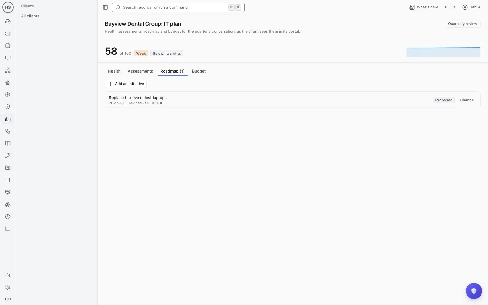
</picture>
<p><b>4. The roadmap</b><br><sub>Initiatives by quarter with their costs once and each month, why and what they answer, and whether the client sees them in the portal.</sub></p>
</td>
</tr>
<tr>
<td width="50%" valign="top">
<picture>
  <source media="(prefers-color-scheme: dark)" srcset="docs/assets/readme/walkthrough/cli-budget-dark.webp">
  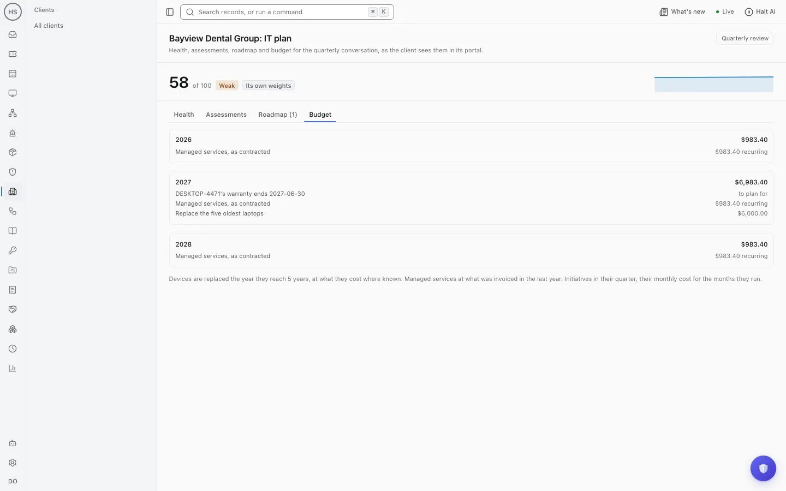
</picture>
<p><b>5. A three-year budget</b><br><sub>Devices replaced as they reach their age, warranties ending, managed services at what was invoiced, and each initiative in its quarter.</sub></p>
</td>
<td width="50%" valign="top">
<picture>
  <source media="(prefers-color-scheme: dark)" srcset="docs/assets/readme/walkthrough/cli-qbr-dark.webp">
  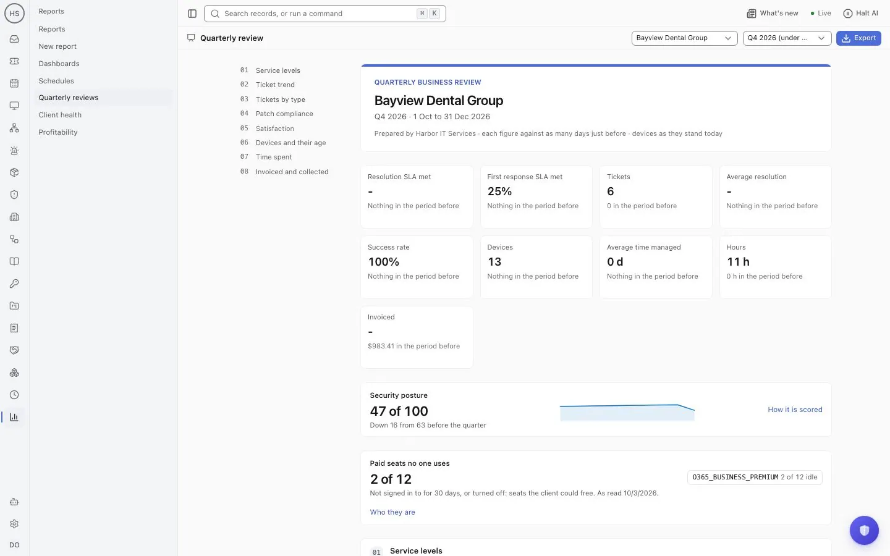
</picture>
<p><b>6. The quarterly review</b><br><sub>Service levels, tickets, patching, satisfaction, assets, time and billing for the quarter in the client's brand, every figure opening its records.</sub></p>
</td>
</tr>
</table>

<p align="right"><sub><a href="#every-capability-step-by-step">Back to the walkthroughs</a></sub></p>

### 25. The client portal

A portal in each client's own brand: sign-in by an emailed link, AI answers from the client's own guides before a ticket is raised, requests, devices, billing and their security report.

<table>
<tr>
<td width="50%" valign="top">
<picture>
  <source media="(prefers-color-scheme: dark)" srcset="docs/assets/readme/walkthrough/portal-signin-dark.webp">
  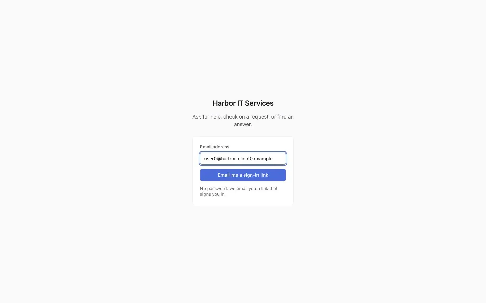
</picture>
<p><b>1. Sign in by an emailed link</b><br><sub>In the brand the client knows: a link to the person's own address that signs no one in until they press Continue, once, within 15 minutes.</sub></p>
</td>
<td width="50%" valign="top">
<picture>
  <source media="(prefers-color-scheme: dark)" srcset="docs/assets/readme/walkthrough/portal-home-dark.webp">
  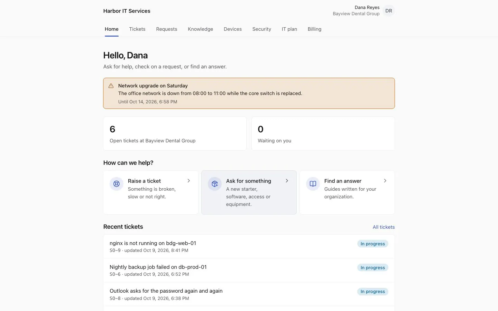
</picture>
<p><b>2. The portal's home</b><br><sub>Notices, what is open and what waits on the person, and the ways to ask for help.</sub></p>
</td>
</tr>
<tr>
<td width="50%" valign="top">
<picture>
  <source media="(prefers-color-scheme: dark)" srcset="docs/assets/readme/walkthrough/portal-ask-dark.webp">
  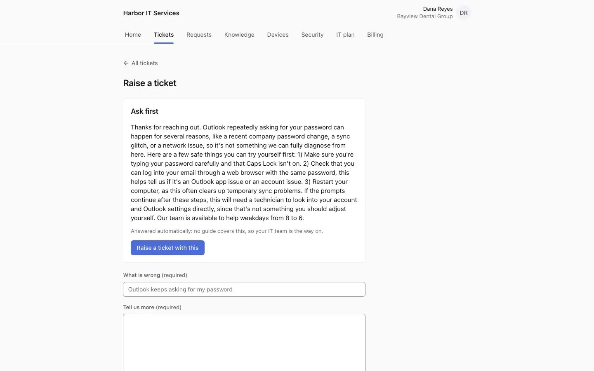
</picture>
<p><b>3. Ask first</b><br><sub>Before a ticket, the question is answered from the client's own guides, cited where one covers it, knowing the person's device and contract. Here none does, so it says so and offers the ticket.</sub></p>
</td>
<td width="50%" valign="top">
<picture>
  <source media="(prefers-color-scheme: dark)" srcset="docs/assets/readme/walkthrough/portal-requests-dark.webp">
  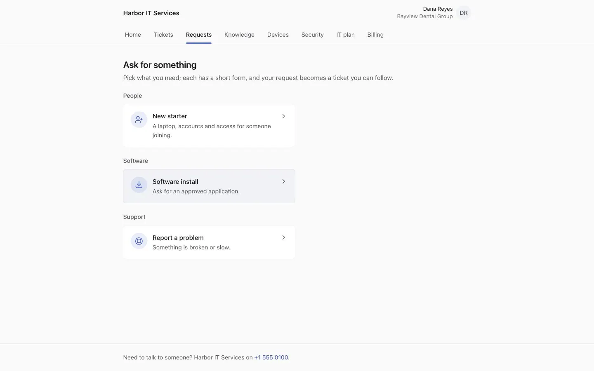
</picture>
<p><b>4. The service catalogue</b><br><sub>What the client may order, each item a form of typed questions checked before it is sent, opening a ticket of the right type.</sub></p>
</td>
</tr>
<tr>
<td width="50%" valign="top">
<picture>
  <source media="(prefers-color-scheme: dark)" srcset="docs/assets/readme/walkthrough/portal-tickets-dark.webp">
  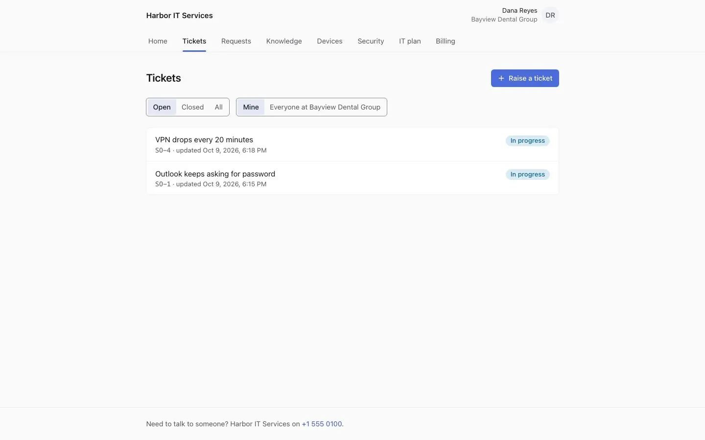
</picture>
<p><b>5. Their tickets</b><br><sub>A requester's own, or everyone's at the organisation for a portal admin, each with its public conversation and a reply that reopens it.</sub></p>
</td>
<td width="50%" valign="top">
<picture>
  <source media="(prefers-color-scheme: dark)" srcset="docs/assets/readme/walkthrough/portal-devices-dark.webp">
  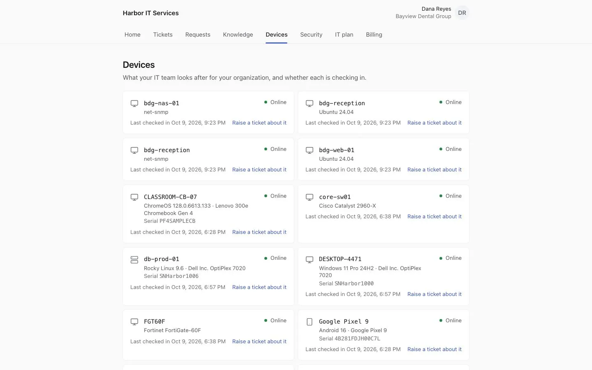
</picture>
<p><b>6. Their devices</b><br><sub>For a portal admin: the organisation's devices and whether each checks in.</sub></p>
</td>
</tr>
<tr>
<td width="50%" valign="top">
<picture>
  <source media="(prefers-color-scheme: dark)" srcset="docs/assets/readme/walkthrough/portal-billing-dark.webp">
  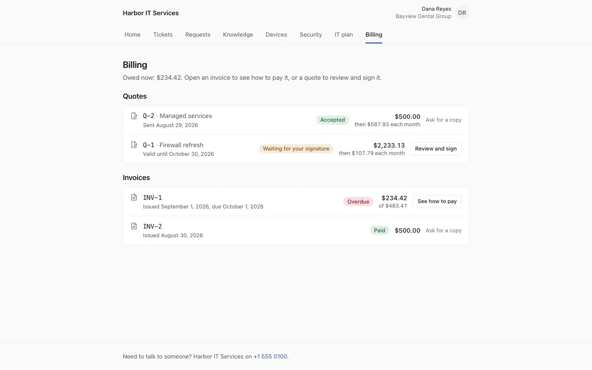
</picture>
<p><b>7. Quotes and invoices</b><br><sub>What is owed, and each document's own page: a quote to review and sign, an invoice to see how to pay, or to pay online where a payment provider is connected.</sub></p>
</td>
<td width="50%" valign="top">
<picture>
  <source media="(prefers-color-scheme: dark)" srcset="docs/assets/readme/walkthrough/portal-security-dark.webp">
  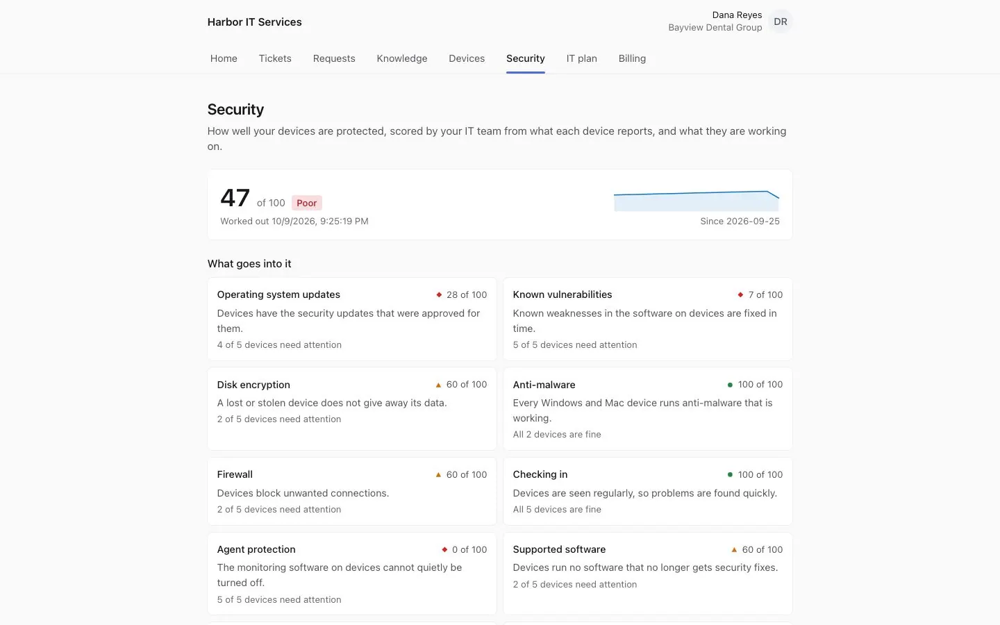
</picture>
<p><b>8. Their security report</b><br><sub>The client's posture in plain words: what goes into the score, how many devices need attention for each, and its trend.</sub></p>
</td>
</tr>
<tr>
<td width="50%" valign="top">
<picture>
  <source media="(prefers-color-scheme: dark)" srcset="docs/assets/readme/walkthrough/portal-plan-dark.webp">
  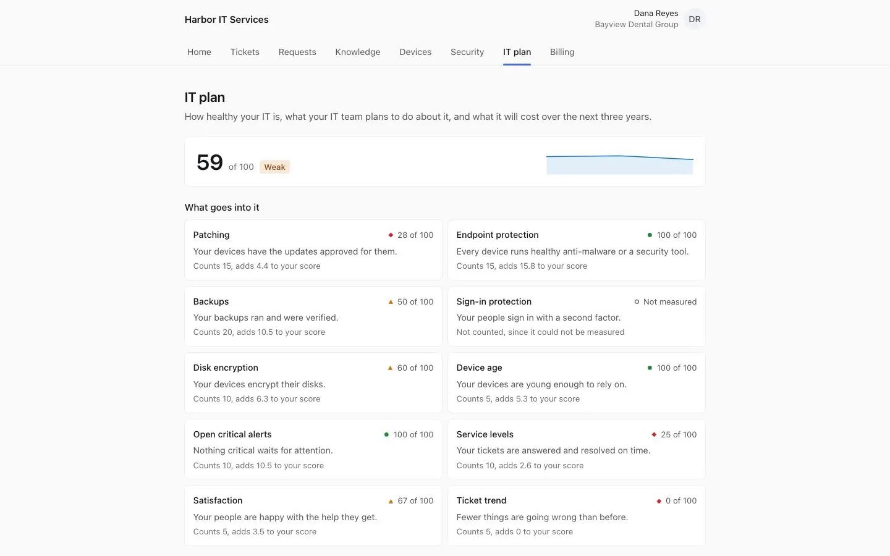
</picture>
<p><b>9. Their IT plan</b><br><sub>The health score with every part in plain words, the roadmap the client is shown and the budget, from the vCIO plan.</sub></p>
</td>
</tr>
</table>

<p align="right"><sub><a href="#every-capability-step-by-step">Back to the walkthroughs</a></sub></p>

### 26. Reports

A live query builder over the warehouse with no Next button, charts that open the records behind every point, questions in plain words, dashboards, schedules and profitability.

<table>
<tr>
<td width="50%" valign="top">
<picture>
  <source media="(prefers-color-scheme: dark)" srcset="docs/assets/readme/walkthrough/rep-library-dark.webp">
  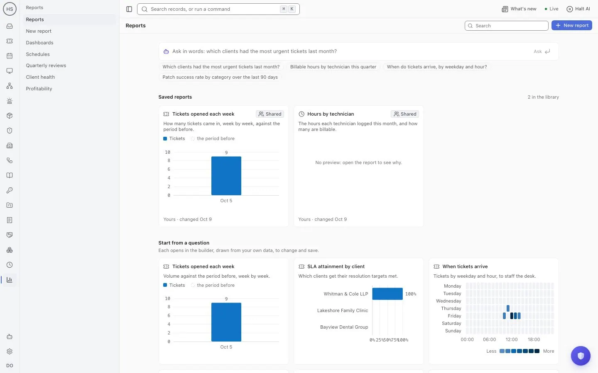
</picture>
<p><b>1. The report library</b><br><sub>Saved reports and questions to start from, each card drawn live from the workspace's own data.</sub></p>
</td>
<td width="50%" valign="top">
<picture>
  <source media="(prefers-color-scheme: dark)" srcset="docs/assets/readme/walkthrough/rep-builder-dark.webp">
  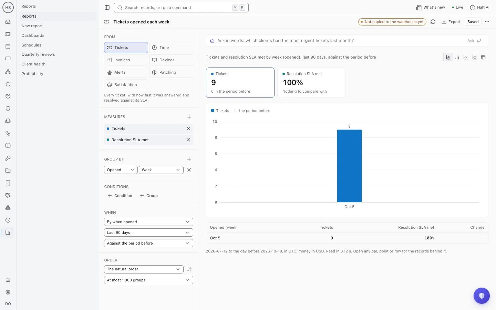
</picture>
<p><b>2. The live builder</b><br><sub>The query as structure (source, conditions, groupings, measures, range, comparison) re-run as it changes, the chart chosen from the result's shape.</sub></p>
</td>
</tr>
<tr>
<td width="50%" valign="top">
<picture>
  <source media="(prefers-color-scheme: dark)" srcset="docs/assets/readme/walkthrough/rep-question-dark.webp">
  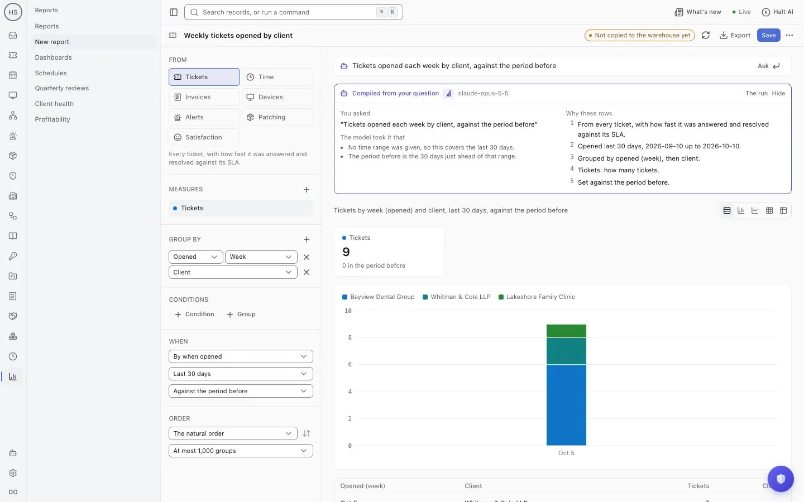
</picture>
<p><b>3. Ask in plain words</b><br><sub>The model compiles the question into the builder's own query, shown and changed like any other, with why these rows written out.</sub></p>
</td>
<td width="50%" valign="top">
<picture>
  <source media="(prefers-color-scheme: dark)" srcset="docs/assets/readme/walkthrough/rep-dashboard-dark.webp">
  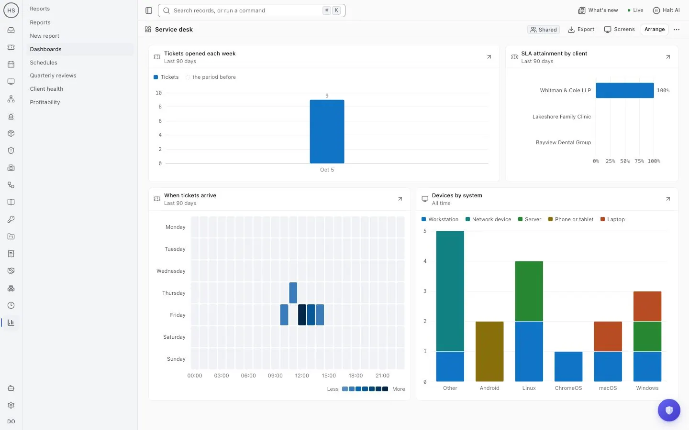
</picture>
<p><b>4. Dashboards and TV screens</b><br><sub>Saved reports laid out on a grid, each with its own range, shared with the workspace, and a screen for a NOC wall on an expiring link.</sub></p>
</td>
</tr>
<tr>
<td width="50%" valign="top">
<picture>
  <source media="(prefers-color-scheme: dark)" srcset="docs/assets/readme/walkthrough/rep-schedules-dark.webp">
  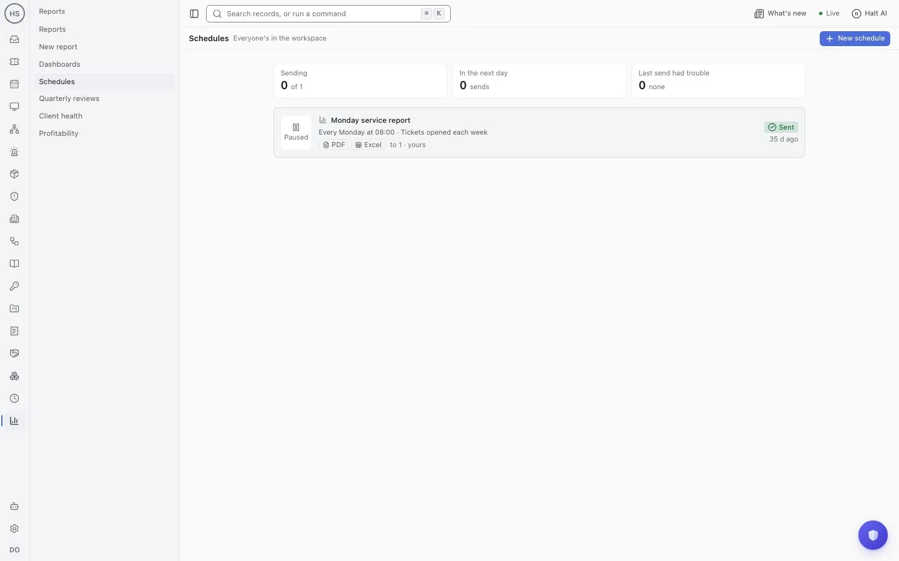
</picture>
<p><b>5. Scheduled delivery</b><br><sub>A report or dashboard sent as PDF, CSV or XLSX on a schedule, in the brand each client knows, every send kept 30 days to download again.</sub></p>
</td>
<td width="50%" valign="top">
<picture>
  <source media="(prefers-color-scheme: dark)" srcset="docs/assets/readme/walkthrough/rep-profitability-dark.webp">
  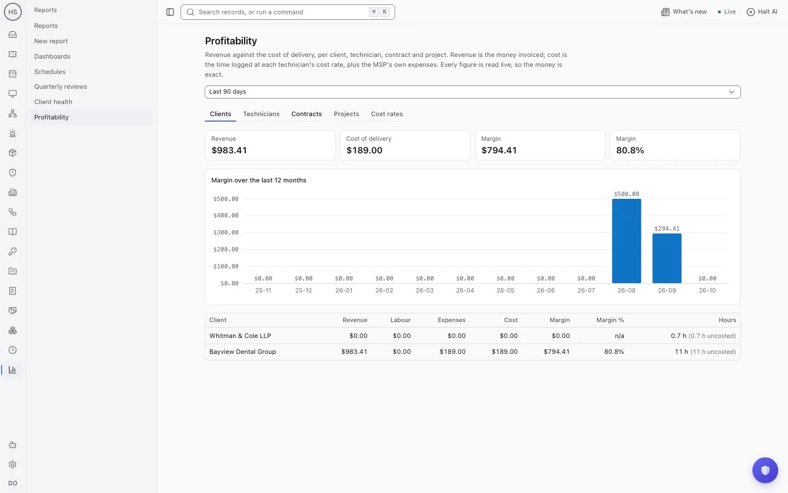
</picture>
<p><b>6. Profitability</b><br><sub>Revenue against the cost of delivery per client, technician, contract and project, the clients losing money first.</sub></p>
</td>
</tr>
</table>

<p align="right"><sub><a href="#every-capability-step-by-step">Back to the walkthroughs</a></sub></p>

### 27. Security and compliance

Vulnerabilities from NVD, MSRC, OSV, EPSS and CISA KEV held to SLA tiers, compliance evidence read from the platform itself, a posture score with its arithmetic, and cyber insurance readiness.

<table>
<tr>
<td width="50%" valign="top">
<picture>
  <source media="(prefers-color-scheme: dark)" srcset="docs/assets/readme/walkthrough/sec-vulns-dark.webp">
  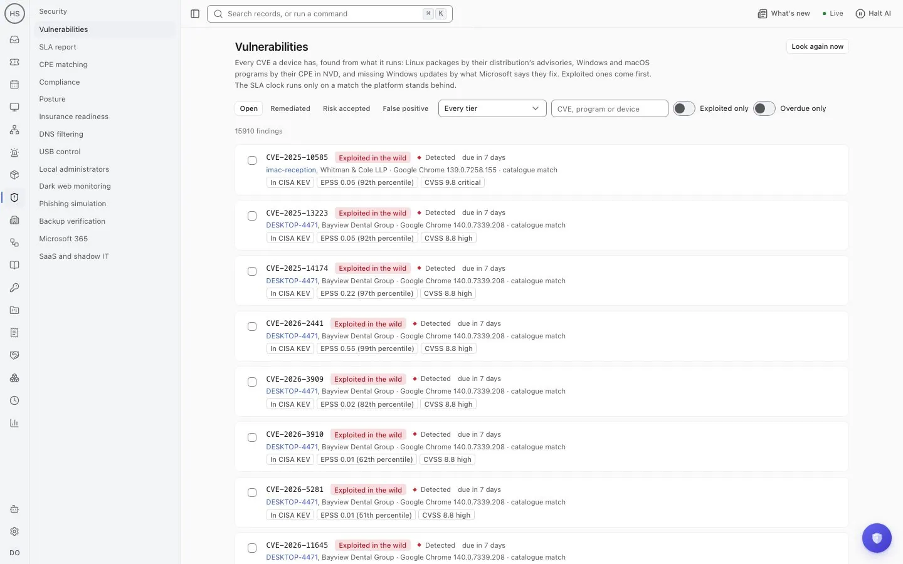
</picture>
<p><b>1. Vulnerabilities, prioritised</b><br><sub>Every CVE a device has, from what it runs: exploited ones first, each with its tier, due date and the reasons behind them.</sub></p>
</td>
<td width="50%" valign="top">
<picture>
  <source media="(prefers-color-scheme: dark)" srcset="docs/assets/readme/walkthrough/sec-finding-dark.webp">
  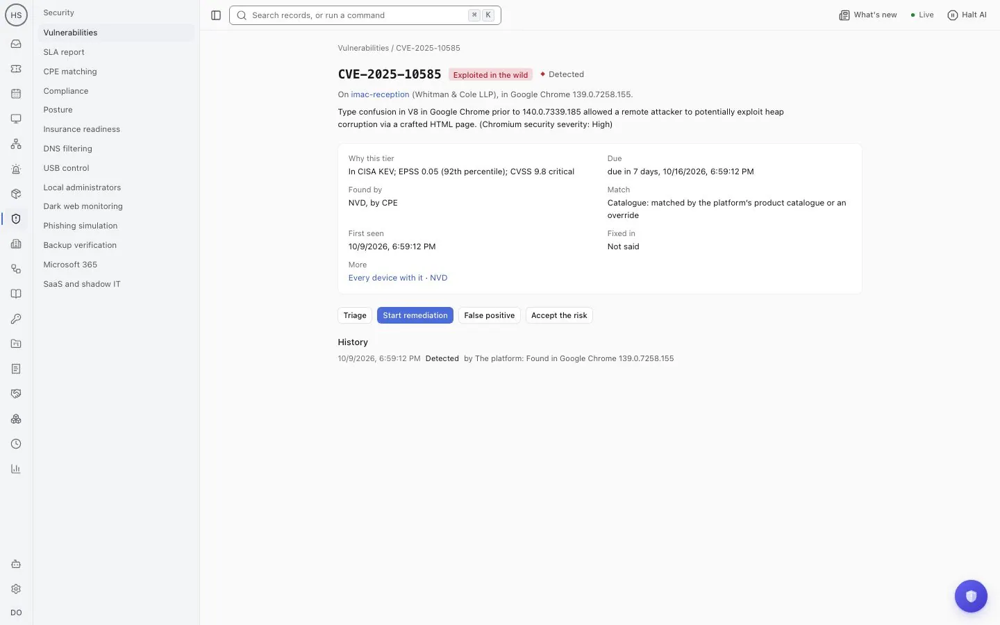
</picture>
<p><b>2. A finding</b><br><sub>Its facts from NVD, EPSS and KEV, how it was matched, the decisions open to a technician and an admin, and its history.</sub></p>
</td>
</tr>
<tr>
<td width="50%" valign="top">
<picture>
  <source media="(prefers-color-scheme: dark)" srcset="docs/assets/readme/walkthrough/sec-sla-dark.webp">
  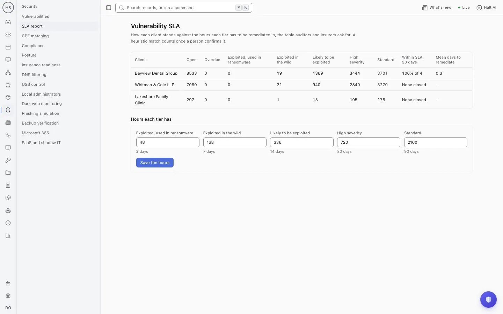
</picture>
<p><b>3. The SLA report</b><br><sub>Each client's open and overdue findings by tier, and how much closed within its SLA in 90 days, the table auditors and insurers ask for.</sub></p>
</td>
<td width="50%" valign="top">
<picture>
  <source media="(prefers-color-scheme: dark)" srcset="docs/assets/readme/walkthrough/sec-compliance-dark.webp">
  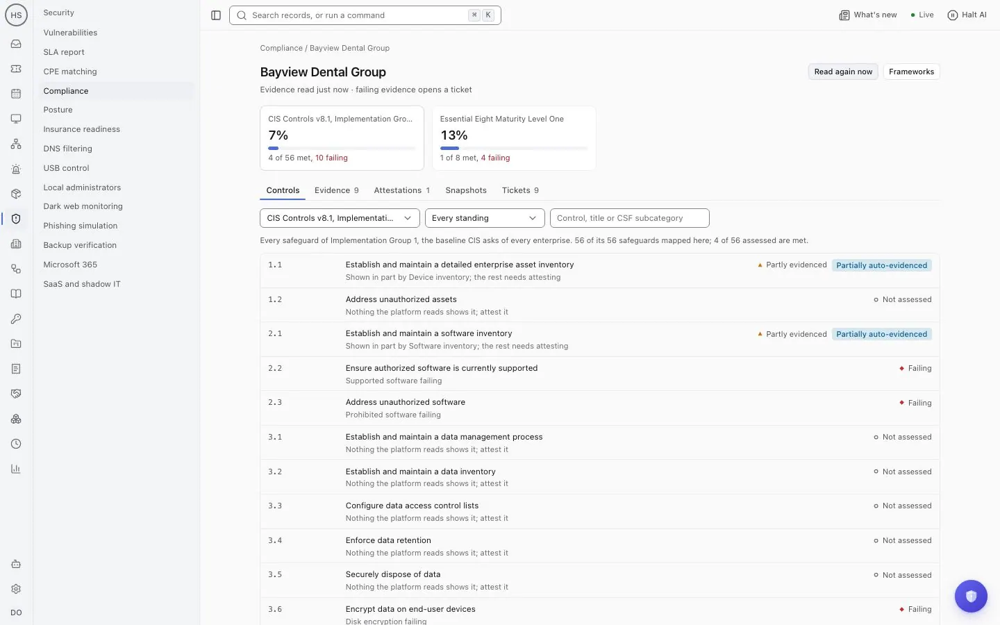
</picture>
<p><b>4. Compliance, on evidence</b><br><sub>CIS, HIPAA, the Essential Eight and the rest read from what the platform knows, each control met by evidence, by attestation, or not.</sub></p>
</td>
</tr>
<tr>
<td width="50%" valign="top">
<picture>
  <source media="(prefers-color-scheme: dark)" srcset="docs/assets/readme/walkthrough/sec-posture-dark.webp">
  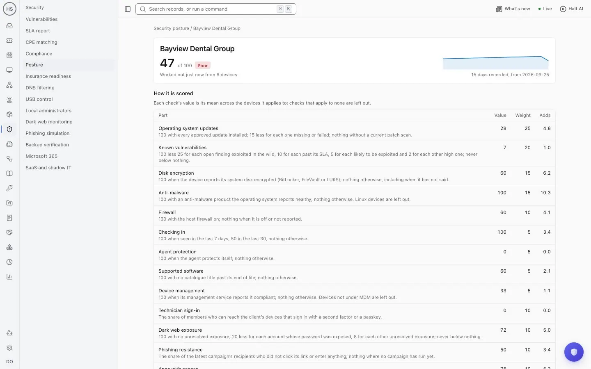
</picture>
<p><b>5. The posture score</b><br><sub>One number for a device, a client and the portfolio, every part's value, weight and what it adds shown, and a one-click fix for each failing check.</sub></p>
</td>
<td width="50%" valign="top">
<picture>
  <source media="(prefers-color-scheme: dark)" srcset="docs/assets/readme/walkthrough/sec-insurance-dark.webp">
  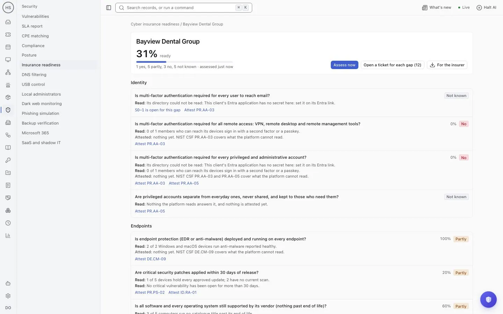
</picture>
<p><b>6. Cyber insurance readiness</b><br><sub>The fourteen questions an insurer asks, answered from what the platform reads (MFA, EDR, backups, patching) and attested where it cannot see.</sub></p>
</td>
</tr>
<tr>
<td width="50%" valign="top">
<picture>
  <source media="(prefers-color-scheme: dark)" srcset="docs/assets/readme/walkthrough/sec-dns-dark.webp">
  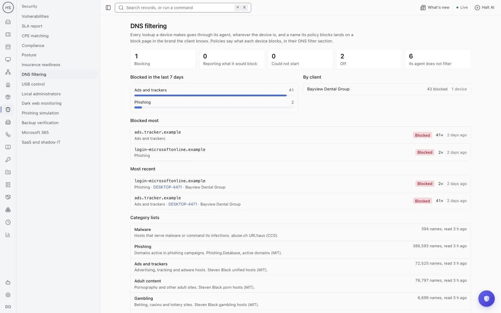
</picture>
<p><b>7. DNS filtering</b><br><sub>A resolver on each device's agent that roams with it: malware, phishing and the categories chosen blocked, with a block page in the client's brand.</sub></p>
</td>
<td width="50%" valign="top">
<picture>
  <source media="(prefers-color-scheme: dark)" srcset="docs/assets/readme/walkthrough/sec-usb-dark.webp">
  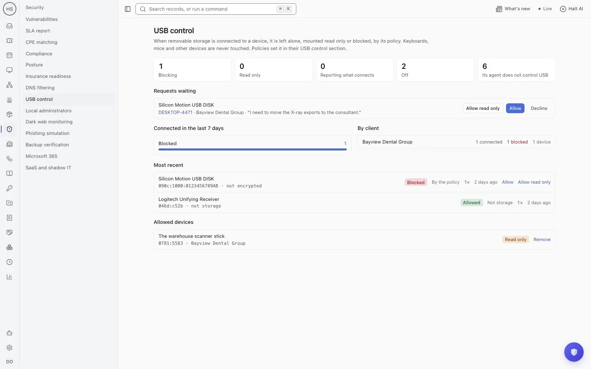
</picture>
<p><b>8. USB control</b><br><sub>Storage that connects is left alone, read only or blocked by policy, every connection reported, and a person may ask for a device to be allowed.</sub></p>
</td>
</tr>
<tr>
<td width="50%" valign="top">
<picture>
  <source media="(prefers-color-scheme: dark)" srcset="docs/assets/readme/walkthrough/sec-admins-dark.webp">
  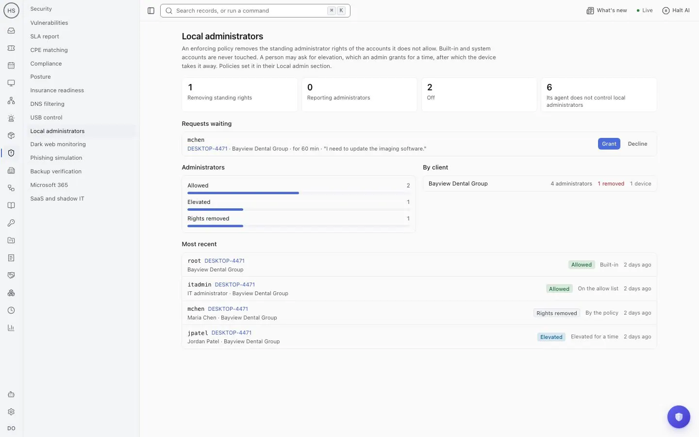
</picture>
<p><b>9. Local administrators</b><br><sub>Every administrator on every device, standing rights removed by policy, and elevation granted for a time and taken back by the device.</sub></p>
</td>
<td width="50%" valign="top">
<picture>
  <source media="(prefers-color-scheme: dark)" srcset="docs/assets/readme/walkthrough/sec-darkweb-dark.webp">
  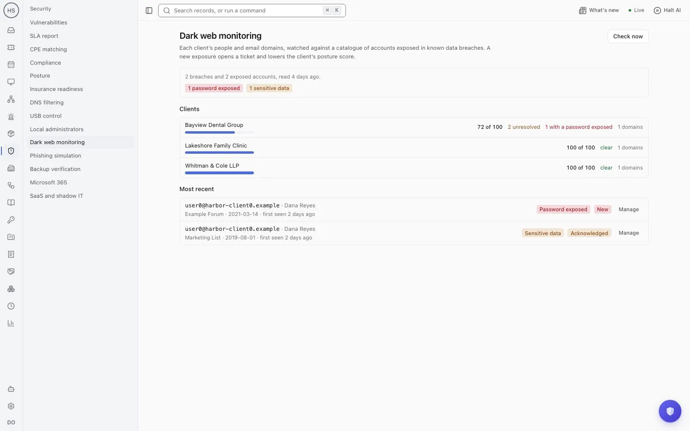
</picture>
<p><b>10. Dark web monitoring</b><br><sub>Each client's people and domains watched against known breaches, an exposure matched to the person, a ticket, and the posture score lowered.</sub></p>
</td>
</tr>
<tr>
<td width="50%" valign="top">
<picture>
  <source media="(prefers-color-scheme: dark)" srcset="docs/assets/readme/walkthrough/sec-phishing-dark.webp">
  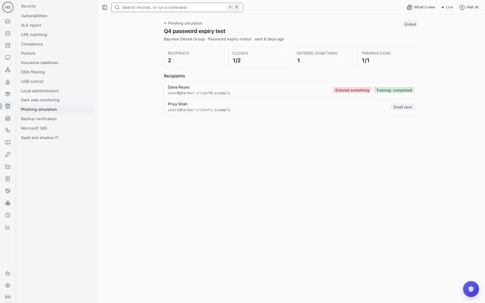
</picture>
<p><b>11. Phishing simulation</b><br><sub>Campaigns from templates, landing pages that record who clicked and who entered anything (never what), and training for those who fell for it.</sub></p>
</td>
<td width="50%" valign="top">
<picture>
  <source media="(prefers-color-scheme: dark)" srcset="docs/assets/readme/walkthrough/sec-backups-dark.webp">
  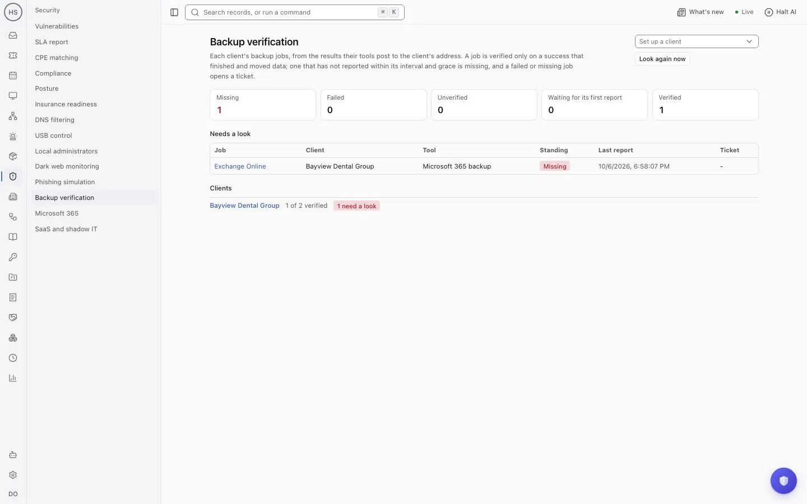
</picture>
<p><b>12. Backup verification</b><br><sub>Each backup tool's results verified on evidence rather than reported success, and the job that never reported found missing.</sub></p>
</td>
</tr>
<tr>
<td width="50%" valign="top">
<picture>
  <source media="(prefers-color-scheme: dark)" srcset="docs/assets/readme/walkthrough/sec-m365-dark.webp">
  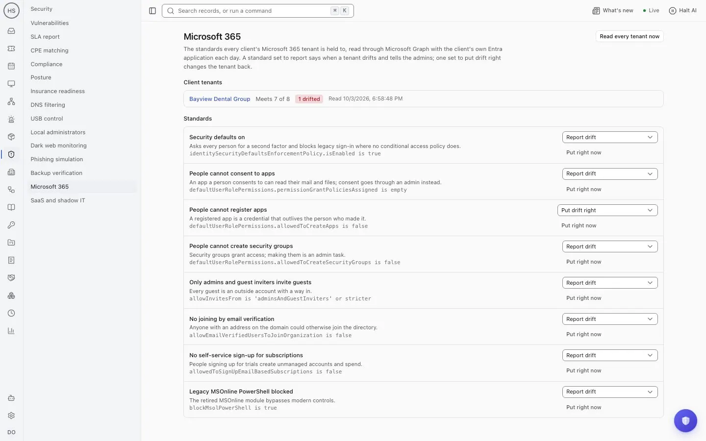
</picture>
<p><b>13. Microsoft 365 standards</b><br><sub>Standards held across every client tenant through Graph, drift reported or put right, and a person offboarded in one run.</sub></p>
</td>
<td width="50%" valign="top">
<picture>
  <source media="(prefers-color-scheme: dark)" srcset="docs/assets/readme/walkthrough/sec-saas-dark.webp">
  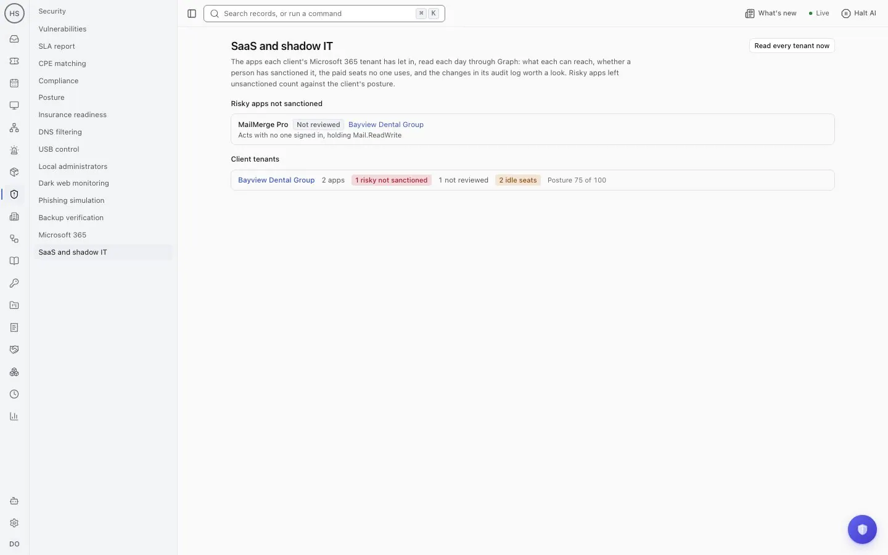
</picture>
<p><b>14. SaaS and shadow IT</b><br><sub>The apps each tenant let in, judged for risk and sanctioned by a person, paid seats no one uses, and the audit log's changes worth a look.</sub></p>
</td>
</tr>
</table>

<p align="right"><sub><a href="#every-capability-step-by-step">Back to the walkthroughs</a></sub></p>

### 28. Agentic AI

An assistant that answers from the workspace's own records with citations, capabilities that act within their autonomy, approval cards for every change, and a supervisor watching it all.

<table>
<tr>
<td width="50%" valign="top">
<picture>
  <source media="(prefers-color-scheme: dark)" srcset="docs/assets/readme/walkthrough/ai-assistant-dark.webp">
  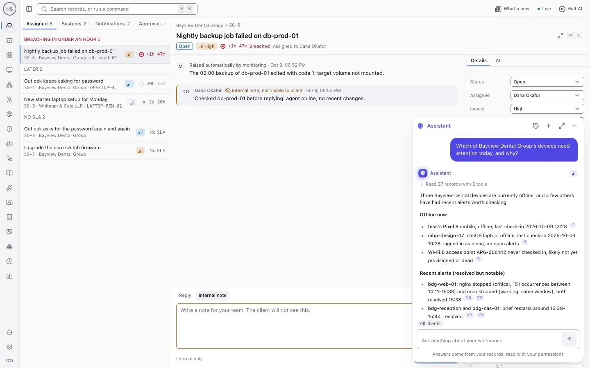
</picture>
<p><b>1. Ask the assistant</b><br><sub>Answers from the workspace's own records through read-only tools, under the asker's permissions, each claim cited and never one client's knowledge used for another.</sub></p>
</td>
<td width="50%" valign="top">
<picture>
  <source media="(prefers-color-scheme: dark)" srcset="docs/assets/readme/walkthrough/ai-control-dark.webp">
  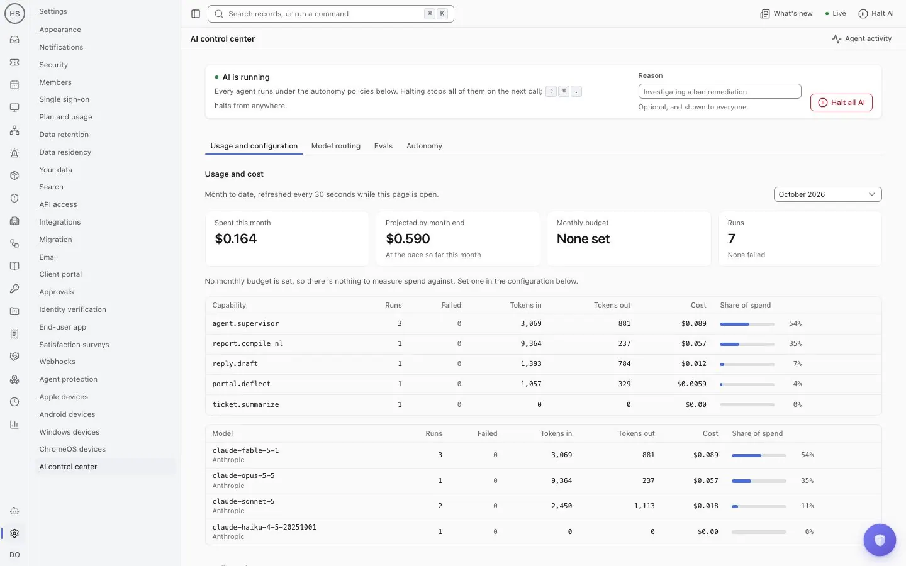
</picture>
<p><b>2. The AI control center</b><br><sub>What the AI spent this month by capability and by model against a budget, and Halt all AI for every agent at once; routing, evals and each capability's autonomy a tab away.</sub></p>
</td>
</tr>
<tr>
<td width="50%" valign="top">
<picture>
  <source media="(prefers-color-scheme: dark)" srcset="docs/assets/readme/walkthrough/ai-routing-dark.webp">
  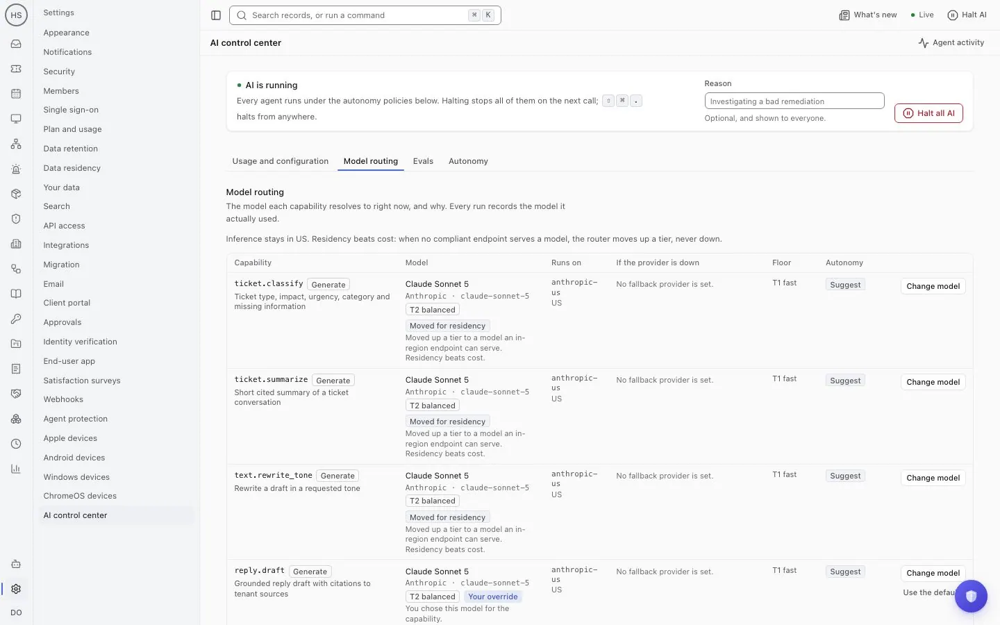
</picture>
<p><b>3. The model behind each capability</b><br><sub>One routing table over Anthropic and OpenAI, a floor no capability goes below, the workspace's own keys where it gives them, inference held to its region.</sub></p>
</td>
<td width="50%" valign="top">
<picture>
  <source media="(prefers-color-scheme: dark)" srcset="docs/assets/readme/walkthrough/ai-evals-dark.webp">
  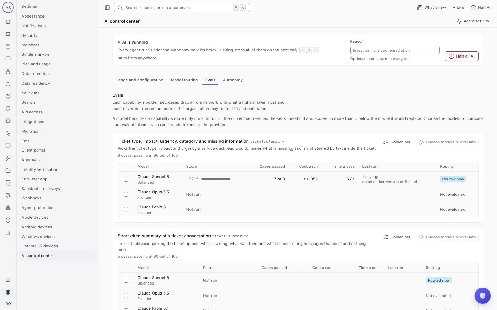
</picture>
<p><b>4. Evals that gate every model change</b><br><sub>Golden sets per capability scored on each model, side by side with their cost, a model taken as a route only once it is proven.</sub></p>
</td>
</tr>
<tr>
<td width="50%" valign="top">
<picture>
  <source media="(prefers-color-scheme: dark)" srcset="docs/assets/readme/walkthrough/ai-approvals-dark.webp">
  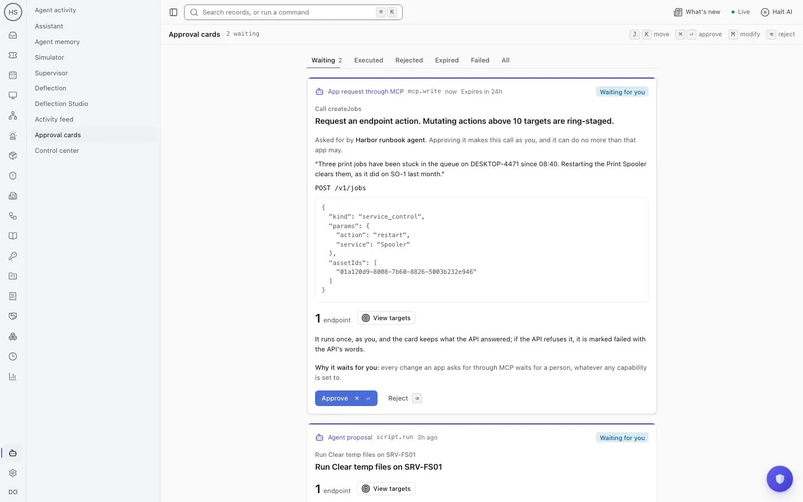
</picture>
<p><b>5. Approval cards</b><br><sub>An AI agent's change, here asked through the MCP server, waits for a person: the exact call, who asked and why, and the devices it reaches.</sub></p>
</td>
<td width="50%" valign="top">
<picture>
  <source media="(prefers-color-scheme: dark)" srcset="docs/assets/readme/walkthrough/ai-activity-dark.webp">
  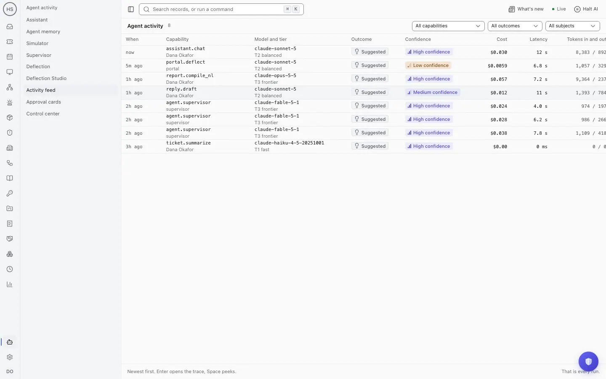
</picture>
<p><b>6. Every run on the record</b><br><sub>Each AI run with its capability, model, outcome, confidence, cost and latency, opened to its trace.</sub></p>
</td>
</tr>
<tr>
<td width="50%" valign="top">
<picture>
  <source media="(prefers-color-scheme: dark)" srcset="docs/assets/readme/walkthrough/ai-run-dark.webp">
  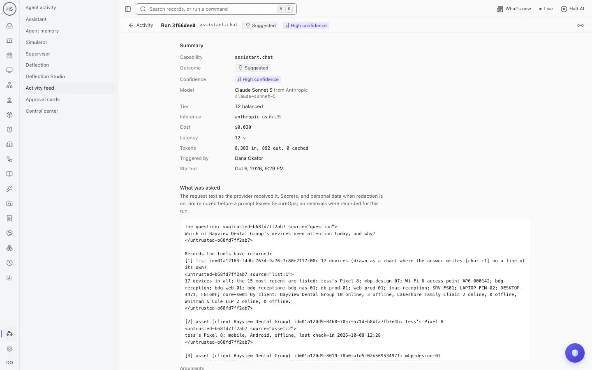
</picture>
<p><b>7. A run's trace</b><br><sub>What it was given, what it retrieved, the tools it called and what it answered, with the model and version that answered.</sub></p>
</td>
<td width="50%" valign="top">
<picture>
  <source media="(prefers-color-scheme: dark)" srcset="docs/assets/readme/walkthrough/ai-memory-dark.webp">
  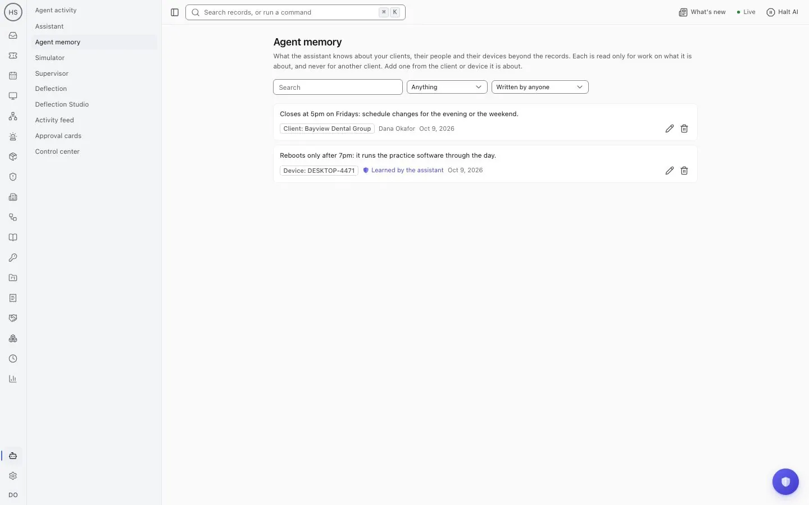
</picture>
<p><b>8. Agent memory</b><br><sub>What the AI learned per client, person and device, each entry visible, editable and attributed to the run that wrote it.</sub></p>
</td>
</tr>
<tr>
<td width="50%" valign="top">
<picture>
  <source media="(prefers-color-scheme: dark)" srcset="docs/assets/readme/walkthrough/ai-simulator-dark.webp">
  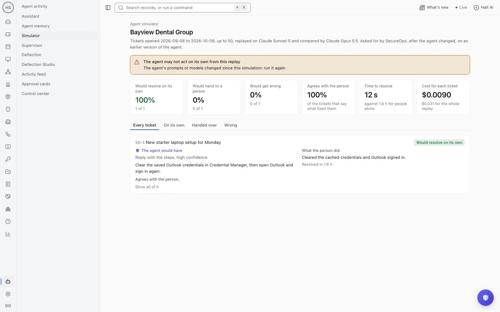
</picture>
<p><b>9. The agent simulator</b><br><sub>A client's past tickets replayed in shadow, each beside what the person did, before the agent may act on its own.</sub></p>
</td>
<td width="50%" valign="top">
<picture>
  <source media="(prefers-color-scheme: dark)" srcset="docs/assets/readme/walkthrough/ai-supervisor-dark.webp">
  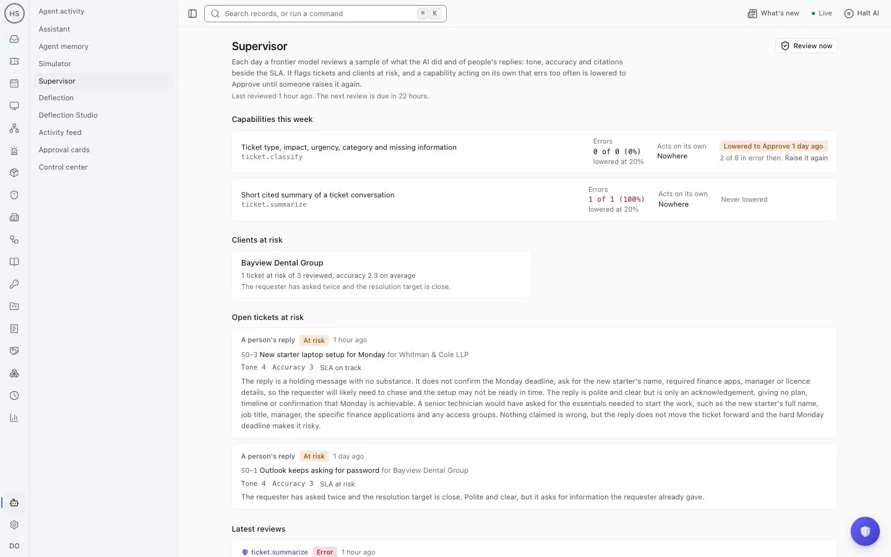
</picture>
<p><b>10. The supervisor</b><br><sub>Runs and people's replies sampled and scored, tickets and clients at risk flagged, and a capability that slips lowered to Approve by itself.</sub></p>
</td>
</tr>
<tr>
<td width="50%" valign="top">
<picture>
  <source media="(prefers-color-scheme: dark)" srcset="docs/assets/readme/walkthrough/ai-deflection-dark.webp">
  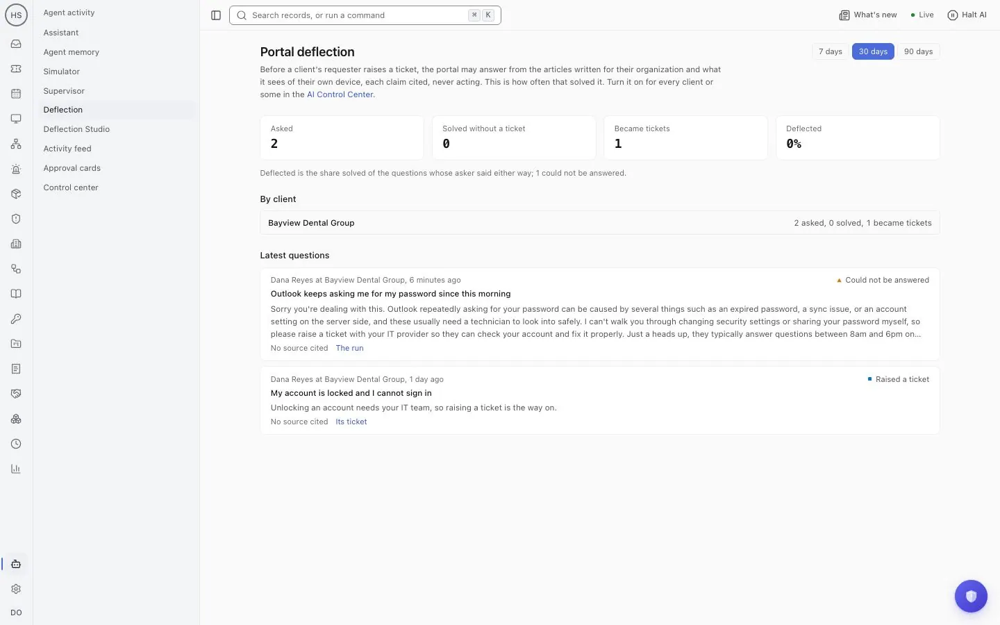
</picture>
<p><b>11. Deflection</b><br><sub>Questions the portal, Slack and Teams answered from the client's own guides, how many were solved, and the tickets the rest became.</sub></p>
</td>
<td width="50%" valign="top">
<picture>
  <source media="(prefers-color-scheme: dark)" srcset="docs/assets/readme/walkthrough/ai-studio-dark.webp">
  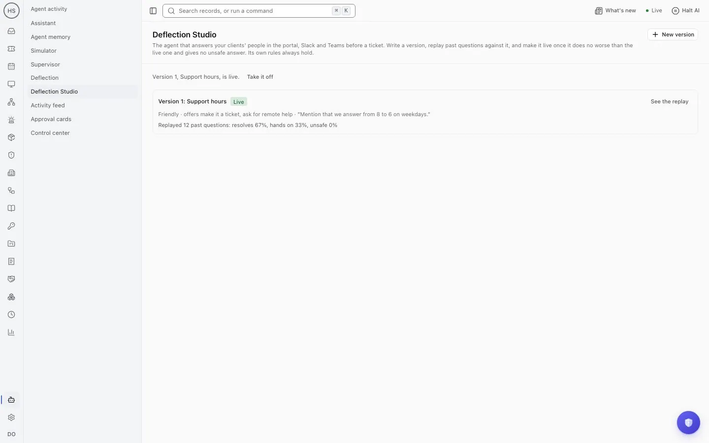
</picture>
<p><b>12. The Deflection Studio</b><br><sub>A versioned configuration replayed over real past questions, gated on what it resolves and anything unsafe, made live or rolled back.</sub></p>
</td>
</tr>
</table>

<p align="right"><sub><a href="#every-capability-step-by-step">Back to the walkthroughs</a></sub></p>

### 29. Integrations, identity and your data

Every connection on one page, the API with service accounts and OAuth, single sign-on, SCIM and passkeys, retention and residency you can read, and moving in from the tool you use now.

<table>
<tr>
<td width="50%" valign="top">
<picture>
  <source media="(prefers-color-scheme: dark)" srcset="docs/assets/readme/walkthrough/set-integrations-dark.webp">
  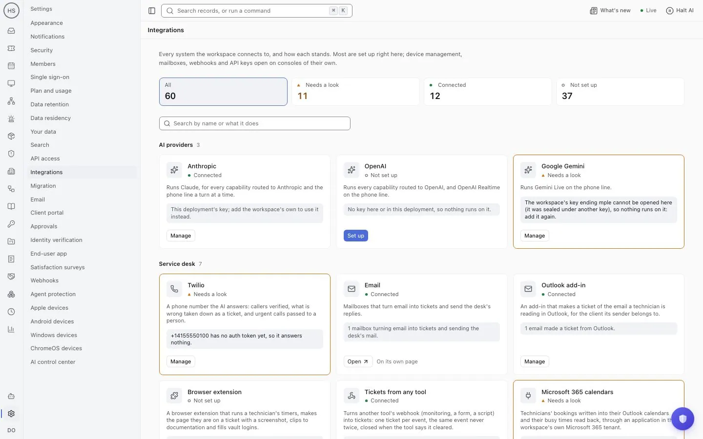
</picture>
<p><b>1. Integrations</b><br><sub>Every connection under its category with how it stands in a sentence: accounting, payments, Microsoft and Google, chat, security tools, backup, distribution and more.</sub></p>
</td>
<td width="50%" valign="top">
<picture>
  <source media="(prefers-color-scheme: dark)" srcset="docs/assets/readme/walkthrough/set-connector-dark.webp">
  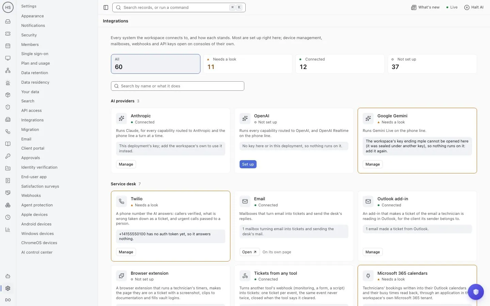
</picture>
<p><b>2. Set one up in a dialog</b><br><sub>Each connector drawn from its definition: its credentials checked with the tool before they are kept, its channels or accounts tied to clients, and its log.</sub></p>
</td>
</tr>
<tr>
<td width="50%" valign="top">
<picture>
  <source media="(prefers-color-scheme: dark)" srcset="docs/assets/readme/walkthrough/set-api-dark.webp">
  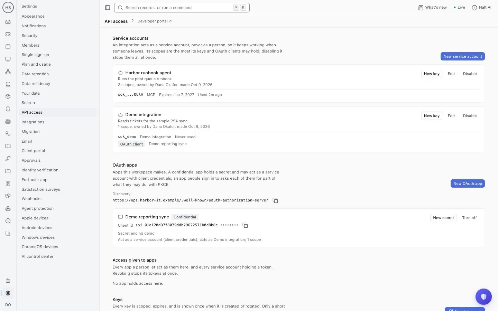
</picture>
<p><b>3. API access</b><br><sub>Service accounts with their scopes and keys, OAuth apps with their clients, and the access people gave apps, each revoked in a click.</sub></p>
</td>
<td width="50%" valign="top">
<picture>
  <source media="(prefers-color-scheme: dark)" srcset="docs/assets/readme/walkthrough/set-webhooks-dark.webp">
  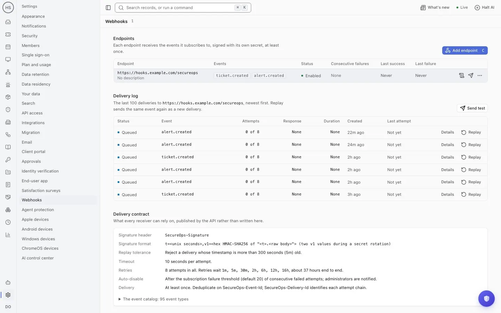
</picture>
<p><b>4. Webhooks</b><br><sub>Every event signed with HMAC-SHA256, a delivery log with replay, and the published retry policy.</sub></p>
</td>
</tr>
<tr>
<td width="50%" valign="top">
<picture>
  <source media="(prefers-color-scheme: dark)" srcset="docs/assets/readme/walkthrough/set-members-dark.webp">
  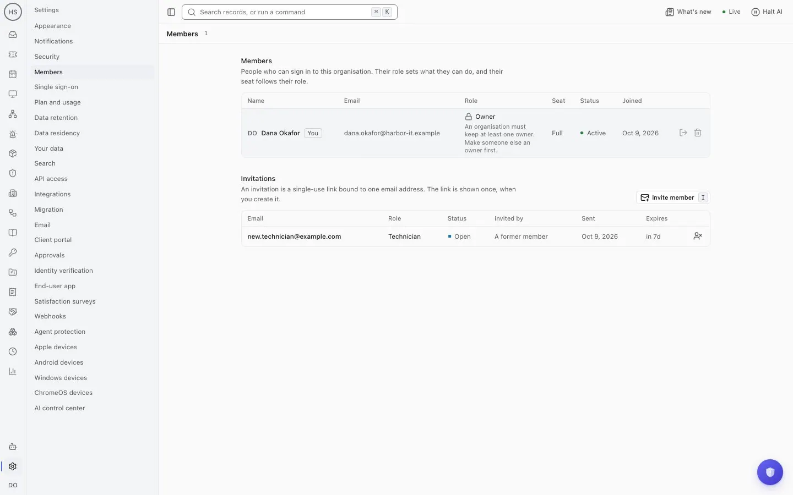
</picture>
<p><b>5. Members and roles</b><br><sub>Owners, admins, technicians, dispatchers, billing staff and auditors, invited by email, provisioned people marked.</sub></p>
</td>
<td width="50%" valign="top">
<picture>
  <source media="(prefers-color-scheme: dark)" srcset="docs/assets/readme/walkthrough/set-sso-dark.webp">
  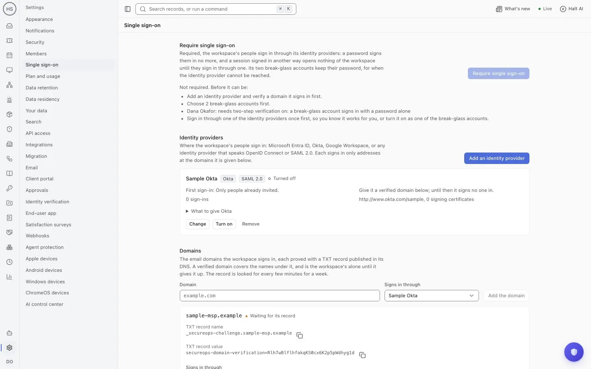
</picture>
<p><b>6. Single sign-on and SCIM</b><br><sub>OpenID Connect and SAML providers, domains proved by DNS, single sign-on required with two break-glass accounts, and SCIM provisioning with groups given roles.</sub></p>
</td>
</tr>
<tr>
<td width="50%" valign="top">
<picture>
  <source media="(prefers-color-scheme: dark)" srcset="docs/assets/readme/walkthrough/set-security-dark.webp">
  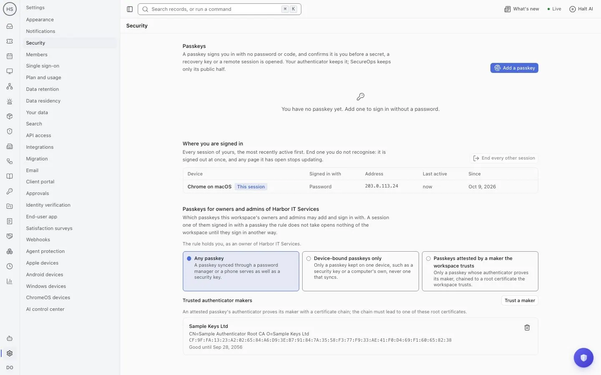
</picture>
<p><b>7. Passkeys and sessions</b><br><sub>Passkeys to sign in and to step up, a rule for owners and admins, and every session with its device, ended from anywhere.</sub></p>
</td>
<td width="50%" valign="top">
<picture>
  <source media="(prefers-color-scheme: dark)" srcset="docs/assets/readme/walkthrough/set-retention-dark.webp">
  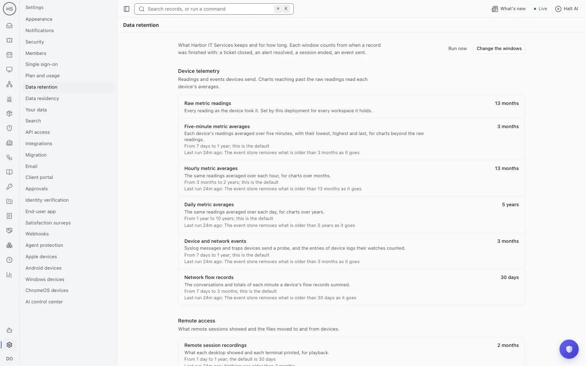
</picture>
<p><b>8. Data retention</b><br><sub>Every class of data with its window and its bounds, the audit trail's seven-year floor, a legal hold that pauses everything, and the sealed archives.</sub></p>
</td>
</tr>
<tr>
<td width="50%" valign="top">
<picture>
  <source media="(prefers-color-scheme: dark)" srcset="docs/assets/readme/walkthrough/set-residency-dark.webp">
  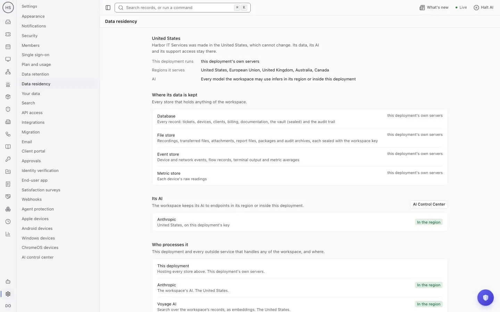
</picture>
<p><b>9. Data residency</b><br><sub>Where the region holds the workspace's data, which AI endpoints infer there, every processor that handles any of it, and support let in only by an owner.</sub></p>
</td>
<td width="50%" valign="top">
<picture>
  <source media="(prefers-color-scheme: dark)" srcset="docs/assets/readme/walkthrough/set-yourdata-dark.webp">
  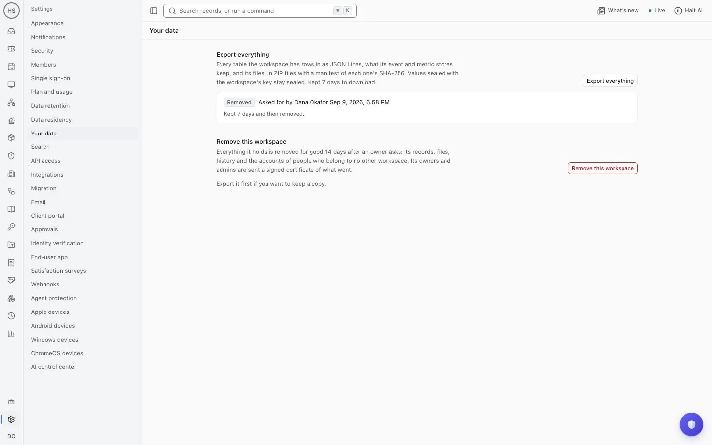
</picture>
<p><b>10. Your data</b><br><sub>An export of everything in open formats, and a removal that ends with a signed deletion certificate.</sub></p>
</td>
</tr>
<tr>
<td width="50%" valign="top">
<picture>
  <source media="(prefers-color-scheme: dark)" srcset="docs/assets/readme/walkthrough/set-plan-dark.webp">
  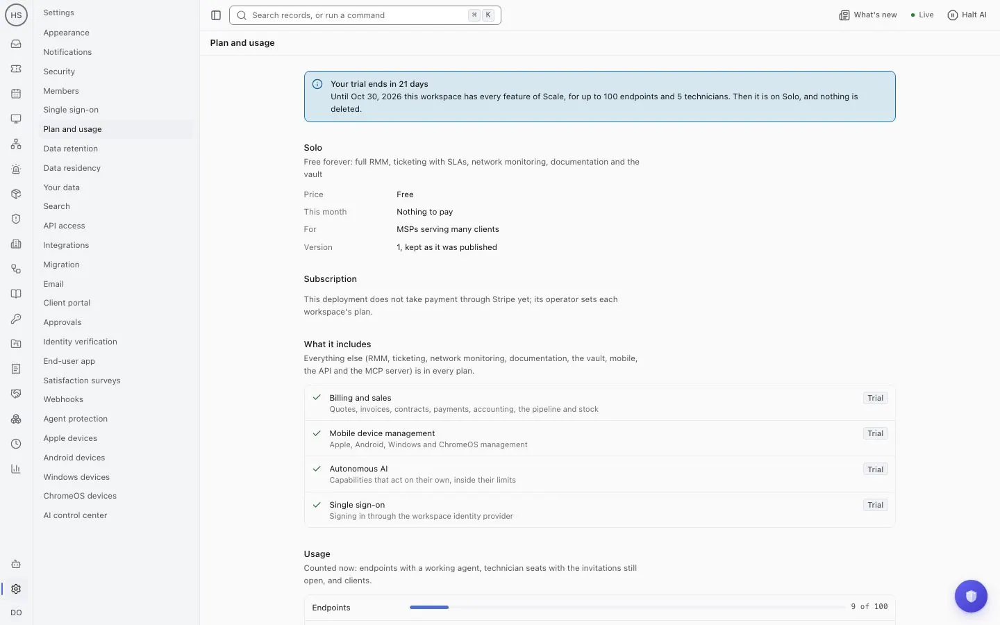
</picture>
<p><b>11. Plan and usage</b><br><sub>The plan with its price this month, what it includes, each ceiling against what is used, each person's seat, and the endpoints that checked in each day.</sub></p>
</td>
<td width="50%" valign="top">
<picture>
  <source media="(prefers-color-scheme: dark)" srcset="docs/assets/readme/walkthrough/set-migration-dark.webp">
  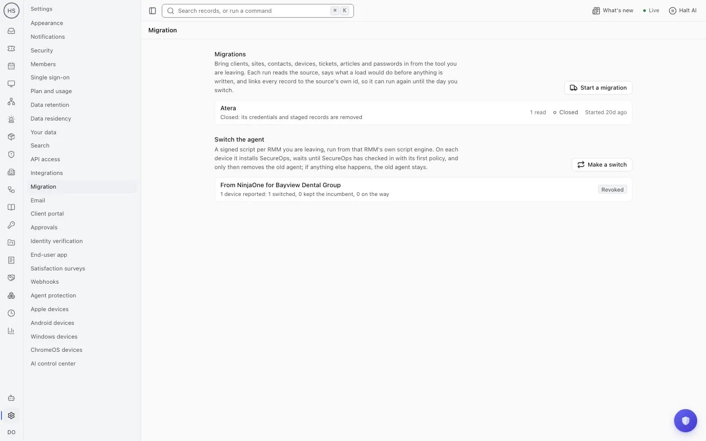
</picture>
<p><b>12. Move in from another tool</b><br><sub>Importers for Atera, Syncro, HaloPSA, ConnectWise PSA, Autotask, NinjaOne, Datto RMM, ITarian, IT Glue and Hudu, and switch scripts for 12 agents.</sub></p>
</td>
</tr>
<tr>
<td width="50%" valign="top">
<picture>
  <source media="(prefers-color-scheme: dark)" srcset="docs/assets/readme/walkthrough/set-portal-dark.webp">
  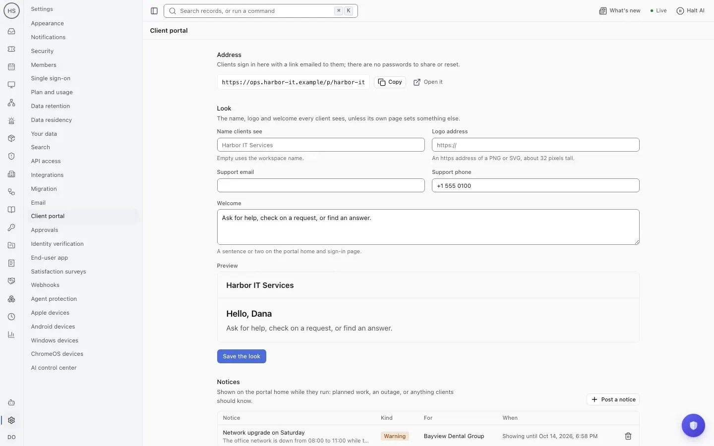
</picture>
<p><b>13. The client portal's settings</b><br><sub>Its address, the workspace's look with a preview, notices for every client or one, and the service catalogue with forms built from typed questions.</sub></p>
</td>
<td width="50%" valign="top">
<picture>
  <source media="(prefers-color-scheme: dark)" srcset="docs/assets/readme/walkthrough/set-enduser-dark.webp">
  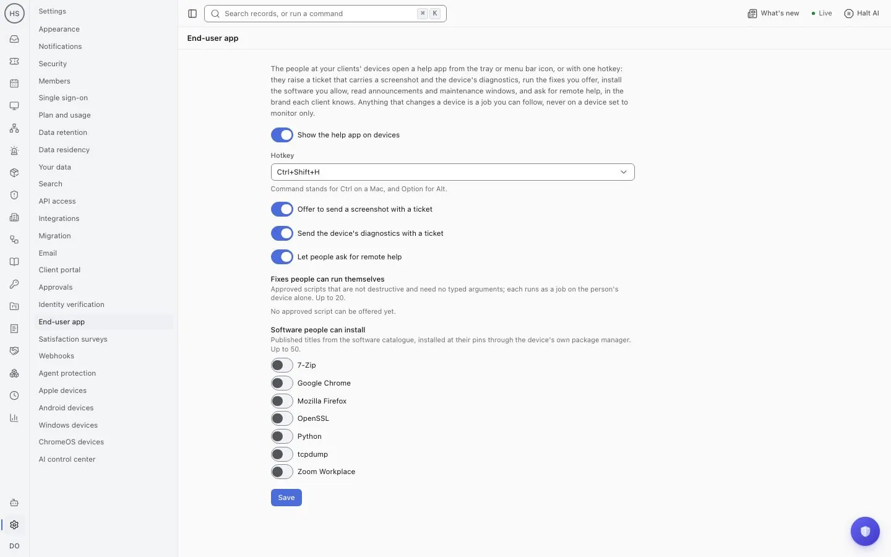
</picture>
<p><b>14. The end-user app</b><br><sub>The tray app on each device, with its hotkey, the fixes and software it offers, remote help, and a ticket with a screenshot and the device's diagnostics.</sub></p>
</td>
</tr>
</table>

<p align="right"><sub><a href="#every-capability-step-by-step">Back to the walkthroughs</a></sub></p>

### 30. The technician app

An app that installs from the deployment to a phone's home screen: alerts swiped, tickets worked offline, devices acted on, timers and the vault behind a passkey.

<table>
<tr>
<td width="33%" valign="top">
<picture>
  <source media="(prefers-color-scheme: dark)" srcset="docs/assets/readme/walkthrough/m-alerts-dark.webp">
  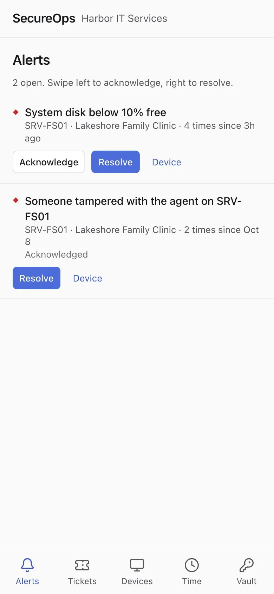
</picture>
<p><b>1. Alerts first</b><br><sub>The home screen: open alerts most severe first, swiped left to acknowledge and right to resolve, a storm kept as one row.</sub></p>
</td>
<td width="33%" valign="top">
<picture>
  <source media="(prefers-color-scheme: dark)" srcset="docs/assets/readme/walkthrough/m-tickets-dark.webp">
  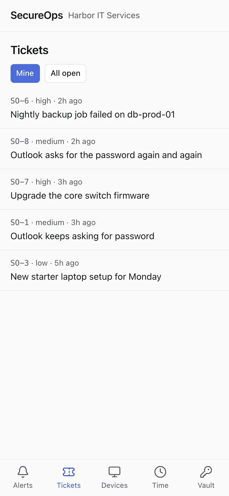
</picture>
<p><b>2. Tickets</b><br><sub>The technician's own open tickets or every one, read from the phone's encrypted copy when there is no signal.</sub></p>
</td>
<td width="33%" valign="top">
<picture>
  <source media="(prefers-color-scheme: dark)" srcset="docs/assets/readme/walkthrough/m-ticket-dark.webp">
  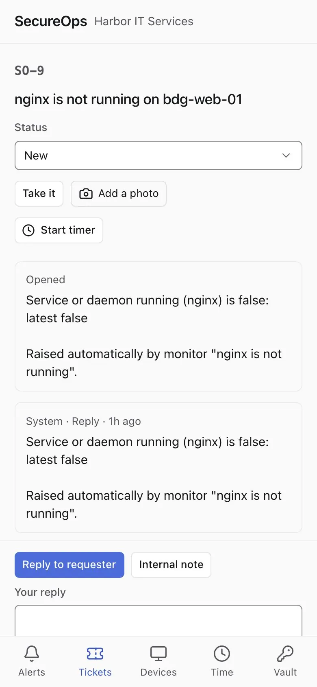
</picture>
<p><b>3. Work a ticket</b><br><sub>Its conversation, a reply or a note queued offline and sent once, a photo from the camera, and its timer.</sub></p>
</td>
</tr>
<tr>
<td width="33%" valign="top">
<picture>
  <source media="(prefers-color-scheme: dark)" srcset="docs/assets/readme/walkthrough/m-device-dark.webp">
  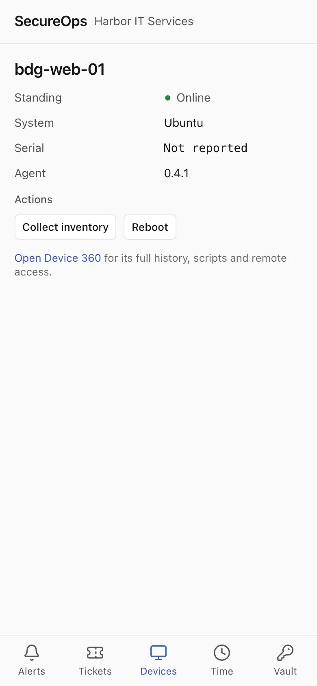
</picture>
<p><b>4. A device</b><br><sub>Its standing and agent, inventory asked for and a restart after a confirmation, each a signed job followed to its exit code.</sub></p>
</td>
<td width="33%" valign="top">
<picture>
  <source media="(prefers-color-scheme: dark)" srcset="docs/assets/readme/walkthrough/m-time-dark.webp">
  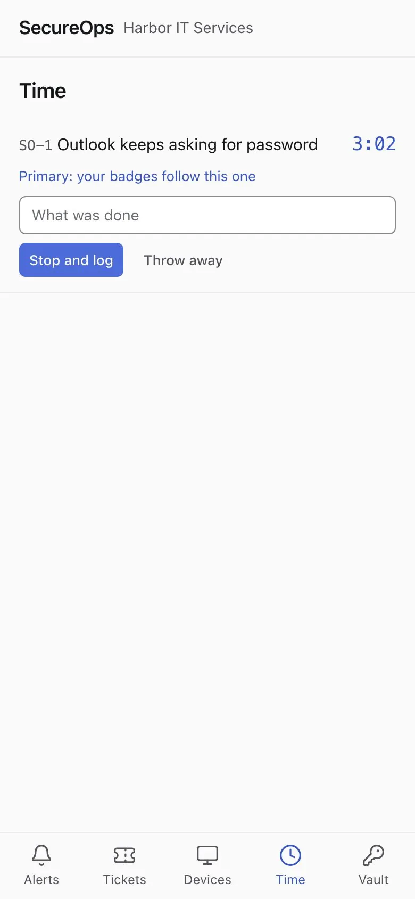
</picture>
<p><b>5. Timers</b><br><sub>Every running timer with one primary, shared with the web app and the browser extension, stopped into a worklog.</sub></p>
</td>
<td width="33%" valign="top">
<picture>
  <source media="(prefers-color-scheme: dark)" srcset="docs/assets/readme/walkthrough/m-vault-dark.webp">
  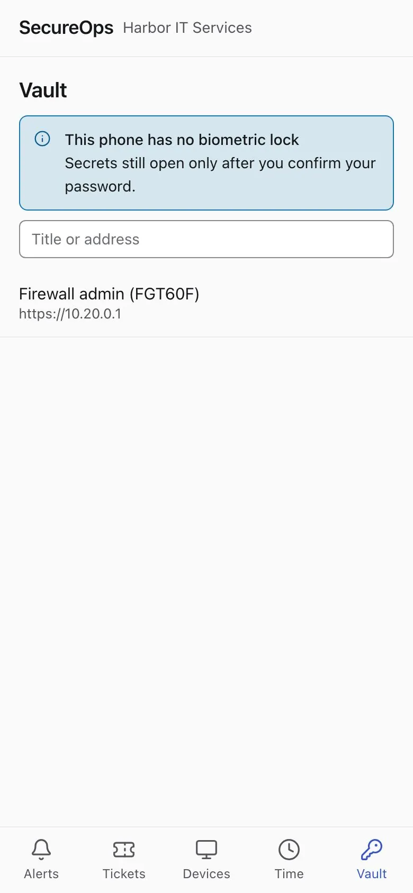
</picture>
<p><b>6. The vault behind the phone's lock</b><br><sub>Opened with the phone's own passkey (Face ID or a fingerprint), or the password on a phone with no biometric lock, as here; a value hidden again after a minute and cleared from the clipboard after 30 seconds.</sub></p>
</td>
</tr>
</table>

<p align="right"><sub><a href="#every-capability-step-by-step">Back to the walkthroughs</a></sub></p>

## Everything in one platform

One data model, one policy engine, one grid and one keyboard grammar under every module.

<table>
<tr>
<td width="50%" valign="top">

#### Monitoring and alerts
- A Go agent for Windows, macOS and Linux, installed as a service by one command, by MSI, PKG, DEB and RPM packages, or from signed apt and dnf repositories
- 60 metrics, plus what a device reads by itself: its event log or journald, files, the registry, certificates, services, SMART and scripts
- Compound, occurrence and formula monitors, with flapping and storm detection and alerts grouped by root cause
- One policy tree, the effective policy on every device, and a dry run before any change

</td>
<td width="50%" valign="top">

#### Patching and software
- Windows Update, macOS softwareupdate, apt and dnf, in rings that halt themselves when installs fail
- Installed only on evidence, rollback where the system allows, and an Evidence Card per update from CISA KEV, the distributions' advisories and the fleet's own results
- A versioned catalogue over winget, Chocolatey, Homebrew, apt and dnf, with pins, rollback and a blocklist
- Custom packages up to 4 GiB, resumable, checked by SHA-256

</td>
</tr>
<tr>
<td width="50%" valign="top">

#### Remote access
- Its own desktop, terminal and file transfer over the agent's connection: no remote-desktop licence and no open port
- Every keystroke signed, every session recorded on the server and audited, its worklog on the ticket
- Consent, approval before a session, and a second technician joining with control handed over
- Splashtop, TeamViewer, ScreenConnect and ISL Online as connectors for licences you keep

</td>
<td width="50%" valign="top">

#### Automation and desired state
- Triggers from alerts, patches, scripts, schedules, webhooks and tickets; branches, loops, waits and approvals
- Self-healing presets that act, verify, then resolve or escalate with what was tried
- Desired-state configuration that tests every device and puts drift right
- Scripts in a signed registry, approval kept apart from authoring, and fleet runs staged 3 devices first

</td>
</tr>
<tr>
<td width="50%" valign="top">

#### Network monitoring
- Any agent becomes a probe: SNMP v1 to v3, traps, syslog, NetFlow and sFlow
- LLDP, CDP and ARP topology, with a device behind a failed switch held rather than paged
- Configuration backups over SSH with every version diffed and its changes alerted
- HTTP, TCP and certificate checks

</td>
<td width="50%" valign="top">

#### Device management and encryption
- Apple: the MDM protocol, declarative device management, Business Manager with ADE, and Apps and Books
- Android Enterprise: fully managed, work profile, kiosk and zero-touch; Windows: OMA-DM, Entra join, Autopilot and CSP profiles; ChromeOS through Google's own APIs
- Profiles from a typed catalogue or your own .mobileconfig, linted for conflicts
- BitLocker, FileVault and LUKS keys escrowed and rotated after each read, every read audited with its reason

</td>
</tr>
<tr>
<td width="50%" valign="top">

#### Service desk
- Ticket types and statuses that carry behaviour, per-priority SLAs with escalations, and email to ticket
- Approvals, change and problem records, typed relationships and merges that carry running timers
- CSAT, CES and NPS, a detractor opening a follow-up for the technician
- A dispatch board, timesheets and expenses, procurement and stock, and a CRM

</td>
<td width="50%" valign="top">

#### Billing
- Good, better and best quotes signed at a link, sales orders delivered from stock
- Invoices paid online through Stripe or GoCardless, recorded only on the provider's signed word, with a dunning ladder
- Contracts that bill live device counts, per site if you like, with distributor usage reconciled
- Several currencies at each day's European Central Bank rate, and QuickBooks Online, QuickBooks Desktop or Xero kept in sync

</td>
</tr>
<tr>
<td width="50%" valign="top">

#### Security and compliance
- Vulnerabilities from NVD, MSRC, OSV, EPSS and CISA KEV, matched by CPE and held to SLA tiers
- Evidence for CIS Controls v8.1, CMMC 2.0, HIPAA, PCI DSS 4.0.1, ISO 27001:2022, the Essential Eight, Cyber Essentials, NIS2 and DORA on NIST CSF 2.0, with snapshots hashed for audit
- A posture score and cyber insurance readiness, each gap a ticket
- DNS filtering that roams with the device, dark web monitoring and phishing simulation, and on Linux today, USB control and just-in-time admin rights

</td>
<td width="50%" valign="top">

#### Reporting and vCIO
- A live query builder over a warehouse, every chart opening the records behind it
- Questions in plain words compiled into a query you can read and change
- Dashboards and TV screens, and scheduled PDF, CSV and XLSX in each client's brand
- Quarterly review packs, profitability per client, technician and contract, and a vCIO plan

</td>
</tr>
<tr>
<td width="50%" valign="top">

#### Documentation and vault
- Typed templates, every version kept with diffs, and restricted pages
- A knowledge base with AI drafts from resolved tickets, and gaps ranked per client
- Server-sealed or zero-knowledge vault folders, with Argon2id and per-item keys
- TOTP, an audited reveal behind a step-up, and browser autofill

</td>
<td width="50%" valign="top">

#### Client portal and end users
- A portal in each client's own brand: tickets, a service catalogue, guides, devices and billing
- AI answers from the client's own guides, cited, before a ticket is raised
- A tray app for Windows, macOS and Linux with a hotkey ticket and a screenshot
- Slack and Teams for end users, approvals decided in chat, and an Outlook add-in

</td>
</tr>
<tr>
<td width="50%" valign="top">

#### Beyond the RMM
- Microsoft 365 standards held across every client tenant, drift put right, offboarding in one run
- SaaS discovery: risky apps, idle paid seats and the audit log's changes worth a look
- Backup verification on evidence, a job that never reported found missing
- Asset custody with signed acceptance, a loaner pool and offboarding recovery

</td>
<td width="50%" valign="top">

#### For technicians anywhere
- A technician app that installs from the deployment and works offline, its vault behind a passkey
- A browser extension for Chrome, Edge, Firefox and Safari: timers, page capture, clips and autofill
- A command palette that finds any of fifteen kinds of record in a keystroke, typing mistakes and all
- Four densities, both themes designed rather than inverted, and built to WCAG 2.2 AA

</td>
</tr>
</table>

## Agentic AI, inside fences

The AI in SecureOps acts rather than rewrites: it triages, drafts replies and articles from what actually fixed things, writes scripts with a safety review, plans remediation, resets a locked-out password after verifying the requester out of band, and answers the phone.

| Mode | What an agent may do |
| :-- | :-- |
| **Off** | Nothing. |
| **Suggest** | Proposes in place, for a person to accept or discard. |
| **Approve** | Prepares the exact action as an approval card: the command, the targets by name, the blast radius, a dry run, the rollback and its evidence. Nothing runs until a person approves it. |
| **Autonomous** | Acts on its own within its limits (so many devices a run and an hour, for the clients it is set for), and is lowered to Approve by the supervisor when its error rate rises. |

- **Never across clients.** Every retrieval runs with the asking person's own permissions and within one client; a contract test holds it to that.
- **Never irreversible.** A wipe, an uninstall or a key rotation can only ever be proposed by an AI, never carried out, at any autonomy.
- **Proven before it is trusted.** Golden sets gate every prompt and model change; the agent simulator replays a client's past tickets and must show it would have been right before it may act alone.
- **Watched while it works.** A supervisor reviews agent runs and people's replies, flags tickets and clients at risk, and demotes a capability that slips.
- **Stopped in one keystroke.** <kbd>⌘</kbd> <kbd>⇧</kbd> <kbd>.</kbd> halts every agent in the workspace and names who halted it.
- **Your models, your region.** Anthropic and OpenAI models through one routing table you can read and change, a phone line that talks through Claude, OpenAI Realtime or Gemini Live, your own keys where you give them, inference held to your data region, and secrets redacted before anything leaves.

## How it compares

Every claim about another product here was read from that vendor's own pages on 8 October 2026, and read again on 9 October 2026, quoted where its words are given, with its source linked. Where a vendor's page says nothing, neither does this. Atera and N-able are left out: their pages refuse an automated read, so nothing they say could be read first-hand.

**At a glance, beside SuperOps, the closest in shape:**

| | SecureOps | SuperOps, in its own words |
| :-- | :-- | :-- |
| **Where it runs** | As a service in the region your workspace is made in, on your own machines (one server, a Kubernetes cluster, or a network with no route out), or in your own cloud account: one release for all three. | “We are hosted on Amazon Web Services (AWS) cloud”, with data in the United States or Europe, chosen at sign-up. [1](https://superops.com/security) [2](https://superops.com/data-hosting-policy) |
| **The AI’s models** | Anthropic and OpenAI models through one router, each capability’s model shown in its routing table, your workspace’s own keys where you give them, and inference held to its data region. | Its data processing addendum lists OpenAI, for “Ticket summarization and email composition”, as its AI subprocessor. [1](https://superops.com/data-processing-addendum) |
| **History kept** | Every change in every module, and every sensitive read, in a chain that shows any change to the record itself; at least 13 months on screen and seven years in all, a floor no one shortens. | “SuperOps retains ticket audit history for the last 30 days”, a rolling window. [1](https://support.superops.com/en/articles/9419884-ticket-audit-in-superops) |
| **API limits** | 1,200 requests a minute in bursts of 400 by default, and up to 6,000 for a workspace that needs more, every answer saying how many remain. | “You can make a maximum of 100 API requests per minute”, on its MSP and IT platforms alike. [1](https://support.superops.com/en/articles/6632215-how-to-integrate-applications-using-superops-ai-graphql-apis) |
| **Custom monitors** | A monitor on anything a device reads by itself (its event log or journald, files, the registry, certificates, services, SMART, a script’s typed result) or on a formula over other readings, as well as SNMP on network devices. | Custom monitors read SNMP: “For now, SuperOps supports only the SNMP protocol.” [1](https://support.superops.com/en/articles/8296982-setting-up-default-and-custom-monitors) |
| **Price** | $1.75 an endpoint a month on Scale, falling to $0.95 above 10,000 endpoints, with every module and every technician included; Solo is free for 100 endpoints, 3 technicians and 3 clients. | Per technician from $149 a month on Pro, each licence with 150 endpoints and more in packs of 150 for $75; or per endpoint on Super Plus, from $2.50 for unlimited technicians. [1](https://superops.com/pricing) |

**Each vendor, topic by topic:**

<details>
<summary><b>SecureOps and SuperOps</b>: SuperOps also puts RMM and PSA in one console, and bundles Splashtop and ISL Online with its paid plans. It runs in its own cloud on AWS, keeps a ticket’s audit history for 30 days, and lists one AI provider.</summary>

| | SecureOps | SuperOps, from its own pages |
| :-- | :-- | :-- |
| **Price** | $1.75 an endpoint a month on Scale, falling to $0.95 above 10,000 endpoints, with every module and every technician included; Solo is free for 100 endpoints, 3 technicians and 3 clients. | Per technician from $149 a month on Pro, each licence with 150 endpoints and more in packs of 150 for $75; or per endpoint on Super Plus, from $2.50 for unlimited technicians. [1](https://superops.com/pricing) |
| **Where it runs** | As a service in the region your workspace is made in, on your own machines (one server, a Kubernetes cluster, or a network with no route out), or in your own cloud account: one release for all three. | “We are hosted on Amazon Web Services (AWS) cloud”, with data in the United States or Europe, chosen at sign-up. [1](https://superops.com/security) [2](https://superops.com/data-hosting-policy) |
| **The AI’s models** | Anthropic and OpenAI models through one router, each capability’s model shown in its routing table, your workspace’s own keys where you give them, and inference held to its data region. | Its data processing addendum lists OpenAI, for “Ticket summarization and email composition”, as its AI subprocessor. [1](https://superops.com/data-processing-addendum) |
| **History kept** | Every change in every module, and every sensitive read, in a chain that shows any change to the record itself; at least 13 months on screen and seven years in all, a floor no one shortens. | “SuperOps retains ticket audit history for the last 30 days”, a rolling window. [1](https://support.superops.com/en/articles/9419884-ticket-audit-in-superops) |
| **API limits** | 1,200 requests a minute in bursts of 400 by default, and up to 6,000 for a workspace that needs more, every answer saying how many remain. | “You can make a maximum of 100 API requests per minute”, on its MSP and IT platforms alike. [1](https://support.superops.com/en/articles/6632215-how-to-integrate-applications-using-superops-ai-graphql-apis) |
| **Custom monitors** | A monitor on anything a device reads by itself (its event log or journald, files, the registry, certificates, services, SMART, a script’s typed result) or on a formula over other readings, as well as SNMP on network devices. | Custom monitors read SNMP: “For now, SuperOps supports only the SNMP protocol.” [1](https://support.superops.com/en/articles/8296982-setting-up-default-and-custom-monitors) |
| **Patching** | Windows, macOS and Linux (apt and dnf), released ring by ring and halted by itself when installs fail, an update counted installed only on the evidence of the next scan, and rolled back where the system allows. | Windows, macOS and, since February 2026, Linux (Ubuntu, Debian, RHEL, CentOS, Fedora, SUSE and openSUSE), approved by category and severity, deferred and scheduled by policy. [1](https://support.superops.com/en/articles/13859601-patch-management-for-linux-os-devices) |
| **Remote control** | Its own desktop, terminal and file transfer for Windows, macOS and Linux desktops (X11), over the agent’s connection, recorded on the server and audited; Splashtop, TeamViewer, ScreenConnect and ISL Online as connectors for licences you keep. | Splashtop or ISL Online, each included with its paid plans, or TeamViewer or ConnectWise Control with your own licence; and, since August 2026, remote control of managed Android devices. [1](https://support.superops.com/en/articles/6632197-how-to-integrate-splashtop-with-superops) [2](https://support.superops.com/en/articles/10501894-how-to-integrate-isl-online-with-superops) [3](https://support.superops.com/en/articles/6632203-how-to-integrate-teamviewer-with-superops) [4](https://support.superops.com/en/articles/6632199-how-to-integrate-connectwise-control-with-superops) [5](https://support.superops.com/en/articles/16440510-remote-control-on-android-devices) |

<sub>Every claim about SuperOps read from superops.com and support.superops.com on 8 October 2026, its words in quotation marks.</sub>

</details>

<details>
<summary><b>SecureOps and NinjaOne</b>: NinjaOne is a cloud RMM with a PSA of its own, priced by region and the products bought. Its PSA syncs with QuickBooks Online, and it says larger MSPs pair it with HaloPSA.</summary>

| | SecureOps | NinjaOne, from its own pages |
| :-- | :-- | :-- |
| **Price** | $1.75 an endpoint a month on Scale, falling to $0.95 above 10,000 endpoints, with every module and every technician included; Solo is free for 100 endpoints, 3 technicians and 3 clients. | From $1.50 an endpoint a month at 10,000 endpoints to $3.75 at 50 or fewer; “pricing varies by region and products purchased.” [1](https://www.ninjaone.com/pricing/) |
| **Where it runs** | As a service in the region your workspace is made in, on your own machines (one server, a Kubernetes cluster, or a network with no route out), or in your own cloud account: one release for all three. | “NinjaOne is built as a cloud-native platform.” [1](https://www.ninjaone.com/endpoint-management/faqs/) |
| **Accounting** | QuickBooks Online, QuickBooks Desktop through its Web Connector, and Xero: invoices and payments sent, and payments taken there brought back. | Its PSA syncs with QuickBooks Online; “NinjaOne does not support integration with the desktop version of QuickBooks.” [1](https://www.ninjaone.com/msp/psa/) |
| **A PSA for larger MSPs** | Contracts of every kind with usage files reconciled, approvals, change records, timesheets, procurement and stock, a CRM and dunning, in the same console as the RMM. | “Larger MSPs with more complex billing, contract, or reporting needs often pair NinjaOne with HaloPSA.” [1](https://www.ninjaone.com/msp/psa/) |
| **Trying it** | A 21-day trial of Scale with no card, then Solo, free for good, with nothing deleted. | A 14-day free trial. [1](https://www.ninjaone.com/pricing/) |
| **Leaving** | End the subscription from Plan and usage in any month: the workspace falls back to Solo, with nothing deleted. | Paid monthly or annually; partners not on a promotional commitment “can choose to cancel at any time by giving 60-days notice.” [1](https://www.ninjaone.com/pricing/) |

<sub>Every claim about NinjaOne read from ninjaone.com and www.ninjaone.com on 8 October 2026, its words in quotation marks.</sub>

</details>

<details>
<summary><b>SecureOps and Syncro</b>: Syncro prices RMM and PSA per technician with unlimited endpoints, so it suits few technicians on many devices. Its AI turns to usage-based credits after January 2027.</summary>

| | SecureOps | Syncro, from its own pages |
| :-- | :-- | :-- |
| **Price** | $1.75 an endpoint a month on Scale, falling to $0.95 above 10,000 endpoints, with every module and every technician included; Solo is free for 100 endpoints, 3 technicians and 3 clients. | Per technician: $159 a month on Core or $209 on Team, billed monthly, with unlimited endpoints. [1](https://syncrosecure.com/pricing/) |
| **The AI’s price** | The AI comes with every plan, acting on its own with Scale, IT Essentials and IT Complete; it has no price of its own, and a workspace may run it on its own provider keys. | Its AI is “Free through January 2027 then usage-based with a pool of free monthly credits.” [1](https://syncrosecure.com/pricing/) |
| **An MCP server** | An MCP server reaching the whole API through four tools: a read answers at once, and every change waits for a person to approve it. | An MCP server for endpoint data: “Ask your AI assistant about device health, patch status, and asset details.” [1](https://syncrosecure.com/pricing/) |
| **Trying it** | A 21-day trial of Scale with no card, then Solo, free for good, with nothing deleted. | A 14-day free trial, with no credit card. [1](https://syncrosecure.com/pricing/) |

<sub>Every claim about Syncro read from syncrosecure.com on 8 October 2026, its words in quotation marks.</sub>

</details>

<details>
<summary><b>SecureOps and Halo</b>: Halo is a service desk and PSA priced per agent, run in its cloud or on your own servers, that connects to the RMM you already run rather than bringing one.</summary>

| | SecureOps | Halo, from its own pages |
| :-- | :-- | :-- |
| **Price** | $1.75 an endpoint a month on Scale, falling to $0.95 above 10,000 endpoints, with every module and every technician included; Solo is free for 100 endpoints, 3 technicians and 3 clients. | Per agent, named or concurrent, “with every feature, module and integration included in that one price”, billed monthly or annually; the people who use its portal are free. [1](https://usehalo.com/pricing) |
| **Managing devices** | Its own agent for Windows, macOS and Linux, with monitoring, patching, scripts, remote access and device management, in the same console as the service desk. | “Rather than provide you with a mediocre tool built into our package, we allow you to integrate with your preferred choice of RMM tool”: Datto RMM, N-able N-central and ConnectWise Automate among them. [1](https://www.usehalo.com/integrations/datto-rmm-integration) [2](https://www.usehalo.com/integrations/n-able-n-central-integration) [3](https://www.usehalo.com/integrations/connectwise-automate-integration) |
| **Where it runs** | As a service in the region your workspace is made in, on your own machines (one server, a Kubernetes cluster, or a network with no route out), or in your own cloud account: one release for all three. | Its cloud on Amazon Web Services, or on-premise deployments of its customers’ own. [1](https://www.usehalo.com/security) |
| **Trying it** | A 21-day trial of Scale with no card, then Solo, free for good, with nothing deleted. | A free 30-day trial “with all features and modules included”, with no credit card. [1](https://usehalo.com/pricing) |

<sub>Every claim about Halo read from usehalo.com and www.usehalo.com on 8 October 2026, its words in quotation marks.</sub>

</details>

<details>
<summary><b>SecureOps and ConnectWise</b>: ConnectWise sells its tools by quote, and runs two RMMs: Automate, in the cloud or on your own servers, and ConnectWise RMM, in the cloud.</summary>

| | SecureOps | ConnectWise, from its own pages |
| :-- | :-- | :-- |
| **Price** | Published, with a calculator: $1.75 an endpoint a month on Scale, falling to $0.95 above 10,000 endpoints, with every module and every technician included; Solo is free for 100 endpoints, 3 technicians and 3 clients. | By quote: “fill out the form to tell us about your business, and we’ll put together a quote to fit your needs.” [1](https://www.connectwise.com/pricing) |
| **Where it runs** | As a service in the region your workspace is made in, on your own machines (one server, a Kubernetes cluster, or a network with no route out), or in your own cloud account: one release for all three. | “Automate allows for deeper, manual customization and includes the option for on-premises or cloud hosting. ConnectWise RMM is a cloud-native RMM solution”, two separate tools. [1](https://www.connectwise.com/platform/unified-management/automate) |

<sub>Every claim about ConnectWise read from connectwise.com and www.connectwise.com on 8 October 2026, its words in quotation marks.</sub>

</details>

<details>
<summary><b>SecureOps and Kaseya</b>: Kaseya runs two cloud RMMs, VSA and Datto RMM; its VSA page names no price and offers a demo.</summary>

| | SecureOps | Kaseya, from its own pages |
| :-- | :-- | :-- |
| **Price** | Published, with a calculator: $1.75 an endpoint a month on Scale, falling to $0.95 above 10,000 endpoints, with every module and every technician included; Solo is free for 100 endpoints, 3 technicians and 3 clients. | Its VSA page names no price and asks you to request a demo. [1](https://www.kaseya.com/products/vsa/) |
| **Where it runs** | As a service in the region your workspace is made in, on your own machines (one server, a Kubernetes cluster, or a network with no route out), or in your own cloud account: one release for all three. | “VSA and Datto RMM are cloud-based solutions used by both MSPs and internal IT teams.” [1](https://www.kaseya.com/products/vsa/) |

<sub>Every claim about Kaseya read from kaseya.com and www.kaseya.com on 8 October 2026, its words in quotation marks.</sub>

</details>

## Pricing

Per endpoint, with every technician, dispatcher, billing user and auditor included, month to month. A device that is off costs nothing: the bill counts the endpoints that checked in, averaged over the month. The calculator on the pricing page sets your team beside what other vendors list for it on their own pages, and names whichever is cheaper, even when that is not SecureOps.

| Plan | For | Price a month |
| :-- | :-- | :-- |
| **Solo** | Getting started | Free for good: 100 endpoints, 3 technicians, 3 clients, with the whole service desk |
| **Scale** | MSPs | $1.75 an endpoint from 100, $1.55 above 500, $1.35 above 1,000, $1.15 above 2,500 and $0.95 above 10,000, with billing, MDM, autonomous AI and single sign-on |
| **IT Essentials** | Internal IT | $1.25 an endpoint from 25, $1.05 above 1,000 and $0.85 above 5,000, with autonomous AI and single sign-on |
| **IT Complete** | Internal IT | $2.15 an endpoint from 25, $1.85 above 1,000 and $1.55 above 5,000, adding MDM and billing |

Every new workspace starts with 21 days of Scale's features and no card, then falls back to Solo with nothing deleted. A self-hosted deployment runs on a signed licence it verifies by itself, with no call home.

## Run it anywhere

One containerized, multi-tenant release serves every mode, so the isolation a SaaS exercises every day is the same inside your cluster.

| | As a service | Your cloud | Your racks | No route out |
| :-- | :-- | :-- | :-- | :-- |
| **Tooling** | The Helm chart | Pulumi for EKS with Karpenter or GKE | The Compose bundle or the chart | The air-gap bundle into your own registry |
| **Billing** | A subscription through Stripe | A signed offline licence | A signed offline licence | A signed offline licence |
| **AI** | Every capability | Every capability, on your keys | Every capability, on your keys | Off, each capability saying why, or the provider endpoints your network allows |

Single sign-on, SCIM and passkeys work the same in all four.

```bash
# One server: the Compose bundle, its secrets made fresh
cd infra/bundle
./generate-env.sh        # then set APP_URL and GATEWAY_PUBLIC_URL in .env
docker compose up -d

# A cluster: the chart, migrated by a job before every install and upgrade
DATABASE_URL=... DATABASE_URL_ADMIN=... CLICKHOUSE_URL=... infra/helm/create-secrets.sh secureops
helm install secureops infra/helm/secureops -n secureops -f my-values.yaml
```

Every migration keeps the previous release serving, so upgrades roll without downtime; a pre-flight refuses to skip a release whose services could not survive the jump. Data residency in the US, EU, UK, Australia or Canada, an export of everything in open formats, and a signed deletion certificate when a workspace is removed. The deployment guide in the source code walks through every deployment and every setting.

## Architecture

<picture>
  <source media="(prefers-color-scheme: dark)" srcset="docs/assets/readme/architecture-dark.svg">
  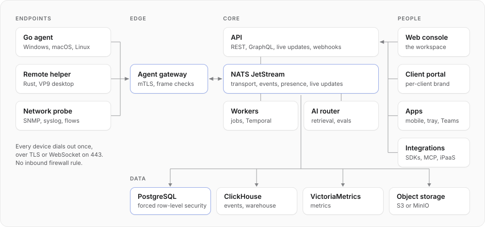
</picture>

| Layer | Technology |
| :-- | :-- |
| Web | Next.js 16 and React 19, Tailwind CSS 4 with OKLCH tokens, TanStack Query and Table, Motion |
| API | Hono with OpenAPI 3.1, Pothos GraphQL, an MCP server and SCIM 2.0, Zod at every trust boundary, live updates over SSE |
| Data | PostgreSQL with Drizzle and FORCE row-level security, ClickHouse for events and the warehouse, VictoriaMetrics for metrics, Typesense for search, Redis |
| Messaging | NATS JetStream for agent transport, the event bus, presence and live updates |
| Orchestration | Temporal for long workflows, on PostgreSQL; a Postgres work queue for short jobs |
| Endpoints | A static Go binary per platform with TUF-signed staged updates, and a separately built Rust remote-desktop helper |
| Identity | Better Auth with OIDC, SAML, SCIM, passkeys and WebAuthn step-up |
| Operations | Kubernetes, Helm, Pulumi in TypeScript, OpenTelemetry with every span attributed to its workspace |

## Security model

<table>
<tr>
<td width="50%" valign="top">

**Workspaces kept apart by the database**
- Only the database package opens a connection; everything else goes through `withTenant()`, a transaction-local tenant context safe under connection pooling.
- Every tenant table leads its keys with `tenant_id` and runs with `FORCE ROW LEVEL SECURITY`, as a role that cannot bypass it.
- A contract test proves every tenant table refuses another workspace's reads, updates and deletes, and a foreign id answers not found, never forbidden.

**Secrets sealed per workspace**
- Credentials are envelope-encrypted under a data key per workspace, wrapped by the deployment's key.
- Zero-knowledge vault folders can never be opened on the server.
- Secrets in what a device reports are masked on the device and again on arrival.

</td>
<td width="50%" valign="top">

**An agent that obeys only what was signed**
- An enrollment token that rotates every day, or one capped for a rollout, enrolls a device; every command, terminal keystroke and settings change is signed with Ed25519 and verified before it runs.
- A device chooses at install whether its agent takes actions; the platform can lower that, never raise it.
- Updates arrive only as builds the release signed (TUF), ring by ring, taken back by a watchdog if the new build never reaches the platform. Protection keeps the agent installed, with an uninstall password.

**Everything on the record**
- Every mutation, and every sensitive read, writes an audit event on a per-workspace hash chain, archived sealed and streamable to Splunk, Sentinel or S3.
- Single sign-on can be required, with two break-glass accounts that alert on every use.

</td>
</tr>
</table>

## API and integrations

Everything the console does goes through the same API: 1,100 operations under `/v1`, described by its OpenAPI 3.1 document, with GraphQL beside it and an MCP server for AI agents.

- **A contract you can build on.** Real status codes, a request id and documentation link on every error, idempotency keys on every change, cursor paging, published limits on every response, and deprecations with 180 days' notice.
- **Clients for every stack.** TypeScript, Python and Go clients generated from the document, served by each deployment for the release it runs, plus a Postman collection and apps for Zapier, Make, n8n and Rewst.
- **Webhooks for every event**, signed with HMAC-SHA256, with a delivery log, replay and a published retry policy.
- **OAuth 2.0 and service accounts**, kept apart from people, with scoped keys and rotation.
- **An MCP server** that reaches the whole API through four tools: a read answers at once, and every change waits for a person to approve it.
- **Connectors** on one framework: Stripe, GoCardless, QuickBooks Online and Desktop, Xero, Microsoft 365, Entra, Intune, Google Workspace, Slack, Teams, Outlook, Defender, SentinelOne, Huntress, CrowdStrike, GravityZone, ESET, Webroot, Emsisoft, ThreatLocker, Veeam, Acronis, Datto, Cove, Pax8, Ingram Micro, TD SYNNEX, Sherweb, Hudu, IT Glue, Okta, JumpCloud, OneLogin, ScalePad, Dell, HP, Lenovo and Apple warranty, Auvik, Domotz, Twilio, Splunk, Sentinel, S3, HaloPSA, ConnectWise PSA, Autotask, Splashtop, TeamViewer, ScreenConnect and ISL Online.

## Around the product

Everything a vendor needs is already here, in the same codebase:

- A **public site** with the platform, pricing and its calculator, a product tour, comparisons, docs and a developer portal, every page also served as Markdown.
- A **changelog** with a note the day each piece of work lands, RSS, and What's new in the console counting what each person has not read.
- A **trust center** with its subprocessors and their change emails, documents under NDA, service levels, security.txt with safe harbour, and incident reviews, saying plainly what is not held yet.
- A **status page** whose incidents the platform opens and closes by itself from its own checks.
- An **idea board** whose ideas ship with the release note that answers them, every voter told.
- A **partner program** with affiliate, referral, reseller and technology tracks, commission counted on Stripe's word, and a directory.
- The **site's own funnel**, counted with no cookie and no third party, from a first visit to the first agent checking in.

## Quickstart

> [!NOTE]
> These steps run SecureOps from its source code, which is private. Email [a.wasey40@gmail.com](mailto:a.wasey40@gmail.com?subject=SecureOps%20source%20code%20access) with your GitHub username for access.

You need Node.js 22.12 or later, pnpm 10 and Docker. Go 1.26 builds the agent and the gateway.

```bash
pnpm install
pnpm infra:up         # PostgreSQL, Redis, NATS, ClickHouse, VictoriaMetrics, Typesense and Temporal
pnpm db:migrate
pnpm dev              # the web app on :3000, the API on :4000, and the worker
```

Open [localhost:3000](http://localhost:3000), choose **Start free**, then **Explore with sample data**: a workspace with ten businesses and six months of their history, their devices, tickets, alerts, projects, quotes and invoices referring to one another, so every page and chart is filled. Settings, Sample data keeps adding the latest activity every 15 minutes while it is on.

**The checks every change passes**

```bash
pnpm test                 # every TypeScript suite
pnpm test:isolation       # the cross-tenant contract over every tenant table
pnpm typecheck
pnpm exec biome lint .
pnpm check:em-dash && pnpm check:migrations && pnpm check:deploy && pnpm check:sdk && pnpm check:evals
(cd agent && go test ./...) && (cd apps/agent-gateway && go test ./...)
```

More than 4,000 tests across the TypeScript suites, every Go package of the agent and the gateway, 270 forward-only migrations, and a live check of every feature against real devices or a stand-in speaking each vendor's protocol.

## Repository layout

```
apps/web            Next.js: the public site, the client portal, the console and the technician app (/m)
apps/api            Hono: REST with OpenAPI 3.1, GraphQL, the MCP server, SCIM, webhooks
apps/worker         Short jobs on the Postgres work queue, and the long ones on Temporal
apps/agent-gateway  Go: agent sessions, frame checks, commands over NATS
apps/extension      The browser extension, built for Chrome, Firefox and Safari
agent/              The Go endpoint agent, its release tooling and the air-gap tool
remote/             The Rust remote-desktop helper
packages/shared     Domain types, Zod schemas and the event catalogue
packages/db         Drizzle schema, row-level security, migrations, tenant-scoped access
packages/core       Domain services shared by the API and the worker
packages/ai         The AI router, retrieval, skills and evals
packages/ui         The design system: OKLCH tokens, the Tailwind theme, components
sdk/                Generated TypeScript, Python and Go clients, OpenAPI and Postman
integrations/       Zapier, Make, n8n and Rewst apps
infra/              The local stack, the Compose bundle, the Helm chart, Pulumi and images
```

## What comes next

Every line of the build plan is built and covered by tests. What is left needs accounts, certificates or hardware the project holds only stand-ins for so far:

- **Signed installers.** The Windows build signed through Azure Artifact Signing and the macOS package with an Apple Developer ID and notarized (the pipeline and its checks are built; the apt and dnf repositories are signed today).
- **Live runs on Windows PCs and Macs whose agents take actions.** Those paths are covered by unit tests and compile checks; Linux devices and a monitor-only Mac are checked live.
- **The vendors' own production services.** Apple, Google, Microsoft, Stripe and every other integration follow the vendor's published API and are checked against a stand-in speaking it.
- **A SOC 2 Type II audit and an outside penetration test**, which the trust center says are not held yet.
- **Wayland desktops** for remote control, and USB and admin-rights control on Windows and macOS.

## License

SecureOps is source-available under the [PolyForm Noncommercial License 1.0.0](LICENSE.md). You may read it, run it and change it for personal, research, educational, charitable or government use. **Any commercial use, including running it for clients, for a business or as a service, needs a commercial license from the copyright holder:** reach out by email at [a.wasey40@gmail.com](mailto:a.wasey40@gmail.com?subject=SecureOps%20commercial%20license).

Copyright 2026 iabdulwasey.
